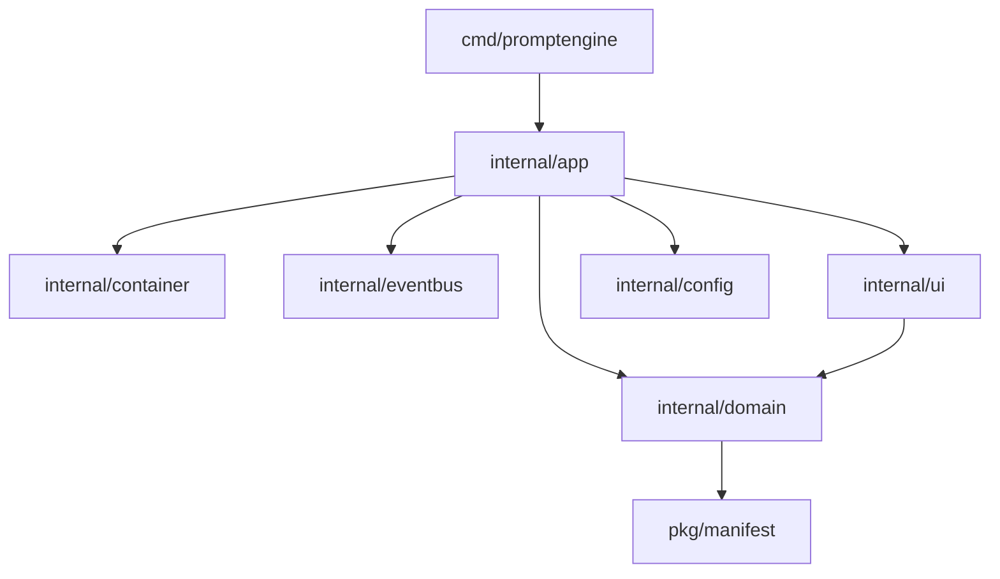

# CLI Implementation Architecture

This document specifies the complete, production-ready implementation architecture for the PromptEngine CLI using Go. It serves as a blueprint for development, separating presentation, orchestration, domain analysis, and file system boundaries.

---

## 1. Technology Choices & Library Recommendations

The CLI will be written in **Go** to ensure fast execution, single-binary distribution, and cross-platform compatibility without external runtime dependencies (like Node or Python).

| Domain | recommended Library | Design Rationale & Alternatives |
| :--- | :--- | :--- |
| **CLI Framework** | `github.com/spf13/cobra` | The industry standard for Go CLI applications (used by Kubernetes, Hugo, and GitHub CLI). Provides robust flag parsing, nested subcommands, shell autocompletion generation, and built-in help text routing. |
| **Configuration** | `github.com/spf13/viper` | Integrates seamlessly with Cobra. Handles configuration precedence (flags > env vars > local configs > global configs > defaults) and supports JSON/YAML/TOML file parsing automatically. |
| **Terminal UI (TUI)** | `github.com/charmbracelet/bubbletea` | A modern Elm-architecture-based TUI framework for Go. Provides robust keyboard focus mapping, multi-select states, scroll support, and highly interactive terminal flows. |
| **Terminal Styling** | `github.com/charmbracelet/lipgloss` | Declarative terminal styling layout system using HSL colors, margins, borders, and paddings. Essential for modern, rich terminal designs. |
| **Progress/Spinners** | `github.com/charmbracelet/bubbles/spinner` | Charm-native spinner components that run asynchronously without blocking TTY keyboard capture loops. |
| **Structured Logging** | Standard Library `log/slog` | Modern, fast structured logger. Supports JSON and text-based handlers, context tracking, and custom level parameters natively without external library clutter. |
| **JSON/YAML Parsing** | Standard `encoding/json` & `gopkg.in/yaml.v3` | Standard Go JSON decoder handles configuration validation. `yaml.v3` parses frontmatter blocks and manifest indexes correctly. |
| **Testing Harnesses** | Standard `testing` & `github.com/stretchr/testify` | Standard `testing` framework for unit tests. `testify/assert` and `testify/require` simplify checks. `github.com/google/go-cmp` for deep struct comparison diffs. |
| **File Watching** | `github.com/fsnotify/fsnotify` | Cross-platform file system monitor. Essential for monitoring file drift triggers. |
| **Cross-Platform** | Pure Go Standard Libraries | Standard libraries (`os`, `path/filepath`, `io`) ensure path separators resolve correctly across macOS, Linux, and Windows. |

---

## 2. Directory Layout (Repository Structure)

The folder layout complies with the Standard Go Project Layout guidelines:

```text
promptengine-cli/
├── assets/             # Embedded visual assets, fonts, or default schemas
├── cmd/                # Binary entry points
│   └── promptengine/   # Main CLI entry (contains main.go)
├── configs/            # Default configuration schemas and default overrides
├── internal/           # Private code (cannot be imported by external packages)
│   ├── app/            # Application layer orchestrators (use-case coordinators)
│   ├── config/         # Configuration loading, validation, and Viper mapping
│   ├── domain/         # Pure domain logic (entities, interfaces, engines)
│   │   ├── context/    # Context resolution and token minimizer
│   │   ├── detection/  # Project Detection Engine
│   │   ├── docs/       # Document scaffolding and sync rules
│   │   ├── health/     # Health scoring algorithms
│   │   └── review/     # Static review auditing logic
│   ├── filesystem/     # Filesystem reader/writer adapter (sandbox boundary)
│   └── ui/             # Charm Bubble Tea TUI interactive views
├── pkg/                # Public code importable by external packages
│   └── manifest/       # Playbook manifest JSON models and parsers
├── templates/          # Embedded default markdown templates (AGENTS.template.md)
└── tests/              # End-to-end CLI integration test suites
```

---

## 3. Package Architecture & Mappings

To prevent **circular dependencies**, packages follow a strict dependency flow:
- `cmd` -> `internal/app` -> `internal/domain` & `internal/filesystem` & `internal/ui`
- `internal/domain` must contain pure logic and interfaces. It **must never** import `internal/app` or `internal/ui`.
- All filesystem access inside engines must go through a mockable `FileSystem` boundary interface to allow memory testing.



### Dependency Injection Service Container (`internal/container`)
The platform uses a lightweight `Container` to instantiate and manage shared dependencies:
- **Filesystem & Config**: Provides mockable file reads and configuration bindings.
- **Caching & Telemetry**: Handles drift check cache storage and anonymous event logs.
- **Event Bus & Logger**: Synchronizes logger parameters and routes platform state signals.

### Event-Driven Architecture (`internal/eventbus`)
The internal event bus decoupling permits decoupled components and future plugins to subscribe to lifecycle events without link-time dependencies. Supported signals include:
- `ProjectDetected` / `ProjectInitialized` / `ProjectMigrated`
- `WorkflowStarted` / `WorkflowCompleted`
- `ContextBuilt` / `PromptGenerated`
- `HealthCalculated` / `ValidationCompleted`

---

## 4. Reusable SDK Architecture

PromptEngine is designed as both a CLI application and a reusable Go library (SDK). Developers can import sub-packages programmatically:

```go
import (
    "github.com/LordCodex/promptengine/internal/app"
    "github.com/LordCodex/promptengine/internal/filesystem"
)

func main() {
    // 1. Initialize SDK environment
    cliApp, _ := app.Bootstrap(os.Stdout, false)
    
    // 2. Query workspace health
    report, _ := cliApp.Doctor.Diagnose(cliApp.FS)
    fmt.Printf("Health score: %d\n", report.Score.Overall)
}
```
This isolates CLI execution formats from pure domain computations.

---

## 5. Configuration Loading Precedence

Viper handles parameter resolution based on a strict priority ladder:

```text
[Priority 1: CLI Explicit Flags] 
   └── [Priority 2: Environment Variables] 
          └── [Priority 3: Local Project File (.promptengine.json)] 
                 └── [Priority 4: Global Configuration (~/.promptengine/config.json)] 
                        └── [Priority 5: Codebase Defaults]
```

---

## 6. PromptEngine Discovery Flow

The CLI resolves the location of the core PromptEngine repository folder in sequence:
1. **Explicit Parameter**: Checks CLI flag `--promptengine-path` or environment variable `PROMPTENGINE_PATH`.
2. **Local Settings**: Inspects `promptengine_path` key in `.promptengine.json`.
3. **Internal Scan**: Searches for a nested `./promptengine/` folder.
4. **Parent Crawl**: Crawls upwards from the active directory scanning for parent folders containing `playbook-manifest.json`.
5. **Global Fallback**: Resolves to the user's global registry directory `~/.promptengine/core/`.

---

## 7. Interactive TUI Engine

Bubble Tea views are constructed dynamically using reusable, validated components:

```go
package ui

import "github.com/charmbracelet/bubbletea"

type QuestionModel struct {
    Prompt       string
    Placeholder  string
    ValidateFunc func(string) error
    DefaultValue string
    IsSecret     bool
}

type MenuModel struct {
    Title        string
    Options      []string
    MultiSelect  bool
    DefaultCheck []bool
}
```
Each command passes an array of these structures to a centralized TUI runner, isolating interactive UI rendering from business logic.

---

## 8. Detection Engine Design

The Project Detection Engine utilizes a registry of decoupled, unit-testable detector interfaces:

```go
package detection

type ProjectMetadata struct {
    Languages     []string
    Frameworks    []string
    Database      string
    TestingFrame  string
    HasDocker     bool
    HasCI         bool
}

type Detector interface {
    Name() string
    Detect(fs FileSystem) (bool, error)
    Apply(fs FileSystem, meta *ProjectMetadata) error
}
```
Adding support for a new technology (e.g., Rust or Go) simply requires implementing the `Detector` interface and appending it to the detection registry slice, complying with the **Open/Closed Principle**.

---

## 9. Documentation, Context, and Health Engines

### Documentation Engine
Manages spec templating and synchronization. Outlines are parsed using frontmatter headers patterns. Surgical updates to tables in `docs/Database.md` are performed by parsing lines into key-value data maps, applying diff updates, and rendering them back to Markdown.

### Context Engine
Reduces token bloat. The engine maps task IDs (e.g. `bug-fix`) to target specs using the following dependency resolver:

```go
package context

type TaskType string

const (
    TaskBugFix TaskType = "bug-fix"
    TaskFeature TaskType = "new-feature"
)

type DependencyResolver struct {
    manifest *manifest.Manifest
}

func (r *DependencyResolver) Resolve(task TaskType, paths []string) ([]string, error) {
    // 1. Load active playbooks registered under task_mappings in playbook-manifest.json
    // 2. Scan paths list to resolve specific database, api, or business specs
    // 3. Return minimum slice of target file paths
}
```

### Health Engine
Computes metrics scores. Validation rules are registered as separate logic units:

```go
package health

type HealthMetric struct {
    Category    string
    Description string
    CheckFunc   func(fs FileSystem) (Score int, Warning string, err error)
}
```
Scores are computed asynchronously. Results are returned as a unified checklist payload containing metric logs.

---

## 10. Logging & Error Handling

### Structured Logger (`slog`)
- Normal: Logs only info, warnings, and errors in clean human format.
- Verbose (`--verbose`): Logs debug steps, scanner paths trace, and config parameters readings.
- Quiet (`--quiet`): Suppresses all logs, outputting only command results payloads (or JSON arrays) to `stdout`.

### Exit Codes & Diagnostics
Standard POSIX exit codes ensure simple shell automation:
- `0`: Success.
- `1`: General Error (file traversal blocks, missing configs, directory permissions exceptions).
- `2`: Validation Drift Warning (link warnings or documentation drift warnings).
- `3`: Health Score Block (in strict validation runners).

---

## 11. Security Model

- **Path Traversal Prevention**: All file operations are checked using `filepath.Clean` and matched against target project boundaries:
  ```go
  func IsSafePath(base, target string) bool {
      rel, err := filepath.Rel(base, target)
      if err != nil || strings.HasPrefix(rel, "..") {
          return false
      }
      return true
  }
  ```
- **Config & Manifest Sanitization**: Config files undergo schema verification on loading to prevent shell injection vectors inside paths parameters.

---

## 12. Future Compatibility & Adaptability

- **AI Provider Adaptors**: Outlines a decoupled adapter structure (`internal/domain/ai`), isolating formatting patterns. Translating context blocks to Claude-compatible files or Cursor configs is handled by provider-specific serializer adapters.
- **Cloud/Remote Sync**: The domain interfaces are designed to be transport-agnostic, paving the way for remote playbooks repository fetching (e.g. fetching over HTTP APIs) without requiring core refactoring.

---

## 13. Implementation Order

To implement the CLI efficiently, follow this phased plan:

### Phase 1: Core Foundation & Configuration
1. Setup Go module boundaries and write standard repository directories.
2. Implement config package (`internal/config`) with Viper precedence setup.
3. Write command registrar using Cobra (`cmd/`).
4. Build `version` and `help` commands.

### Phase 2: Discovery & Scanning Engines
1. Build `internal/filesystem` mockable reader.
2. Implement **Project Detection Engine** (`internal/domain/detection`) with manifests parser.
3. Write the `scan` and `init` commands specs logic.

### Phase 3: Context Resolution & Prompts
1. Implement playbooks manifest JSON parser.
2. Implement **Context Builder** resolver to filter target file arrays.
3. Write the `context` and `prompt` command logic.

### Phase 4: Doctor, Health, and Hook system
1. Implement markdown relative links parser.
2. Implement **Health Engine** scoring and validation checks rules.
3. Implement `doctor`, `health`, and `hooks` command scripts.
