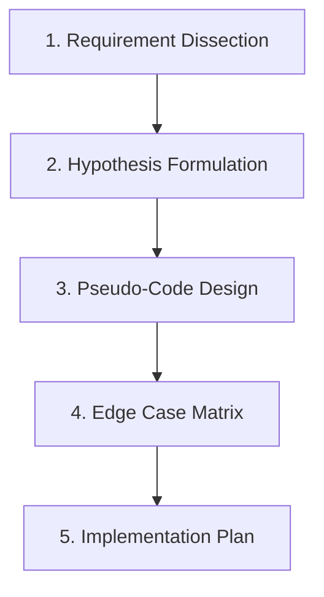

# Thinking and Planning Before Coding

## Purpose
This document establishes the "Thinking Loop" as the mandatory starting process for all software engineering tasks. It guides developers and AI agents to define requirements, model constraints, and evaluate edge cases before writing active production code.

## Scope
Applies to all software changes, including core business logic updates, database schema changes, framework routing configurations, and cross-platform mobile implementations.

## Why This Exists
Writing code without planning leads to:
- Tight coupling and premature abstractions.
- High rates of logic gaps and missing edge cases.
- Expensive structural refactoring cycles late in development.
- Increased token consumption and execution errors in automated AI agents.

---

## The Thinking Loop Methodology

Every development task must proceed through five distinct phases of analysis before implementation:



### 1. Requirement Dissection
Deconstruct the user request or task card into functional requirements and non-functional constraints. Explicitly distinguish between:
- **Given Inputs**: The starting state, payloads, or method arguments.
- **Expected Outputs**: UI states, return values, database modifications, or network payloads.
- **Hidden Prerequisites**: Implicit business rules (e.g. "User must be authenticated and active").

### 2. Hypothesis Formulation
Formulate the core architectural approach.
- *How will the data flow?*
- *Which existing components should handle this logic?*
- *Is a new model, service, or interface required, or is this a minor extension of an existing one?* (Refer to [02-architecture-and-simplicity.md](file:///Users/kodexkode/Documents/workspace/promptengine/core/02-architecture-and-simplicity.md)).

### 3. Pseudo-Code Design
Draft the algorithm in plain English or simplified code. Do not worry about exact syntax or framework helpers yet. Focus on logical sequencing:
```text
IF user.is_suspended THEN
    RETURN unauthorized error
ENDIF

FETCH user account balance
IF balance < transaction_amount THEN
    LOG warning "Insufficient funds"
    RETURN transaction rejected
ENDIF

DECREMENT user balance
RECORD transaction audit log
```

### 4. Edge Case Matrix
Construct a table mapping inputs and environmental states to expected behaviors. Identify bounds and limits.

| Input/State | Behavior | Handling Strategy |
| :--- | :--- | :--- |
| Zero / Null Values | Rejection or default mapping | Throw `InvalidArgumentException` early |
| Network Outage | Graceful recovery/offline storage | Retry queues or local database cache |
| High Concurrency | Prevent double-clicks / race conditions | Database transactions with pessimistic locks |
| Unauthorized Actor | Access denied | Middleware check before logic execution |

### 5. Implementation Plan
Compile the findings into a clear checklist of files to modify or create. Group actions logically (e.g., database schema changes first, backend data access layer second, API endpoint routing third, frontend representation last).

---

## Trade-offs of Planning
- **Cost of Planning**: Planning takes time. For a simple text string change, spending 10 minutes planning is inefficient.
- **Action Threshold**: If a task takes less than 5 minutes to implement and verify (e.g. adding a simple log string, updating a static asset path), bypass formal documentation but maintain the mental checklist.

---

## Anti-Patterns & Common Mistakes
- **The "Jump-to-Code" Trap**: Creating models and controllers immediately after reading the ticket summary.
- **Implicit Assumptions**: Implementing a feature assuming inputs are always well-formed (e.g. assuming an email parameter is validated).
- **Infinite Loop of Abstraction**: Overthinking requirements and designing general interfaces for systems that do not yet have three distinct implementations.

---

## References
- Simplicity Rules: [02-architecture-and-simplicity.md](file:///Users/kodexkode/Documents/workspace/promptengine/core/02-architecture-and-simplicity.md)
- Data Contracts: [03-data-and-api-modeling.md](file:///Users/kodexkode/Documents/workspace/promptengine/core/03-data-and-api-modeling.md)
- Test Planning: [04-testing-philosophy.md](file:///Users/kodexkode/Documents/workspace/promptengine/core/04-testing-philosophy.md)
