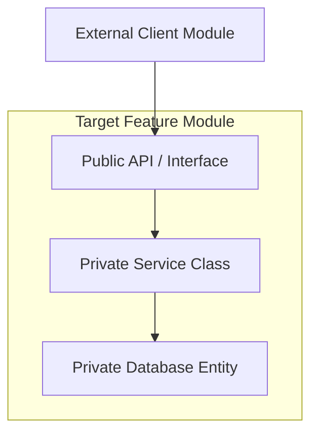

# Architecture and Project Structure Standard

This document defines the architectural boundaries, structural layout patterns, and design principles across all applications. Framework-specific implementation guides extend this standard.

---

## 1. Fundamental Architectural Principles

Software design is the balance of coupling and cohesion. All codebase architectures must enforce the following definitions:

### A. Cohesion and Coupling
- **High Cohesion**: Elements inside a class or module must belong together and serve a single business purpose.
- **Low Coupling**: Modules must remain independent, communicating via explicit public interfaces (contracts) rather than directly referencing private internals.

### B. Encapsulation and Information Hiding
- Classes must shield their internal state. Never expose public properties directly. Expose state changes through descriptive public methods that validate parameters (refer to [core/05-universal-coding-standards.md](file:///Users/kodexkode/Documents/workspace/promptengine/core/05-universal-coding-standards.md)).

### C. Dependency Inversion and Explicit Dependencies
- High-level business logic must not depend on low-level framework details (drivers, HTTP packages, database engines). Both must depend on abstractions (interfaces).
- **Rule**: Dependencies must be explicit. Avoid hidden dependencies (global states, direct database calls inside view layouts). Inject dependencies via class constructors.

### D. Architectural Value Mapping

| Principle | Benefit | Trade-off | When to Apply |
| :--- | :--- | :--- | :--- |
| **Composition over Inheritance** | Prevents subclass side-effects, class flexibility | Boilerplate delegator methods | Implementing service classes, UI view models |
| **Single Responsibility** | Simple test isolation, isolated change zones | Higher class count, file noise | All class, function, and component designs |
| **Predictable Data Flow** | Easier state debugging, event tracking | Extra state serialization wrappers | UI reactivity states, network integrations |

---

## 2. Application Structure Archetypes

There is no single "correct" architecture. Choose the archetype that matches the scope, traffic, and team size of the target system.

### Archetype 1: Layered Architecture (Horizontal)
- **Concept**: Groups files by technical responsibility (e.g., Controllers, Services, Models).
- **Use Case**: Small to medium monoliths with low domain complexity (e.g., standard CRUD applications).
- **Pros**: Easy to understand, low directory nesting.
- **Cons**: High coupling across domains; change in a database table forces updates across multiple distant folders.

### Archetype 2: Feature-First Architecture (Vertical Slices)
- **Concept**: Groups files by cohesive business domain (e.g., `Billing`, `Authentication`, `UserManagement`).
- **Use Case**: Medium to large scale systems with high domain complexity and multiple developers.
- **Pros**: High cohesion; all files related to billing are stored in a single place.
- **Cons**: Requires explicit bridge management to prevent cyclic references.

### Archetype 3: Modular Monolith
- **Concept**: The system is split into independent modules that communicate only via public interfaces. Databases are isolated per module (logical separation).
- **Use Case**: Large systems that plan to transition to microservices later.
- **Pros**: Clean code boundaries; easy to split modules into microservices.
- **Cons**: Requires strict build linting to prevent developers from bypassing module boundaries.

---

## 3. Folder Structure and Dumping Grounds

### The "Dumping Ground" Anti-pattern
Over time, generic directories like `/Common/`, `/Shared/`, `/Base/`, or `/Utils/` accumulate hundreds of unrelated functions, creating dependency traps and raising cognitive load.

### How to Prevent Dumping Grounds
1. **Prefer Proximity**: Store helper methods directly inside the class or module that uses them. Do not share them globally unless three distinct domains require them (Rule of Three).
2. **Context-Specific Utilities**: If sharing is necessary, name files specifically after their single function (e.g. `StringFormatter.ts` rather than `utils.ts`).
3. **Inject Constants**: Do not create a single global `Config.php` file containing system parameters. Bind configurations to specific classes via constructor variables.

---

## 4. Business Logic Boundaries

Business logic must live in explicit, predictable zones. The table below defines responsibilities across system layers:

| Layer / Component | Valid Responsibilities | Prohibited Actions (Anti-patterns) |
| :--- | :--- | :--- |
| **Controllers** | Parse parameters, route authorization, call Action classes, return HTTP envelopes | DB queries, business calculations, logging integrations |
| **Eloquent Models** | Define database relationships, columns type casting, local scopes | External API calls, event dispatches, payment processing |
| **Action Classes / Use Cases** | Execute single business actions, manage DB transactions, trigger domain events | Read HTTP request variables directly, output views |
| **Repositories** | Shield raw SQL queries, execute cache retrievals, fetch models | Determine business logic rules, parse client inputs |
| **UI Components / Widgets** | Render state values, capture user tap triggers | Perform direct network calls, write DB records |
| **Middleware** | Assert global constraints (auth, CORS checks, rate limits) | Mutate core business database records |

---

## 5. Module Design and Public APIs

When building features inside Feature-First structures, isolate implementation details behind an explicit public boundary:

### Directives
- **Public Contracts**: Only interfaces and DTOs should be imported by external modules. Private models and internal services must remain private to the module.
- **Dependency Isolation**: Avoid cyclic dependencies (e.g. Module A imports Module B, and Module B imports Module A). If modules require mutual interaction, refactor the shared dependency out to a third, lower-level core module.

---

## 6. Design Patterns Pragmatism

Design patterns should solve concrete design bottlenecks, not be used as boilerplate markers.

- **Strategy Pattern**: Use when you have multiple algorithms for the same action (e.g., different payment gateways) that change dynamically at runtime. Avoid if you only support a single implementation.
- **Factory Pattern**: Use when object instantiation is complex and depends on config variables. Avoid if standard constructors suffice.
- **Facade Pattern**: Use to wrap a complex third-party library interface inside a simplified local interface.
- **Repository Pattern**: Use when you need to mock database access during testing, or cache reads dynamically. Avoid in standard CRUD frameworks (like Laravel) where Eloquent already acts as a robust Active Record pattern, unless explicit isolation is required.

---

## 7. Preventing Overengineering

Overengineering starts silently. Prevent system bloat by adhering to the following rules:

1. **No Speculative Interfaces**: Never write an interface if only one class implements it, unless required for mock testing boundaries (e.g. external network gateways).
2. **No Empty Layers**: Avoid creating service wrappers that simply call repository functions with no added logic:
   - **Bad**: `Controller` $\rightarrow$ `Service` $\rightarrow$ `Repository` $\rightarrow$ `Model` (where Service and Repository just call `$model->all()`).
   - **Good**: `Controller` $\rightarrow$ `Model::all()` (for simple CRUD), or `Controller` $\rightarrow$ `Action` $\rightarrow$ `Model` (for transaction business logic).
3. **Minimize Traits**: Traits create silent dependencies and hide method definitions. Prefer Composition (injecting class instances) over importing traits.

---

## 8. Legacy System Evolution

Modernizing systems must occur incrementally without disrupting running operations:

- **Strangler Pattern**: Place a routing gateway in front of old applications. Route new APIs to new service modules while legacy endpoints continue targeting old procedural systems (refer to [legacy/01-safe-refactoring.md](file:///Users/kodexkode/Documents/workspace/promptengine/legacy/01-safe-refactoring.md)).
- **Expand-and-Contract**: Execute database changes by double-writing to old and new columns, backfilling data, and then dropping legacy fields across distinct deploy iterations (refer to [legacy/02-backward-compatibility.md](file:///Users/kodexkode/Documents/workspace/promptengine/legacy/02-backward-compatibility.md)).

---

## 9. AI Agent Architectural Directives

AI agents executing coding tasks in this repository must follow these rules:

1. **Investigate Presence**: Before creating a class or utility, search the codebase for similar helper implementations.
2. **Conform to Archetype**: Match the current directory layout exactly. If the codebase is type-first, do not introduce feature-first structures.
3. **No Unjustified Layers**: Do not create interfaces or repository patterns unless explicitly requested or defined in the task's architecture specification.

---

## 10. Architecture Review Checklist

PE and Tech Leads must verify the following parameters during code reviews:

- [ ] **Coupling**: Does this change introduce circular module imports?
- [ ] **Boundaries**: Are database entities exposed directly to the views, or passed via DTOs/Resources?
- [ ] **Cohesion**: Do class methods all focus on a single domain responsibility?
- [ ] **Simplicity**: Can the logic be written in fewer files without violating SRP?
- [ ] **Testing**: Can the business service be tested without booting the database container?

---

## References
- Coding standards: [core/05-universal-coding-standards.md](file:///Users/kodexkode/Documents/workspace/promptengine/core/05-universal-coding-standards.md)
- Testing strategy: [core/04-testing-philosophy.md](file:///Users/kodexkode/Documents/workspace/promptengine/core/04-testing-philosophy.md)
- Schema structures: [core/03-data-and-api-modeling.md](file:///Users/kodexkode/Documents/workspace/promptengine/core/03-data-and-api-modeling.md)
