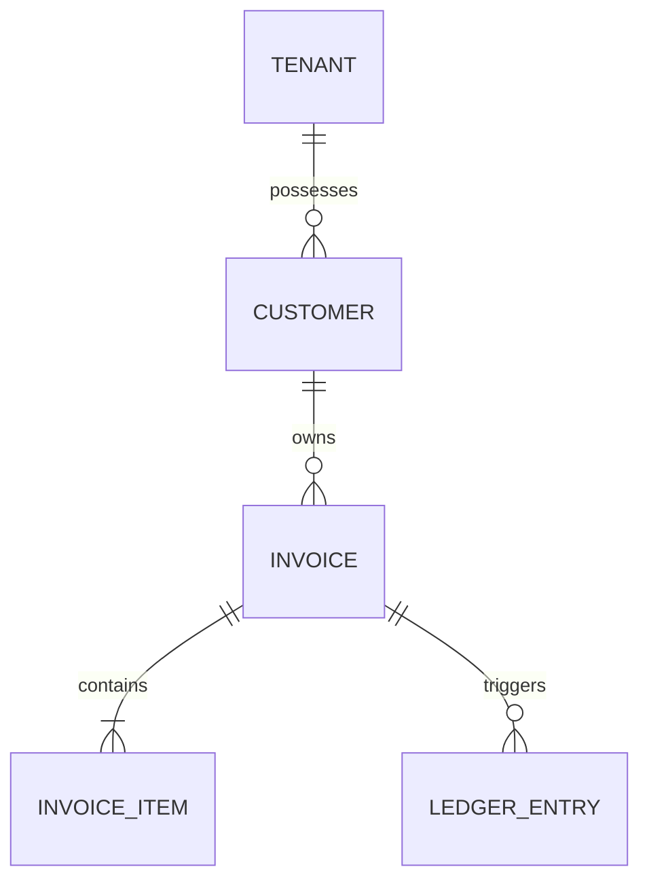
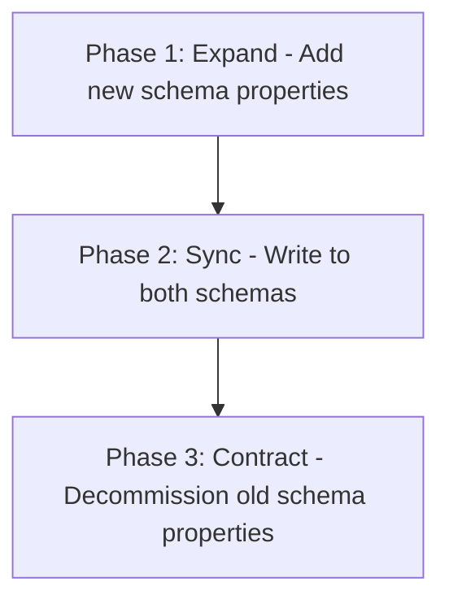

# Database Engineering Standard

## Purpose & Inheritance
This document establishes the definitive database engineering standard for all codebases. It inherits from and extends the [Universal Coding Standards](05-universal-coding-standards.md) and [Architecture Standards](02-architecture-and-simplicity.md). It outlines strict rules for data modeling, transaction boundaries, index engineering, multi-tenant boundaries, financial ledger designs, and database performance across relational databases (PostgreSQL, MySQL, MariaDB).

---

## 1. Database Philosophy

Databases are not merely passive bit stores or application dump sites. They are the **ultimate guardians of business rules and relational integrity**. Application code is transient and easily bypassed; the database schema is permanent and must act as the single source of truth for correctness.

### Core Directives
1. **Data Correctness Over Convenience**: Do not write nullable columns, loose types, or unconstrained relationships to save development time. If a relation is required, enforce it in SQL.
2. **Explicit Data Modeling**: Maintain clear schema layouts. Every table must represent a unique entity or pivot structure with physical keys.
3. **Defense in Depth via Constraints**: Enforce checks (`CHECK`), unique constraints (`UNIQUE`), and foreign keys (`FOREIGN KEY`) in the database engine. Application-layer validations (`FormRequest`, validation libraries) are friendly interfaces; SQL constraints are hard security and structural guarantees.
4. **Optimize for Core Access Patterns**: Schema and index designs must be informed by actual read/write volume profiles. Do not guess; index only after mapping actual query paths.
5. **Pragmatic Growth Modeling**: Design structures that support current requirements while ensuring that migrations can be run in the future with zero downtime.

---

## 2. Data Modeling

Data modeling defines how systems represent data entities, relationships, and business states.



### Table Normalization vs. Denormalization
- **Normal Form Target**: All schema layouts must target **Third Normal Form (3NF)** by default to eliminate duplicate states and write anomalies.
- **Denormalization Rules**: You may only denormalize columns (such as aggregate totals, status counts, or recent cached states) under the following conditions:
  1. The target read queries have been proven by database profiling to be too slow (due to heavy joins) under normal production traffic.
  2. The denormalized field is maintained using atomic transactions or database triggers to prevent data drift.
  3. A mitigation plan is documented for reconciling values if sync breaks.

### Primary Keys & Key Strategies

Primary key selection directly impacts indexing performance, security, distributed system correctness, and external API design. There is no universally correct choice; the right strategy depends on the database engine, architecture, and scalability requirements.

See **[Section 2A: Primary Key & Identifier Strategy](#2a-primary-key--identifier-strategy)** for the full decision framework, tradeoff analysis, and default recommendations.

### Relationships and Constraints
- **Foreign Keys**: Every reference to an external entity must use a physical foreign key constraint with explicit cascading actions:
  - Use `ON DELETE RESTRICT` (or `ON DELETE NO ACTION`) by default to prevent accidental orphaned data deletion.
  - Use `ON DELETE CASCADE` only for child tables that have no logical reason to exist without their parent (e.g., `invoice_items` when deleting an `invoice`).
- **Composite Keys**: Use composite keys (multi-column primary or unique constraints) for pivot tables and unique attribute pairings.
- **Nullability**: All columns must be `NOT NULL` by default. Use nullable columns only if the `null` state represents a distinct, valid business case (e.g., `completed_at` for an active job). Do not use nullable fields to represent empty strings or zero balances.

### Temporal, Auditing & State Management
- **Audit Columns**: Every table must include standard tracking fields:
  - `created_at` (TIMESTAMP WITH TIME ZONE / DATETIME)
  - `updated_at` (TIMESTAMP WITH TIME ZONE / DATETIME)
  - `created_by` (BIGINT / UUID, referencing the executing actor)
- **Soft Deletes**:
  - **Do not use soft deletes by default**. Soft deletes pollute query planning, break unique constraints, and require developer overhead to filter deleted records out of every custom query.
  - **Alternative**: Use hard deletes for transient records. For business-critical data, use a separate archiving table (`archived_invoices`), or implement a strict status-based soft-state (e.g., `status = 'deleted'`) that is validated explicitly.
- **History Tracking**: When historical records are legally required (e.g., auditing user profile changes or shipping rates), write a separate history ledger table (`shipping_rate_history`) to store immutable snapshots of changes, rather than maintaining mutable updates in the main table.

---

## 2A. Primary Key & Identifier Strategy

Choosing the right primary key and identifier strategy is one of the highest-impact architectural decisions in database engineering. This section provides the full decision framework, tradeoff analysis, and default recommendations.

> **Exception Policy**: Any deviation from the defaults defined in this section must be documented in the project's `Architecture.md` or `Decisions.md` file with a clear rationale.

---

### Identifier Strategy Comparison

The table below compares the most common identifier strategies across key evaluation axes.

| Strategy | Sortable | Sequential | Index Performance | Collision Risk | Exposes Sequence | Distributed-Safe | Storage (bytes) |
| :--- | :---: | :---: | :---: | :---: | :---: | :---: | :---: |
| **Auto-Increment Integer** (`BIGINT`) | ✅ | ✅ | ⭐⭐⭐⭐⭐ | None (DB-enforced) | ❌ Yes | ❌ No | 8 |
| **UUIDv4** (random) | ❌ | ❌ | ⭐⭐ (random fragmentation) | Negligible | ✅ No | ✅ Yes | 16 |
| **UUIDv7** (time-ordered) | ✅ | ✅ | ⭐⭐⭐⭐ | Negligible | ✅ No | ✅ Yes | 16 |
| **ULID** | ✅ | ✅ | ⭐⭐⭐⭐ | Negligible | ✅ No | ✅ Yes | 16 |
| **NanoID** | ❌ | ❌ | ⭐⭐ | Low (configurable) | ✅ No | ✅ Yes | variable |
| **Composite Natural Key** | Contextual | Contextual | ⭐⭐⭐ | None (if unique) | Contextual | Contextual | variable |

---

### Strategy Definitions & Tradeoffs

#### Auto-Increment Integer (`BIGINT` / `BIGINT AUTO_INCREMENT`)

**How it works**: The database engine generates sequential integers (1, 2, 3…) on each insert, enforced at the engine level.

**Advantages**:
- Highest possible B-Tree index performance. Sequential inserts fill index pages in order, minimising page splits.
- Minimal storage footprint (8 bytes vs. 16 bytes for UUID).
- Simple, human-readable values that are trivial to debug in log files and support tooling.
- Zero risk of collision.

**Disadvantages**:
- **Exposes record count and sequence** to anyone who can observe an ID in a URL or API response. This enables resource enumeration attacks (IDOR — Insecure Direct Object Reference).
- **Not safe for distributed systems**: Requires a single authoritative writer (or a coordination sequence). Multi-node generation produces collisions.
- **Not portable across databases**: Merging data from two database instances requires ID remapping.
- **Poor for sharding**: Sequential IDs concentrate writes on the same partition, preventing horizontal write distribution.

**When to use**: Internal join keys on tables never exposed in external APIs or URLs, where the application runs on a single primary writer database.

---

#### UUIDv4 (Random)

**How it works**: A 128-bit randomly generated identifier per RFC 4122. Each UUID is fully random and statistically unique.

**Advantages**:
- Distributed-safe: Any node can generate a UUID independently without coordination.
- No sequence exposure. Resistant to enumeration attacks.
- Portable and mergeable across database instances without collision.

**Disadvantages**:
- **Index fragmentation**: Random values cause B-Tree page splits on every insert, leading to severely fragmented indexes on high-volume tables. This degrades both insert and read performance significantly at scale.
- Larger storage cost (16 bytes vs. 8 bytes for integers).
- Joins on UUID foreign keys consume more memory and CPU than integer joins.
- Human-unfriendly in logs and debugging sessions.

**When to use**: Legacy systems already using UUIDv4. **Avoid for new projects** where index performance matters. Prefer UUIDv7 or ULID instead.

---

#### UUIDv7 (Time-Ordered) — **Default for New Projects**

**How it works**: A 128-bit identifier per RFC 9562. The most significant 48 bits encode a Unix millisecond timestamp, followed by random bits. This produces lexicographically sortable UUIDs that cluster chronologically in B-Tree indexes.

**Advantages**:
- **Time-ordered and sortable**: Inserts are monotonically increasing in the same millisecond window, dramatically reducing B-Tree page fragmentation compared to UUIDv4.
- Distributed-safe: No coordination required between nodes.
- No sequence exposure. Resistant to enumeration attacks.
- Portable and mergeable across database instances.
- Natively supported in PostgreSQL 17+ (`gen_random_uuid()` produces v4; UUIDv7 support arrives via extension or application layer). MySQL 8.4+ has no native UUIDv7 function but accepts `CHAR(36)` / `BINARY(16)` values generated in the application layer.
- RFC 9562 standardised in May 2024; broad library support across PHP, Node.js, Python, Go, Rust, and Java.

**Disadvantages**:
- Slightly more complex to generate than auto-increment (requires a library call).
- 16-byte storage cost vs. 8 bytes for integers.
- Millisecond timestamp leaks creation time to an observer who decodes the UUID — this is rarely a security concern but must be evaluated for high-confidentiality records.

**When to use**: **Default recommendation for all new projects**. Recommended whenever distributed safety, non-enumerable IDs, or cross-shard portability are required.

> **PostgreSQL Note**: Use `uuid` column type natively. For UUIDv7 generation, use the `pg_uuidv7` extension (PostgreSQL 13+) or generate in the application layer using a RFC 9562-compliant library (e.g., `ramsey/uuid` v4.7+ for PHP, `uuidv7` for Node.js).

> **MySQL / MariaDB Note**: Store as `BINARY(16)` (not `CHAR(36)`) to preserve index performance and halve the storage cost of the text representation. Use the application layer to generate and convert values.

---

#### ULID (Universally Unique Lexicographically Sortable Identifier)

**How it works**: A 128-bit identifier encoded as a 26-character Crockford Base32 string. The first 48 bits are a millisecond Unix timestamp; the remaining 80 bits are random.

**Advantages**:
- Time-ordered and lexicographically sortable, like UUIDv7.
- Human-readable and URL-safe (26 uppercase alphanumeric characters, no hyphens).
- Distributed-safe.
- Case-insensitive and compatible with string columns.

**Disadvantages**:
- Less universally supported than UUID at the database engine level. Requires string storage (`CHAR(26)`) rather than a native UUID type.
- String comparison is slower than integer comparison; larger storage than native UUID binary.
- The ULID spec (v0.3.0) is less formally standardised than RFC 9562 UUIDv7.

**When to use**: Prefer UUIDv7. Use ULID only when human-readability of the identifier itself is a specific product requirement (e.g., ticket IDs, reference numbers in support tooling).

---

#### NanoID

**How it works**: A cryptographically secure URL-friendly unique string generator. Defaults to a 21-character alphanumeric string with a collision probability comparable to UUIDv4.

**Advantages**:
- Short, URL-safe, human-copy-friendly output (e.g., `V1StGXR8_Z5jdHi6B-myT`).
- Good for short codes, public slugs, invite tokens, and short-lived resource IDs.

**Disadvantages**:
- Not time-ordered. Random, so index performance degrades similarly to UUIDv4.
- Not a database-native concept; requires careful collision testing for high-volume tables.
- Not suitable as a primary database key for large tables.

**When to use**: Short public identifiers (referral codes, invite tokens, short-lived slugs), not as primary keys for large tables.

---

#### Composite Natural Keys

**How it works**: A multi-column primary key formed from natural business attributes (e.g., `(tenant_id, order_number)`).

**Advantages**:
- Eliminates surrogate key joins for pivot and relationship tables.
- Self-documenting; the key encodes business meaning.

**Disadvantages**:
- Natural keys can change (e.g., a username-based key breaks on rename). Requires careful stability analysis.
- Wider keys increase the size of all foreign key references in child tables.
- Complex to manage in ORM layers that assume single-column PKs.

**When to use**: Pivot/junction tables (e.g., `user_roles`, `category_product`) where the relationship itself is the entity. Avoid for business entity tables.

---

### Default Recommendation for New Projects

For **all new projects**, use the following strategy unless a documented exception is approved:

```
Primary Key Type: UUIDv7
Column Type:      PostgreSQL → uuid | MySQL/MariaDB → BINARY(16)
Generation:       Application layer (RFC 9562-compliant library)
External APIs:    Expose UUIDv7 directly (non-enumerable, non-sequential)
Internal Joins:   UUIDv7 — do not maintain a separate surrogate integer key
                  unless profiling evidence justifies the dual-key overhead
```

**Rationale**: UUIDv7 is time-ordered (preserving B-Tree insert performance), distributed-safe (no single sequence writer required), non-enumerable (resistant to IDOR attacks), and is now standardised under RFC 9562. It is the pragmatic convergence point between the performance characteristics of sequential integers and the security and distribution properties of random UUIDs.

---

### Decision Framework: Choosing an Identifier Strategy

Use the following decision tree when selecting an identifier strategy for a new table or service:

```
1. Is this an internal pivot/junction table with no external exposure?
   └─ YES → Composite natural key (e.g., (user_id, role_id))

2. Is the system distributed (multi-node writes, microservices, event sourcing)?
   └─ YES → UUIDv7 (default) or ULID

3. Is the record ID ever exposed in an API response, URL, or external system?
   └─ YES → UUIDv7 (default). Never expose auto-increment integers.
   └─ NO  → Continue to question 4

4. Is the database a single primary writer with no distributed concerns?
   └─ YES → Auto-increment BIGINT is acceptable IF the ID will never be
             exposed externally AND index performance is the primary concern.
             Document this exception in Architecture.md or Decisions.md.

5. Is a human-readable, URL-safe short code specifically required?
   └─ YES → ULID for reference numbers; NanoID for invite tokens / short slugs
             (not as a primary key for high-volume tables)
```

---

### Dual-Key Pattern (Integer PK + UUID Public ID)

In legacy systems or performance-critical tables, a dual-key pattern may be evaluated:
- An internal `BIGINT` surrogate primary key for join performance.
- A separate indexed `uuid` column (`public_id`) used as the external identifier in APIs.

**Tradeoffs**:
- Reduces index fragmentation on write-heavy tables compared to UUID-as-PK.
- Doubles the storage footprint of the identifier columns.
- Adds application complexity: the correct key must be used in every query context.
- Required ORM configuration to prevent accidental leakage of the integer PK.

**Decision**: This pattern is **not recommended as a default**. Adopt it only when EXPLAIN analysis provides concrete evidence that UUIDv7-as-PK is a measurable performance bottleneck on the specific table in question. The exception must be documented in `Architecture.md` or `Decisions.md`.

---

### Database Engine Support Reference

| Engine | Native UUID Type | UUIDv7 Native Generation | Recommended Storage |
| :--- | :--- | :--- | :--- |
| **PostgreSQL 13–16** | `uuid` ✅ | Via `pg_uuidv7` extension | `uuid` column |
| **PostgreSQL 17+** | `uuid` ✅ | Via `pg_uuidv7` extension | `uuid` column |
| **MySQL 8.0+** | None (string only) | Application layer | `BINARY(16)` |
| **MySQL 8.4+** | None (string only) | Application layer | `BINARY(16)` |
| **MariaDB 10.7+** | `UUID` ✅ | `UUID()` generates v1 — use app layer for v7 | `UUID` column or `BINARY(16)` |
| **SQLite** | None (text) | Application layer | `TEXT` |

---

### Exception Documentation Requirement

Any deviation from the **UUIDv7 default** must be recorded as an Architecture Decision Record (ADR) in either:
- **`Architecture.md`** — if the decision applies to the entire project or a major subsystem.
- **`Decisions.md`** — if the decision is scoped to a specific table, service, or feature boundary.

The exception record must include:
1. **The table or service name** where the alternative strategy is applied.
2. **The alternative identifier type chosen** (e.g., `BIGINT AUTO_INCREMENT`, ULID).
3. **The specific rationale** (e.g., "EXPLAIN analysis shows 40% index fragmentation on `events` table at 500M rows under UUIDv7").
4. **The mitigation** for any security or distribution risk introduced by the alternative.

---

## 3. Database Design & Naming Conventions

Consistent naming rules ensure readability and automate migration generation across developers and AI tools.

### Naming Guidelines
- **Table Names**: Lowercase, plural, using snake_case (e.g., `customers`, `invoice_items`).
- **Pivot Tables**: Singular alphabetical order of the tables joined (e.g., `category_product` joining `categories` and `products`).
- **Columns**: Lowercase, singular, using snake_case (e.g., `first_name`, `amount_cents`).
- **Foreign Key Columns**: Singular parent table name followed by `_id` (e.g., `customer_id`).
- **Indexes**: Format as `{table_name}_{columns_joined_with_underscore}_{index_type}` (e.g., `users_email_unique`, `invoices_customer_id_created_at_index`).

### Schema Evolution & Migration Structuring
- **Immutable Migrations**: Once a migration file is executed in staging or production, it must **never be modified**. Alterations to schemas must be done by writing a new migration file.
- **Reversibility**: Every migration must have a corresponding, fully functional rollback method (`down()`) that drops the created columns/tables safely.
- **Single Alteration Rules**: Do not mix schema structures changes and data migrations in a single migration block. Keep them separate to allow safe failures and rollbacks.

---

## 4. Database Transactions & Locking

Relational transactions protect the database state during multi-step modifications.

```text
HTTP Request
  └── Start SQL Transaction
        ├── SELECT FOR UPDATE (Lock target rows)
        ├── Insert Order Record
        ├── Update Account Balance
        └── Commit SQL Transaction (All modifications written or rolled back together)
```

### ACID & Transaction Isolation Levels
- **Read Committed (Default)**: Enforce as the default baseline. Prevents dirty reads but allows non-repeatable reads and phantom reads.
- **Serializable**: Enforce Serializable or Repeatable Read isolation levels for ledger-level balance updates or double-entry ledgers.
- **Deadlock Mitigation**:
  1. Always acquire locks on rows in the exact same logical order throughout your codebase (e.g., always lock the lower ID user before the higher ID user).
  2. Keep transactions short. Avoid invoking external network APIs, mail clients, or heavy computations within a transaction block.

### Locking Strategies
- **Pessimistic Locking**: Use `SELECT ... FOR UPDATE` when you must read a record and guarantee that no other database transaction modifies it before your write finishes.
- **Optimistic Locking**: Use a version counter column (`version INT DEFAULT 1`) when writing to tables where concurrent writes are rare, reducing connection lock overhead:
  ```sql
  UPDATE inventory SET stock = stock - 1, version = version + 1 
  WHERE id = :id AND version = :current_version;
  ```

---

## 5. Indexing Strategy

Indexes turn $O(N)$ linear scans into $O(\log N)$ tree searches. However, unnecessary indexes degrade write speeds.

### Index Planning Rules
1. **Index All Foreign Keys**: Every column containing a foreign key constraint must be indexed to optimize joins.
2. **High-Cardinality Fields**: Place indexes on fields with high variability (e.g., `email`, `serial_number`). Do not index low-cardinality fields (e.g., `status`, `gender`) unless used in a composite index.
3. **Composite Index Ordering (The Leftmost Prefix Rule)**:
   - Order composite columns from highest selectivity to lowest selectivity.
   - For an index on `(tenant_id, status, created_at)`, queries searching for `tenant_id` or `(tenant_id, status)` will use the index. A query searching only for `status` or `created_at` will bypass the index entirely.
4. **Covering Indexes**: Include frequently selected columns in your index payload to allow the database to fetch query data directly from the index tree without running a secondary table lookup scan.

### Performance Analysis
- **EXPLAIN Plans**: Every slow query must be analyzed using `EXPLAIN ANALYZE` (PostgreSQL) or `EXPLAIN FORMAT=JSON` (MySQL) to identify bottlenecks:
  - **Sequential Scans (Seq Scan)** on large tables indicate missing indexes.
  - **Index Scans** with high filter costs mean the index is not targeting the query predicates efficiently.
- **Analyze Queries in Code Review**: If a query joins more than three tables or uses subqueries, run an EXPLAIN plan in your local environment before merging code.

---

## 6. Query Performance & Optimization

Optimized queries reduce memory consumption and connection lock times on the database engine.

### Common SQL Optimization Rules
- **Prevent N+1 Queries**: Ensure relation data is eager loaded. Never perform query execution loops inside loops in application controllers or services.
- **Subqueries vs. Joins**: Prefer explicit `JOIN` clauses over correlated subqueries. Joins allow database query planners to select optimal execution paths.
- **Offset Pagination Hazard**: Do not use `OFFSET` pagination (e.g., `LIMIT 20 OFFSET 50000`). To execute offset pagination, the database engine must scan and discard all preceding records, leading to performance degradation on large tables.
- **Cursor Pagination (Mandatory for Large Data)**: Use keyset/cursor pagination for large lists and infinite scroll APIs:
  ```sql
  -- Good: Performance remains constant regardless of page depth
  SELECT * FROM transactions 
  WHERE created_at < :last_seen_timestamp AND id < :last_seen_id
  ORDER BY created_at DESC, id DESC 
  LIMIT 20;
  ```

### Batch Operations & Streaming
- **Batch Updates**: Do not execute loops running individual `INSERT` or `UPDATE` statements. Use bulk inserts:
  ```sql
  INSERT INTO logs (user_id, message) VALUES (1, 'msg'), (2, 'msg'), (3, 'msg');
  ```
- **Streaming Cursors**: When exporting large datasets (e.g., CSV exports of millions of records), use cursor streams (like PHP Generators or PostgreSQL cursors) to stream rows incrementally, avoiding Out of Memory (OOM) errors on the application side.

---

## 7. Database Scalability & Growth

When database load limits are reached, scale vertically first, then partition horizontal access lanes.

### Scalability Architectures
- **Read Replicas**: Route read-heavy queries (e.g., dashboards, reporting scripts) to read-only database replicas. Keep write operations directed strictly to the primary writer instance.
- **Database Partitioning**: Use native table partitioning (by Range, List, or Hash) to split massive tables (e.g., partition a `logs` table by month). This allows query planners to perform partition pruning, ignoring entire subsets of data.
- **Connection Pooling**: Use middleware connection poolers (e.g., PgBouncer for PostgreSQL) to manage persistent connection allocations. This prevents connection saturation on high-concurrency applications.

---

## 8. Financial Data Systems

Money demands mathematical precision and immutable records. Never compromise accuracy for developer simplicity.

### Core Rules for Financial Systems
1. **Never Use Floating Point Numbers**: Do not use `FLOAT` or `DOUBLE` to store monetary balances. Floating-point arithmetic introduces rounding errors that lead to financial discrepancies.
2. **Store in Cents (Integers) or Decimal**:
   - **Integer (Cents) Strategy**: Store balances in cents as integers (e.g., `$10.50` is stored as `1050` in a `BIGINT` column).
   - **Decimal Strategy**: Use `DECIMAL(19, 4)` to store fractional values or handle multi-currency conversions (e.g., storing up to 4 decimal places).
3. **Immutable Ledger Design (Double-Entry Bookkeeping)**:
   - Account balances must not be updated by directly overwriting a mutable `balance` column.
   - All balance changes must be represented by writing immutable rows in a ledger table (`ledger_entries` containing `debit` and `credit` columns). The current balance is the sum of these historical records.
   - Run a periodic job to cache balance checkpoints (`balance_snapshots`) for quick retrieval.

```sql
-- Good: Standard Ledger Record Table
CREATE TABLE ledger_entries (
    id BIGINT PRIMARY KEY,
    account_id BIGINT NOT NULL,
    amount_cents BIGINT NOT NULL, -- Positive for Credit, Negative for Debit
    description VARCHAR(255) NOT NULL,
    created_at TIMESTAMP WITH TIME ZONE DEFAULT CURRENT_TIMESTAMP,
    FOREIGN KEY (account_id) REFERENCES accounts(id) ON DELETE RESTRICT
);
```

---

## 9. Multi-Tenancy Isolation

Multi-tenancy defines how a SaaS application isolates data belonging to separate customers (tenants).

### Multi-Tenancy Architecture Choices
- **Database-per-Tenant**: Each tenant gets a separate database. Enforces complete physical isolation, but complicates cross-tenant reporting and updates.
- **Schema-per-Tenant (PostgreSQL specific)**: Separate database schemas within a single database. Provides logical namespace isolation.
- **Shared Database (Logical Partitioning)**: All tenants share a database. Every table includes a `tenant_id` column.

### Shared Database Isolation Enforcement
- **Query Safety**: Every query targeting tenant data must explicitly filter by `tenant_id`:
  ```sql
  SELECT * FROM orders WHERE tenant_id = :tenant_id AND id = :order_id;
  ```
- **Global Scopes**: Implement global database scopes in your ORM to automatically apply `WHERE tenant_id = ?` filters.
- **Defense in Depth**: Set up Row-Level Security (RLS) in PostgreSQL as a final database boundary check to block reads/writes if the session actor does not match the record's `tenant_id`.

---

## 10. Security & Hardening

Protecting database connections and data assets is a non-negotiable security requirement.

### Security Directives
- **SQL Injection Prevention**: Never construct SQL queries using string concatenation or variable interpolation. Always use prepared statements and parameterized bindings.
- **Least Privilege Access**: Create separate database users for your application layers:
  - **Migration User**: Elevated permissions (`CREATE`, `ALTER`, `DROP`). Used only during deploy actions.
  - **App User**: Read/Write permissions (`SELECT`, `INSERT`, `UPDATE`, `DELETE`) on tables. Cannot modify table structures.
- **At-Rest Encryption (Sensitive Data)**: Store personally identifiable information (PII) like passports, social security numbers, or banking credentials using column-level encryption (`CAST AS encrypted` or database KMS integrations).
- **Secrets Storage**: Database credentials must be loaded from system environment variables. Never commit credentials to version control.

---

## 11. Zero-Downtime Migrations

Running database alterations under traffic requires structural sequencing to prevent locking or downtime.

### Schema Change Blueprint (The Expand and Contract Pattern)
To modify table configurations (e.g., renaming a column) on a production database, you must split the change into three distinct deployment phases:



#### Phase 1: Expand
- Add the new column or table without removing the old one.
- Deploy database migrations first, ensuring the application continues using the old column.
- Update application logic to write to both the old and new columns.

#### Phase 2: Sync
- Run a background data migration script (in chunks) to copy historical values from the old column to the new column.
- Verify data consistency between the old and new structures.

#### Phase 3: Contract
- Update the application code to read and write exclusively from the new column.
- Deploy a migration to drop the deprecated column or table.

### Large Table Schema Alterations
- **Avoid Lock Saturations**: Adding columns to tables containing millions of rows can trigger exclusive locks, blocking application access.
- **Action**: Always specify default values carefully. Avoid adding non-nullable columns without defaults to large existing tables. In PostgreSQL, adding columns with `NULL` defaults is fast; do not use expressions that force the database to rebuild the table on disk.

---

## 12. ORM vs. Raw SQL

ORMs accelerate development, but hide the physical performance costs of database operations.

### Matrix: SQL vs. ORM
- **Use ORM**: For basic CRUD operations, saving records, executing standard validation checks, and mapping simple model associations.
- **Use Raw SQL**: For complex reporting dashboards, heavy bulk operations, performance-critical updates, and queries requiring advanced SQL clauses (`WINDOW functions`, `CTE recursive statements`, `JSON aggregates`).

---

## 13. Testing Database Code

Database code is only as reliable as its test coverage.

### Database Testing Protocols
- **Clean State Isolation**: Run every test inside a database transaction that rolls back automatically when the test completes, preventing state leaks.
- **Factories Over Hardcoded Fixtures**: Use Model Factories to generate valid relational dependencies dynamically. Do not maintain static SQL seed files that become stale as the schema evolves.
- **Migration Verification**: Write tests that verify that database rollbacks can be executed cleanly without throwing relational dependency errors.

---

## 14. Database Anti-Patterns

- **God Tables**: Designing a single table (e.g. `users` or `orders`) that accumulates 50+ columns containing un-normalized, disparate data structures.
- **Schema-less Blobs (JSON Abuse)**: Storing core transactional parameters inside JSON fields rather than structured columns, making indexing and constraints impossible.
- **Application-Layer Referential Integrity**: Relying on application code to delete child records instead of using foreign key cascade actions.
- **Unbounded Queries**: Executing queries without `LIMIT` boundaries, allowing memory footprint issues to crash application servers when databases grow.

---

## 15. Decision Matrices

Use these matrices to identify the correct database engineering decision based on application context.

### Matrix 1: SQL vs. ORM
| Context | Choice | Rationale |
| :--- | :--- | :--- |
| Standard CRUD operations, single row inserts, object hydration | **ORM** | Minimizes boilerplates, handles relationships, and integrates with frameworks. |
| Complex reporting queries, batch processing, window functions, CTEs | **Raw SQL** | Prevents resource-heavy object hydration and allows query execution plans optimizations. |

### Matrix 2: Normalize vs. Denormalize
| Context | Choice | Rationale |
| :--- | :--- | :--- |
| Standard transactional business systems, data consistency focus | **Normalize (3NF)** | Eliminates data anomalies, duplicate records, and protects state. |
| High-volume read dashboards, reporting summaries | **Denormalize** | Prevents complex runtime joins, reducing read latency at the cost of write complexity. |

### Matrix 3: Soft Delete vs. Hard Delete
| Context | Choice | Rationale |
| :--- | :--- | :--- |
| Low-value transactional data, logs, transient cache indexes | **Hard Delete** | Reclaims physical disk space instantly and keeps indexes thin. |
| Business-critical documents, invoices, audit trails | **Audit Archive / Status** | Keeps data available for legal compliance while separating it from active queries. |

### Matrix 4: Primary Key & Identifier Strategy
| Context | Recommended Strategy | Rationale |
| :--- | :--- | :--- |
| **Default — all new projects** | **UUIDv7** | Time-ordered (low B-Tree fragmentation), distributed-safe, non-enumerable, RFC 9562 standard. |
| Public API models, routing keys, URLs, external references | **UUIDv7** | Prevents IDOR enumeration attacks. Chronological ordering preserved in indexes. |
| Distributed systems, microservices, event-sourced architectures | **UUIDv7** | No coordination required between writer nodes. Globally unique across services. |
| Legacy or performance-critical single-writer tables (never externally exposed) | **BIGINT AUTO_INCREMENT** | Highest B-Tree performance; acceptable only when ID is never exposed externally. Document exception. |
| Pivot / junction tables (e.g., `user_roles`, `category_product`) | **Composite natural key** | The relationship is the entity; no surrogate key needed. |
| Short public codes, invite tokens, URL slugs | **NanoID / ULID** | Human-friendly, URL-safe. Not suitable as a primary key for high-volume tables. |
| Systems with existing UUIDv4 (migration path) | **UUIDv4 → UUIDv7** | Migrate incrementally; do not adopt UUIDv4 for new tables. |
| Dual-key pattern (integer PK + UUID public ID) | **Exception only** | Adds storage and complexity overhead. Requires EXPLAIN evidence and documented ADR. |

### Matrix 5: JSON Column vs. Separate Table
| Context | Choice | Rationale |
| :--- | :--- | :--- |
| Structured entities, fields queried inside search bounds | **Separate Table** | Enforces database types, enables indexing, and guarantees integrity. |
| Highly dynamic metadata, third-party payload dumps, options configs | **JSON Column** | Prevents schema bloating and provides schema-less flexibility. |

### Matrix 6: Cache vs. Query Database
| Context | Choice | Rationale |
| :--- | :--- | :--- |
| Static list queries, config configurations, user permission models | **Cache** | Eliminates database network overhead for repetitive reads. |
| Financial balances, real-time transaction tracking, active queues | **Query Database** | Prevents double-spending risks and guarantees data fresh. |

### Matrix 7: Transaction vs. No Transaction
| Context | Choice | Rationale |
| :--- | :--- | :--- |
| Adjusting multiple account balances, creating orders + items | **Transaction** | Enforces Atomicity; prevents partial writes on database errors. |
| Recording stateless logs, hit tracking, tracking telemetry | **No Transaction** | Eliminates lock contentions and improves throughput. |

### Matrix 8: Queue vs. Immediate Processing
| Context | Choice | Rationale |
| :--- | :--- | :--- |
| Altering immediate inventory, validating user credentials | **Immediate Processing** | Confirms critical business constraints before returning HTTP replies. |
| Sending notifications, updating analytics schemas, parsing imports | **Queue** | Prevents blocking HTTP threads, improving response speeds. |

### Matrix 9: Read Replica vs. Single Database
| Context | Choice | Rationale |
| :--- | :--- | :--- |
| Read-heavy traffic (e.g., 90% read / 10% write) under heavy load | **Read Replica** | Offloads query overhead from the primary writer node. |
| Small to medium apps, write-intensive applications | **Single Database** | Prevents replica lag bugs and reduces operational costs. |

---

## 16. AI Database Rules

AI agents modifying database files in this repository must follow these rules:

1. **Inspect Before You Alter**: Always inspect the existing schema and verify the row count of a table before suggesting an index or column modification.
2. **Never Remove Columns Directly**: When removing data properties, always suggest an "Expand and Contract" migration plan. Never execute drops in a single step.
3. **No Blind Index Additions**: Do not suggest creating database indexes without profiling confirmation or EXPLAIN evidence indicating slow query execution.
4. **Parameterized Binding Only**: Never generate inline variable SQL executions. Force parameterized syntax (`:name`) in all query builders and raw statements.
5. **No Floating Points**: Ensure all financial columns use `DECIMAL(19,4)` or integer cent storage configurations.

---

## Schema Design Decision Rules

When generating or modifying database schemas, the AI agent must apply these design-level governance rules in addition to the technical rules defined above:

- **Follow current database engineering best practices**: Prefer proven relational modeling principles (normalization to 3NF, explicit constraint enforcement, clear foreign key semantics) over framework-generated scaffolding or ORM conventions that may sacrifice correctness for convenience.
- **Evaluate all identifier strategies consciously**: Do not default to auto-incrementing integers or random UUIDs without evaluating the project's architecture, security boundaries, and scalability needs. Refer to Matrix 4 and the Primary Keys & Key Strategies rules in Section 2. Document the chosen strategy and its rationale.
- **Apply indexing with evidence, not assumption**: Do not add indexes speculatively. Index decisions must be grounded in the actual query access patterns for the table. Refer to Section 5 (Indexing Strategy).
- **Enforce constraints at the database level**: Do not rely solely on application-layer validation. Nullability, uniqueness, referential integrity, and data type correctness must be enforced with SQL constraints as the authoritative boundary.
- **Consider performance, security, maintainability, and future growth**: Before finalising a schema design, evaluate the impact on write throughput, query planning, multi-tenancy isolation (if applicable), and how the schema will evolve as the dataset scales.
- **Document significant schema decisions**: Any non-obvious schema choice — including identifier strategy, denormalization, use of JSON columns, custom partitioning, or deviation from 3NF — must be recorded in the project's `Architecture.md` or `Decisions.md` file with a clear rationale and the trade-offs accepted.

---

## 17. Database Engineering Review Checklist

Use this checklist during code review to evaluate database schema changes and query updates.

### Schema Design
- [ ] Are all foreign keys explicitly constrained with correct cascading delete policies?
- [ ] Are all column structures configured as `NOT NULL` by default?
- [ ] Does the primary key strategy follow the defaults in **Section 2A**? (UUIDv7 for new tables)
- [ ] If a non-default identifier strategy is used (e.g., `BIGINT AUTO_INCREMENT`), is the decision documented in `Architecture.md` or `Decisions.md`?
- [ ] Are auto-increment integer IDs never exposed in external API responses, URLs, or client-facing surfaces?

### Queries & Performance
- [ ] Have you run an `EXPLAIN` query plan to analyze new queries?
- [ ] Have you verified that eager loading is configured to prevent N+1 queries?
- [ ] Do search screens query columns using cursor pagination instead of offset pagination?

### Indexes
- [ ] Are indexes added to all new foreign keys?
- [ ] For composite indexes, are the columns ordered from highest selectivity (left) to lowest selectivity (right)?

### Security
- [ ] Are database queries completely parameterized (preventing SQL injection)?
- [ ] Are sensitive data values (PII) encrypted at-rest using column-level constraints?

### Transactions & Integrity
- [ ] Are multi-table data changes wrapped inside a single transaction?
- [ ] Are database transactions kept short and free of external API calls?

---

## References
- Universal Coding Standards: [05-universal-coding-standards.md](05-universal-coding-standards.md)
- Laravel Architecture Design: [stacks/php-laravel/laravel-engineering-standard.md](../stacks/php-laravel/laravel-engineering-standard.md)
- Zero-Downtime database migrations: [legacy/02-backward-compatibility.md](../legacy/02-backward-compatibility.md)
