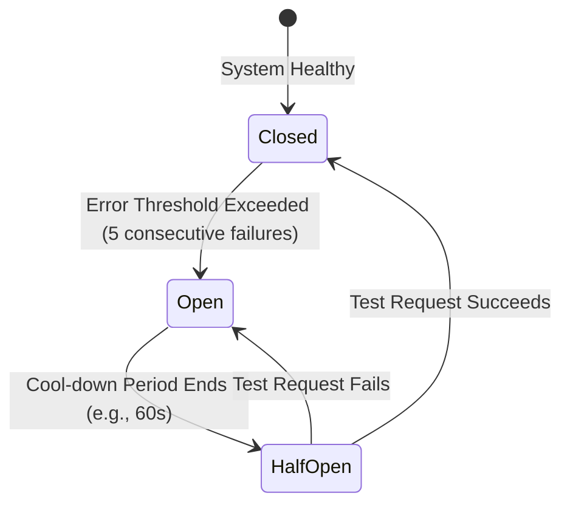

# API Engineering Standard

## Purpose & Inheritance
This document defines the core standards for designing, documenting, securing, and maintaining APIs. It inherits from and extends the [Universal Coding Standards](05-universal-coding-standards.md), the [Architecture Standards](02-architecture-and-simplicity.md), and the [Database Engineering Standard](06-database-engineering-standard.md). It establishes strict protocols for REST and GraphQL APIs, authentication, webhook integration, backward compatibility, and client-facing interfaces.

---

## 1. API Design Philosophy

APIs are **immutable integration contracts**. Once an API is deployed and consumed by external developers, frontend frameworks, or mobile clients, any changes introduce breaking hazards. We treat API design with the same rigor as database schema definition.

### Core Principles
1. **Consumer-Oriented Design**: Design APIs around the client's integration workflows, not your database tables. Hydrating raw models directly into endpoints leads to schema leakage and performance bottlenecks.
2. **Predictable Interface Semantics**: Enforce strict alignment with the HTTP protocol. Verbs (HTTP methods), status codes, and headers must behave consistently across all endpoints.
3. **Defense in Depth**: Trust no client. All inputs must be strictly typed, sized, validated, and sanitized before execution.
4. **Backward Compatibility by Default**: Plan for schema and query growth. Add fields incrementally; never remove or rename columns without a version transition protocol.
5. **Operational Observability**: Every request must be traceable. Enforce request IDs, rate limits, and audit logs on all write endpoints.

---

## 2. API Planning & Resource Design

Coding an endpoint without a pre-defined schema is prohibited. 

### Pre-Implementation Checklist
Before writing routes, developers and AI agents must document:
- **Consumer Profile**: Is this endpoint consumed by a SPA frontend (session-based), mobile app (token-based), or a third-party server (API key-based)?
- **JSON Payload Spec**: Draft schema inputs and outputs in OpenAPI/Swagger format.
- **Authentication & Policy Boundaries**: Define which roles or users own/access the target resource.
- **Performance Budget**: Establish target latency (e.g., `<100ms` response) and mapping database requirements.

### Resource Naming & URL Structure
- **Nouns Only**: Use plural nouns to represent collection resources. Never use verbs in the URL path.
- **Consistent Case**: Use kebab-case for URL segments and snake_case for JSON payloads and query parameters.
- **Hierarchical Nesting Rules**: Restrict sub-resource nesting to a maximum of **one level** to avoid overly complex paths.

```text
Good URL:    GET /api/v1/invoices
Good URL:    GET /api/v1/invoices/01h8x12bf/items
Bad URL:     GET /api/v1/getInvoices              (Uses verb in path)
Bad URL:     GET /api/v1/customers/1/orders/2/items (Over-nested, more than one level)
```

### Collection Query Protocols
To prevent database CPU exhaustion, all collection query endpoints must support:
- **Pagination**: Default to cursor-based pagination. Enforce a maximum page size (e.g., `limit=100`).
- **Filtering**: Use exact-match field query strings: `?status=pending`. Do not allow arbitrary, unindexed text filtering.
- **Sorting**: Enforce a strict whitelist of sortable columns: `?sort=-created_at` (prefix with `-` for descending).
- **Searching**: Extract text searches to dedicated indexing engines (e.g., Elasticsearch, Algolia, PostgreSQL TSVector) instead of running slow SQL `LIKE %wildcard%` queries.

---

## 3. HTTP Method Semantics

HTTP verbs define the transactional nature of API requests.

| Method | Safety | Idempotency | Use Case | Common Misuse |
| :--- | :--- | :--- | :--- | :--- |
| **GET** | Safe | Idempotent | Fetch a resource or collection. | Passing passwords in query strings. |
| **POST** | Unsafe | Non-Idempotent| Create a new resource or initiate non-idempotent actions (e.g., payment charge). | Using for read queries to bypass GET length limits. |
| **PUT** | Unsafe | Idempotent | Replace an entire resource payload. If resource doesn't exist, create it. | Using for partial updates (clears non-specified columns). |
| **PATCH** | Unsafe | Non-Idempotent| Perform a partial update to a resource (e.g., updating a status). | Using PUT instead of PATCH for field updates. |
| **DELETE** | Unsafe | Idempotent | Remove a resource. | Returning deleted records in body payload. |
| **HEAD** | Safe | Idempotent | Retrieve response headers (metadata) only, with no response body. | Returning body payload. |
| **OPTIONS**| Safe | Idempotent | Retrieve the communication requirements (CORS preflight). | Containing custom headers. |

---

## 4. Response & Error Design

API clients expect consistent response formatting. We partition responses into success envelopes and structured error codes.

### Envelope Conventions

#### Collection Success Envelope (Cursor Paginated)
```json
{
  "data": [
    {
      "id": "01h8x12bf983j",
      "amount_cents": 1200,
      "status": "pending"
    }
  ],
  "links": {
    "next": "https://api.domain.com/v1/invoices?cursor=eyJjcmVhdGVkX2F0IjoiMjAyNi0wOC0wMVQwNTozNTo0NloiLCJpZCI6MTJ9"
  },
  "meta": {
    "limit": 20
  }
}
```

#### Error Envelope (Validation Failures)
```json
{
  "error": {
    "code": "validation_failed",
    "message": "The request payload failed validation rules.",
    "details": [
      {
        "field": "amount_cents",
        "message": "Must be an integer greater than zero."
      }
    ]
  }
}
```

### Error Code Classification
Never leak raw database error messages or stacks to clients. Use generic, structured error codes mapped to HTTP status codes:

- `400 Bad Request`: `invalid_payload`, `malformed_json`
- `401 Unauthorized`: `unauthenticated`, `token_expired`
- `403 Forbidden`: `insufficient_permissions`, `resource_ownership_denied`
- `404 Not Found`: `resource_not_found`
- `422 Unprocessable Entity`: `validation_failed`
- `429 Too Many Requests`: `rate_limit_exceeded`
- `500 Internal Server Error`: `internal_error` (log stack trace internally, return only unique request tracer ID to user)

---

## 5. Authentication & Authorization

Securing access paths prevents data exposure and unauthorized operations.

### Authentication Strategy Matrix
- **Session Authentication (Cookie/Stateful)**: Best for single-origin web applications (SPAs). Leverages HttpOnly, Secure, SameSite cookies to protect credentials from XSS.
- **Token Authentication (Stateless/Bearer)**: Best for native mobile backends and cross-origin clients. Use secure token storage and enforce short-lived TTLs.
- **JWT (Json Web Tokens)**: Best for distributed microservice environments where service nodes must verify authentication locally without querying a central session database. Enforce short lifespans and signature validation.
- **API Keys**: Best for third-party developer access. Enforce prefix structures (e.g., `sk_live_...`) to allow secret scanning bots (like GitHub Secret Scanning) to detect leaked credentials.

### Access Boundaries (IDOR Prevention)
Insecure Direct Object References (IDOR) happen when endpoint routes fetch files or rows based on user input without confirming ownership.
- **Rule**: Never fetch resources directly using parameter IDs without validating access:
  ```php
  // Bad: Direct query based on URL input (IDOR Vulnerability)
  $invoice = Invoice::findOrFail($id);
  
  // Good: Scoped query through the authenticated user's tenant
  $invoice = $request->user()->tenant->invoices()->findOrFail($id);
  ```
- **Policy Enforcement**: Route access checks through security policy classes (like Laravel Policies) to verify permissions before the controller action starts.

---

## 6. Security Hardening

Defensive engineering prevents resource abuse and infrastructure attacks.

### Security Directives
1. **Input Validation (Defensive Checks)**: Enforce size and type constraints. Reject request bodies exceeding size limits (e.g., `max:10MB`) to mitigate Denial of Service (DoS) risks.
2. **Output Sanitization**: Sanitize user-generated HTML in JSON outputs to protect consumers from Cross-Site Scripting (XSS).
3. **Rate Limiting**: Enforce rate limits on all endpoints. Apply strict limits (e.g., `5 requests/minute`) to auth/login routes, and standard limits (e.g., `60 requests/minute`) to API resource paths.
4. **CORS Restrictions**: Do not configure `Access-Control-Allow-Origin: *` in production. Explicitly whitelist allowed domains.
5. **CSRF Protection**: Stateful session routes must validate anti-CSRF tokens for all state-changing verbs (`POST`, `PUT`, `PATCH`, `DELETE`).
6. **SSRF Mitigation**: When server APIs make outgoing requests to URLs provided by users, validate the host address strictly against a whitelist. Reject connections to private IP spaces (`127.0.0.1`, `10.0.0.0/8`, `169.254.169.254`).

---

## 7. Versioning & Backward Compatibility

### Versioning Protocols
- **URL Versioning**: Enforce major version indexes in the URL path: `/api/v1/resources`. This makes routing rules explicit at the gateway level.
- **Avoid Over-Versioning**: Do not increment API versions for backward-compatible additions (e.g., adding a new field to a JSON response). Only version when breaking updates (e.g., deleting fields, restructuring payload relationships) are required.

### Deprecation Strategy
When deprecating old endpoints:
1. Return a `Sunset` header containing the date of deprecation.
2. Return a `Deprecation` header containing documentation details.
3. Log usage metrics to track which clients are still using the deprecated path before turning it off.

---

## 8. Webhooks & Integrations

Webhooks allow server-to-server event synchronization.

```text
Sender Server                       Receiver Server
  ├── Trigger Event
  ├── Sign Payload with HMAC-SHA256
  └── POST Payload + Signature Header ──> 
                                     ├── Read Request Headers
                                     ├── Recompute Signature using Shared Secret
                                     └── Compare Signatures (Verify and Process or Reject)
```

### Webhook Delivery Rules
- **Signature Verification**: Every webhook sent or received must validate a cryptographic signature using a shared secret. Do not trust webhook payloads without checking signatures.
  - Generate the signature by signing the raw payload bytes with `HMAC-SHA256` using the shared secret.
- **Idempotency**: Webhook receivers must handle events idempotently. Check if the event ID (`evt_...`) was already processed before applying changes.
- **Retry Strategy**: When delivering webhooks, implement exponential backoff retry schedules (e.g., retry up to 5 times over 24 hours). Treat a `2xx` status code as successful delivery.
- **Asynchronous Handlers**: Webhook receivers must log the event, return a `202 Accepted` status code immediately, and process the payload asynchronously in a background queue. Never run business operations synchronously inside the webhook request thread.

---

## 9. Performance & Optimizations

- **Payload Size Control**: Enable compression (Gzip or Brotli) at the proxy server layer (Nginx, Cloudflare) for payloads larger than `1KB`.
- **ETags & Caching**: Use ETags (cryptographic hashes of the response payload) to support HTTP caching. If the resource hasn't changed, return a `304 Not Modified` status code:
  ```text
  If-None-Match: "a3f12b" -> Server checks hash -> Matches -> Return 304 (Save bandwidth)
  ```
- **Asynchronous Offloading**: Any request that modifies state and takes longer than `50ms` (e.g., exporting spreadsheets, sending emails) must return a task tracker URL immediately and process the work using background jobs:
  ```json
  {
    "task_id": "tsk_01h8x12bf",
    "status": "processing",
    "href": "/api/v1/tasks/tsk_01h8x12bf"
  }
  ```

---

## 10. External API Integrations (Client-Side)

When your application consumes third-party APIs, apply defensive engineering to isolate your application from external failures.

### Third-Party API Guidelines
- **Adapter Pattern**: Wrap all external client libraries inside localized adapters (`StripeGatewayAdapter`) to isolate the third-party schema details from your domain code.
- **Timeouts**: Enforce tight timeouts (`connect_timeout = 2s`, `timeout = 5s`) on external calls. Never block your HTTP request threads waiting for third-party systems.
- **Retries with Jitter**: Configure retries with exponential backoff and random jitter to prevent thundering herd problems during external outages.
- **Circuit Breaker Pattern**: If an external API fails repeatedly (e.g., 5 consecutive errors), open the circuit breaker to route subsequent requests to local fallbacks immediately, avoiding system-wide performance degradation:



---

## 11. Testing Strategy

API functionality must be validated through automated integration testing.

### Testing Protocols
1. **Contract Validation**: Test API payloads against your OpenAPI definition to verify that responses match documented schemas.
2. **Integration Asserts**: Test the full request-response lifecycle (authentication, headers, validation checks, status codes, and database changes).
3. **Mocking External APIs**: Use HTTP client fakes (`Http::fake()`) instead of hitting live external APIs. Validate that the correct request payload and headers are sent.

---

## 12. Decision Matrices

Use these matrices to identify the correct API design choice based on project context.

### Matrix 1: REST vs. GraphQL
| Context | Choice | Rationale |
| :--- | :--- | :--- |
| Standard CRUD operations, predictable resources, simple integrations | **REST** | Universal standard, easy to cache at proxy level, lower complexity. |
| Complex data fetching, dynamic client queries, dashboard aggregations | **GraphQL** | Eliminates over-fetching; client specifies required properties. |

### Matrix 2: JWT vs. Session
| Context | Choice | Rationale |
| :--- | :--- | :--- |
| Mobile apps, public APIs, distributed microservices | **JWT** | Stateless; avoids session database queries at the expense of revocation control. |
| First-party web applications (SPAs) sharing a parent domain | **Session** | Better security profile (HttpOnly cookies); allows instant session revocation. |

### Matrix 3: PUT vs. PATCH
| Context | Choice | Rationale |
| :--- | :--- | :--- |
| Complete resource replacements, upsert operations | **PUT** | Replaces the resource state entirely (idempotent contract). |
| Partial field updates (e.g., updating a status or email) | **PATCH** | Modifies only specified attributes without wiping omitted ones. |

### Matrix 4: Sync vs. Async Processing
| Context | Choice | Rationale |
| :--- | :--- | :--- |
| Fast SQL writes, credential verification, state changes needed immediately | **Sync** | Returns immediate confirmation to the user. |
| Spreadsheet exports, image resizing, heavy third-party calls | **Async** | Offloads resource consumption to queues to protect HTTP thread throughput. |

### Matrix 5: Versioning vs. No Versioning
| Context | Choice | Rationale |
| :--- | :--- | :--- |
| Breaking changes, removing payload properties, renaming schemas | **Versioning** | Prevents breaking existing client integrations. |
| Additive changes, new endpoints, new optional properties | **No Versioning** | Avoids code duplication and routing complexity. |

### Matrix 6: Direct DB Response vs. Resource Transformation
| Context | Choice | Rationale |
| :--- | :--- | :--- |
| Simple internal scratch utilities, raw debugging scripts | **Direct DB** | Zero-boilerplate setup. |
| Production API endpoints, client integrations, public web services | **Resource Transformation** | Decouples response payload from database schemas; hides internal columns. |

### Matrix 7: Webhook vs. Polling
| Context | Choice | Rationale |
| :--- | :--- | :--- |
| Real-time events notification (e.g., payment status change) | **Webhook** | Pushes updates instantly, reducing resource consumption on both sides. |
| Small systems tracking slow processes, client lacks public IP | **Polling** | Simple setup, but increases connection overhead. |

### Matrix 8: Cache vs. Fresh Data
| Context | Choice | Rationale |
| :--- | :--- | :--- |
| High-volume read collection endpoints, static settings collections | **Cache** | Reduces database query overhead and speeds up responses. |
| User profile views, real-time balances, shopping cart states | **Fresh Data** | Prevents transactional inconsistencies. |

---

## 13. AI API Rules

AI agents modifying or generating endpoints in this repository must follow these rules:

1. **Verify Route Integrity**: Search the routing definitions (`routes/api.php` or controller classes) to verify existing naming conventions before adding endpoints.
2. **Convert Models to Resources**: Never return raw database structures. Enforce transformations using dedicated resource classes (like Laravel API Resources).
3. **No Unprotected Endpoints**: Ensure every endpoint is routed through authentication middleware and is validated by a policy class (preventing IDOR).
4. **Parameter Binding Enforcement**: Ensure all input query filters and payloads are explicitly typed and validated by schema requests.
5. **Prepared Webhook Triggers**: Ensure webhook payloads include signature verification and that webhook processing is queued.

---

## 14. API Review Checklist

Use this checklist during code review to evaluate API modifications and new routes.

### Design & Semantics
- [ ] Are all path parameters named using kebab-case and resource fields in snake_case?
- [ ] Do resource routes use plural nouns (no verbs)?
- [ ] Are GET requests safe and idempotent (no state modifications)?
- [ ] Does pagination default to cursor-based limits on large data collections?

### Response & Errors
- [ ] Are outbound responses routed through translation resources (no direct database models)?
- [ ] Do errors follow the standard error structure with structured error codes?
- [ ] Are raw database exceptions caught and hidden from clients (returning generic 500 error)?

### Security & Access Control
- [ ] Are all change endpoints validated through authorization rules or policies?
- [ ] Do queries filter resources using tenant ownership paths (IDOR prevention)?
- [ ] Are rate limiters configured on all routes?
- [ ] Do webhooks use cryptographic HMAC signature validation?

### Documentation & Versioning
- [ ] Are API route modifications registered in the OpenAPI/Swagger definition?
- [ ] If a change is breaking, is the endpoint versioned appropriately?

---

## References
- Universal Coding Standards: [05-universal-coding-standards.md](05-universal-coding-standards.md)
- Database Optimizations: [06-database-engineering-standard.md](06-database-engineering-standard.md)
- Laravel Routing & Request Validation: [stacks/php-laravel/laravel-routing.md](../stacks/php-laravel/laravel-routing.md)
