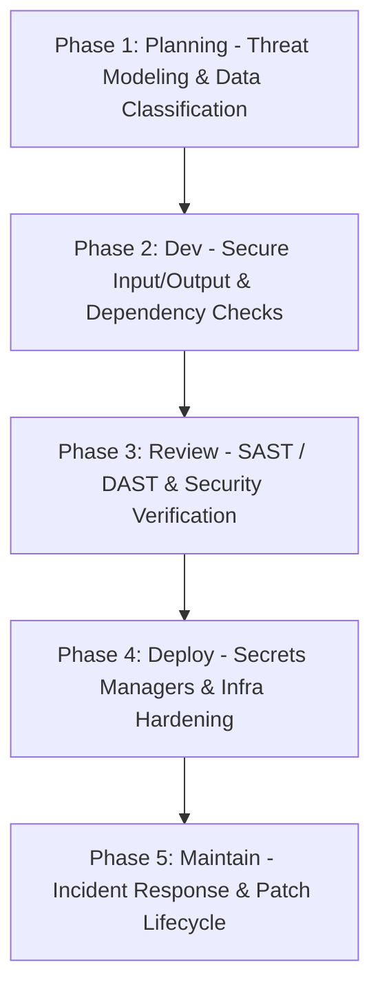

# Security Engineering Standard

## Purpose & Inheritance
This document defines the core standards for securing applications, networks, and databases. It inherits from and extends the [Universal Coding Standards](05-universal-coding-standards.md), the [Architecture Standards](02-architecture-and-simplicity.md), the [Database Engineering Standard](06-database-engineering-standard.md), and the [API Engineering Standard](07-api-engineering-standard.md). It outlines strict security rules across development frameworks (PHP/Laravel, Vue/Nuxt, Dart/Flutter), browser client environments, and API gateway configurations.

---

## 1. Security Philosophy

Security is not a checkbox added at the end of the deployment cycle; it is a **continuous engineering discipline integrated into the entire Software Development Lifecycle (SSDLC)**. 

### Risk-Balanced Engineering
We reject security theater (measures that look secure but add no real protection) and complexity bloat. Engineers must evaluate security implementation based on the following balance:

```text
Security Strength = Risk Reduction vs. (Usability + Performance + Complexity + Cost)
```

For every control proposed, specify:
- **Threat Mitigated**: What actual attack path does this block?
- **Operational Drag**: Does this introduce latency, block development, or degrade user experience?
- **Alternative Controls**: Can the same risk reduction be achieved with a simpler, lower-maintenance pattern?

---

## 2. Secure Software Development Lifecycle (SSDLC)

Our development lifecycle enforces checkpoints to catch and mitigate vulnerabilities early.



### SSDLC Phase Controls

#### Phase 1: Planning (Threat Modeling)
- Identify assets, attack vectors, and data classification boundaries.
- Map entry points and compile the attack surface boundary.

#### Phase 2: Development (Secure Coding)
- Enforce strict static analysis rules locally and in the IDE.
- Enforce parameterized queries, validation rules, and context-aware escaping.

#### Phase 3: Review (Security Verification)
- Run automated SAST and dependency audits on every pull request.
- Conduct mandatory manual security reviews for changes to auth, permissions, or cryptography logic.

#### Phase 4: Deployment (Infrastructure Hardening)
- Provision infrastructure with least privilege boundaries.
- Ingest production secrets strictly from KMS/Secret Managers; never inject `.env` parameters into build images.

#### Phase 5: Maintenance (Incident & Vulnerability Management)
- Monitor application logs, setup telemetry alerting, and review dependency patch advisories.
- Maintain a documented Incident Response plan for patching critical CVEs.

---

## 3. Threat Modeling & STRIDE

Threat modeling must be performed during the design phase of any feature modifying authentication, handling high-value assets (such as money), or exposing new public network endpoints.

### The STRIDE Threat Classification
We use the **STRIDE** methodology to classify and evaluate threats:

| Threat | Security Property | Mitigation Strategy | Example Scenario (Ledger API) |
| :--- | :--- | :--- | :--- |
| **S**poofing | Authenticity | Strong credentials, session tokens, signature checks. | Attacker clones session cookies. |
| **T**ampering | Integrity | Parameterized statements, cryptographic hashes. | Attacker alters a request transaction ID. |
| **R**epudiation | Non-repudiability | Immutable audit logs, signed ledger records. | User claims they did not initiate a transfer. |
| **I**nformation Leak | Confidentiality | Encryption at-rest/in-transit, column-level security. | DB credentials leaked via diagnostic error dump. |
| **D**enial of Service| Availability | Rate limiters, request timeouts, payload limits. | Attacker runs memory-heavy loop requests. |
| **E**levation of Privilege| Authorization | Resource ownership filters, policy classes. | Standard user access endpoint reserved for Admins. |

### DREAD Scoring Matrix
To prioritize mitigations, evaluate threat severity using the **DREAD** framework (Score 1-10 on each parameter, divide by 5):
- **Damage Potential**: How severe is the impact if the attack succeeds?
- **Reproducibility**: How easy is it for an attacker to replicate the exploit?
- **Exploitability**: What level of technical skill/tools is required?
- **Affected Users**: What percentage of your user base is impacted?
- **Discoverability**: How easy is the vulnerability to find?

---

## 4. OWASP Top Risks & Mitigations

### 1. Injection
- **SQL Injection**: Never interpolate strings into raw database executions. Always use prepared statements and parameterized bindings.
- **Command Injection**: Avoid invoking shell functions (`exec`, `system`). If shell execution is required, sanitize parameters using shell-escaping wrappers (e.g., Symfony `Process` component).
- **Template Injection**: Do not evaluate user input inside server-side template compilers (e.g., Blade, Twig, Vue templates).
- **LDAP Injection**: Escape all filters using directory-specific encoders.

### 2. Broken Authentication
- **Password Security**: Force minimum rules: $\ge 12$ characters, verified against a list of common breached passwords. Hash using `Argon2id` or `Bcrypt`.
- **Session Protections**: Generate session identifiers using high-entropy random byte engines. Enable `HttpOnly`, `Secure`, and `SameSite=Lax` or `Strict` cookie configurations.
- **MFA Enforcement**: Protect authentication state changes using time-based one-time password (TOTP) protocols.

### 3. Broken Access Control
- **IDOR**: Do not query resource tables directly by key identifiers without validating ownership:
  ```php
  // Good: Model queried through relation mapping owner scope
  $item = $request->user()->company->items()->findOrFail($itemId);
  ```
- **Privilege Escalation**: Validate vertical permission transitions at the controller router boundary using policy gates.

### 4. Cryptographic Failures
- **TLS**: Force TLS 1.3 for all web services. Disable fallback suites using weak ciphers (e.g., RC4, 3DES).
- **Encryption**: Encrypt sensitive variables using `AES-256-GCM` or `AES-256-CBC` with unique initialization vectors (IVs). Never roll custom encryption algorithms.

### 5. Security Misconfiguration
- **Debug settings**: Enforce `APP_DEBUG=false` in production. Disable system trace outputs on public API errors.
- **Default configurations**: Change default dashboard ports, credentials, and credentials keys before deploying.

### 6. Vulnerable Components & Supply Chain
- **Package Audits**: Run automated vulnerability scans (e.g., `composer audit`, `npm audit`, `snyk`) on every build pipeline step.
- **Version Pinning**: Lock production dependencies to specific patch releases via lock files (`composer.lock`, `package-lock.json`).

### 7. Software Integrity Failures
- **CI/CD Security**: Require signed commits. Prevent build pipelines from installing unsigned packages from third-party public registries without checksum verification.

### 8. Logging and Monitoring Failures
- **Audit Trails**: Log security-sensitive actions (logins, password alterations, record deletions).
- **Data Shielding**: Scrub passwords, API keys, and credit cards from application logs.

### 9. Server-Side Request Forgery (SSRF)
- **Host Whitelisting**: When checking client-supplied URLs, resolve the DNS name and reject any private network IP ranges:
  - Loopbacks: `127.0.0.0/8`, `::1`
  - Private Spaces: `10.0.0.0/8`, `172.16.0.0/12`, `192.168.0.0/16`
  - Cloud Metadata: `169.254.169.254`

---

## 5. Input Validation & Output Encoding

### Input Validation
- **Strict Whitelists**: Validate incoming payloads against a strict whitelist of fields. Reject requests containing unexpected parameters.
- **Type Checking**: Enforce bounds checking on numeric values, string lengths, and characters constraints using regular expressions.

### Output Encoding & XSS Prevention
Context-aware output encoding is mandatory. You must escape variable data before rendering it in the browser:

```html
<!-- HTML Body Context -->
<div>{{ $user_input }}</div>  <!-- Double braces auto-escape in Blade/Vue -->

<!-- HTML Attribute Context -->
<input type="text" value="{{ e($user_input) }}"> <!-- Explicitly escape values -->

<!-- JavaScript Context -->
<script>
    const data = {{ json_encode($user_input) }}; <!-- Direct assignments are unsafe; use JSON encoding -->
</script>
```

---

## 6. Browser Security, CSP & Headers

### Content Security Policy (CSP)
A robust CSP blocks cross-site scripting (XSS) and data exfiltration.

```text
Content-Security-Policy: 
  default-src 'self'; 
  script-src 'self' 'nonce-rAnd0m123' 'strict-dynamic'; 
  style-src 'self' 'unsafe-inline'; 
  object-src 'none'; 
  base-uri 'self';
```

- **Nonces Over Wildcards**: Implement a unique, single-use cryptographic token (`nonce`) generated on each HTTP request. Apply this nonce to all allowed `<script>` tags.
- **Script Restriction**: Never use `'unsafe-inline'` or `'unsafe-eval'` in script-src directives in production.
- **Connect Directives**: Restrict `connect-src` parameters strictly to authorized API endpoints to prevent scripts from exfiltrating data.

#### Laravel & Inertia CSP Implementation Example
```php
// CspMiddleware.php
public function handle($request, Closure $next)
{
    $nonce = Vite::useCspNonce(); // Generate request-unique nonce

    $response = $next($request);

    $csp = "default-src 'self'; " .
           "script-src 'self' 'nonce-{$nonce}' 'strict-dynamic'; " .
           "style-src 'self' 'unsafe-inline'; " .
           "object-src 'none'; " .
           "frame-ancestors 'none';";

    $response->headers->set('Content-Security-Policy', $csp);

    return $response;
}
```

### Security Headers Reference

| Header | Production Directive | Purpose |
| :--- | :--- | :--- |
| **Strict-Transport-Security** | `max-age=63072000; includeSubDomains; preload` | Forces HTTPS communication at the browser level. |
| **X-Content-Type-Options** | `nosniff` | Blocks MIME-sniffing execution exploits. |
| **X-Frame-Options** | `DENY` or `SAMEORIGIN` | Prevents clickjacking attacks by blocking frame nesting. |
| **Referrer-Policy** | `strict-origin-when-cross-origin` | Limits referrers leakage across domain origins. |
| **Permissions-Policy** | `geolocation=(), camera=(), microphone=()` | Disables device hardware access. |
| **Cross-Origin-Opener-Policy**| `same-origin` | Isolates browser browsing contexts to mitigate Spectre-like attacks. |
| **Cross-Origin-Resource-Policy**| `same-origin` | Prevents cross-origin reads of static assets. |

---

## 7. File Security

Uploading and handling user files introduces Remote Code Execution (RCE) hazards.

### Secure File Upload Pipeline
1. **Malware Scanning**: Run files through scanning tools (e.g., ClamAV) on upload before saving them to storage.
2. **Magic Byte Verification**: Never rely on client-provided MIME types or file extensions. Validate file types by reading the file's header signature (magic bytes).
3. **Randomized Filenames**: Rename files to random identifiers (e.g., `UUIDv4`) upon upload. Never preserve original filenames on disk.
4. **Storage Isolation**: Store uploaded files on separate storage servers (e.g., AWS S3, isolated storage nodes) without execute permissions. Never store user uploads directly inside public application document roots.
5. **Path Traversal Prevention**: Sanitize filename inputs. Strip directory navigation symbols (`../`, `..\`) to prevent path traversal attacks.

---

## 8. Frontend & Mobile Security

### Vue & Nuxt 3 Security
- **Avoid `v-html`**: Never use `v-html` to render user-generated content. If raw HTML rendering is required, sanitize the input using a proven sanitization library (e.g., DOMPurify) first.
- **Nuxt SSR Boundaries**: Do not expose server-side configuration parameters, databases credentials, or internal server tokens inside reactive states rendered on the client side. Wrap variables in `runtimeConfig` with explicit public/private boundaries.

### Flutter & Dart (Mobile Security)
- **Secure Key Storage**: Do not write sensitive user tokens, passwords, or keys to standard local storage (like `SharedPreferences` or `NSUserDefaults`). Always use secure key storage abstractions (such as Android Keystore or iOS Keychain).
- **SSL Pinning**: Implement SSL pinning on mobile API client configurations to block Man-in-the-Middle (MitM) attacks on public network configurations.
- **Root/Jailbreak Detection**: Check for compromised device states (jailbroken iOS or rooted Android) on boot. Block payment or high-value features if the device environment is compromised.

---

## 9. Secrets Management

Passwords, API keys, and certificates must be protected from leakage and exposure.

### Secrets Rules
1. **Never Commit Secrets**: Do not store credentials, API keys, or keys inside code repositories. Set up lint checks (e.g., `git-secrets`, `trufflehog`) to prevent commits from pushing credentials.
2. **Cloud Secret Managers**: In production, pull secrets dynamically from cloud vaults (such as AWS Secrets Manager, HashiCorp Vault, or Google Secret Manager).
3. **Environment Separation**: Enforce complete secret isolation between local development, testing, staging, and production environments.
4. **Rotation Schedule**: Rotate API keys and database credentials automatically at scheduled intervals (e.g., every 90 days).

---

## 10. Security Testing & Penetration Testing

System security must be verified using automated validation pipelines and manual testing methodologies.

### Security Pipelines
- **SAST (Static Application Security Testing)**: Check codebases using static security analysis tools (e.g., PHPStan with security extensions, ESLint security rules, Dart analyzer security checks) on every build pipeline step.
- **Dependency Auditing**: Scan Composer and npm lock files on every pull request to identify and block vulnerable libraries.

### Penetration Testing Foundations
Annual penetration tests must be conducted on all production API routes and customer dashboard systems.
- **Scope Definition**: Define the target IP space, domain scopes, API boundaries, and user roles to be tested.
- **Rules of Engagement**: Establish testing windows, emergency contact protocols, and boundaries for destructive testing (e.g., database injections or heavy load tests).
- **Reporting**: Vulnerability reports must be classified using the **Common Vulnerability Scoring System (CVSS v3.1)**:
  - Critical (9.0–10.0)
  - High (7.0–8.9)
  - Medium (4.0–6.9)
  - Low (0.1–3.9)
- **Remediation**: Establish strict resolution timelines:
  - **Critical**: Patch within 48 hours.
  - **High**: Patch within 14 days.
  - **Medium**: Patch within 30 days.

---

## 11. AI Security Directives

AI agents modifying code in this repository must follow these rules:

1. **Verify Authorization Boundaries**: Ensure every new endpoint or controller action includes a corresponding authorization check (e.g., policy or middleware rule).
2. **Never Disable CSRF/CORS**: Do not disable CSRF middleware, CORS restrictions, or rate limiters to resolve local development testing failures.
3. **No String Query Construction**: Do not generate database queries using variable concatenation. Parameterize all SQL commands.
4. **Context-Aware Output Encodes**: Ensure user inputs are escaped correctly before rendering in browser templates.
5. **Secrets Check**: Never write hardcoded keys or passwords in scripts or test files. Suggest pulling credentials from environment configurations.

---

## 12. Security Review Checklist

Use this checklist during code review to certify that changes align with this standard.

### Authentication & Sessions
- [ ] Are password hash configurations using Argon2id with correct memory settings?
- [ ] Are authentication session cookies configured as `HttpOnly`, `Secure`, and `SameSite=Lax` or `Strict`?
- [ ] Is rate limiting configured on the endpoint?

### Authorization & Privileges
- [ ] Are policy class authorizations configured for all model actions?
- [ ] Do database queries filter records through tenant ownership parameters (IDOR prevention)?

### Input & Output Security
- [ ] Are all inputs validated against a strict whitelist of fields and types?
- [ ] Are user inputs encoded or sanitized before being rendered in browser templates?
- [ ] Are file uploads restricted to verified MIME signatures and stored renamed with randomized identifiers?

### Browser Security & CSP
- [ ] Does the response include a valid Content-Security-Policy header using nonces or strict script hashes?
- [ ] Are security headers (HSTS, nosniff, frame-options) configured on host routing layers?

### Secrets & Config
- [ ] Are credentials stored in environment configurations (no hardcoded keys in repository)?
- [ ] Are diagnostic stack traces disabled in production payloads (APP_DEBUG=false)?

---

## 13. BOPLA — Broken Object Property Level Authorization

BOPLA is a distinct authorization failure class. Even when a user **owns** a resource, they must only be permitted to modify the fields their role is authorized to write.

- Never allow a user to update privilege-escalation fields (`role`, `balance`, `is_admin`, `status`, `permissions`) through a standard update endpoint.
- Define explicit field-level write permissions per role in a centralized policy.
- Validate and strip fields from request payloads before applying them to models.
- Do not rely solely on `$fillable` mass-assignment guards — validate which fields the **authenticated role** may write, separately from which fields the model accepts.

---

## 14. HTTP Parameter Pollution

HTTP parameter pollution exploits applications that process duplicate query string or body parameters inconsistently.

- Never trust duplicate parameters in query strings (e.g., `?role=user&role=admin`).
- Never trust duplicate field keys in a JSON request body.
- Validate and accept only explicitly expected, whitelisted parameters.
- Use a single validated input parsing strategy — do not mix raw `$_GET`/`$_POST` with framework input helpers.

---

## 15. File Parsing Attacks

### CSV/Spreadsheet Injection
- Sanitize all CSV and spreadsheet exports. Cells beginning with `=`, `+`, `-`, or `@` can execute as formula code in spreadsheet software.
- Strip or quote-escape these characters in any user-generated string before writing it to an export file.

### XXE — XML External Entity Injection
- Disable external entity loading before parsing any XML:
  ```php
  libxml_set_external_entity_loader(null); // PHP
  ```
- Validate and sanitize all XML input before processing.

### Archive Decompression (Zip Bombs)
- Set explicit size limits when decompressing archive files (`.zip`, `.tar.gz`, etc.).
- Reject archives whose decompressed size exceeds the allowable threshold.
- Never decompress user-supplied archives without size validation.

---

## 16. Subdomain Takeover Prevention

Unused DNS records pointing to deprovisioned third-party services (CDNs, SaaS platforms, cloud services) can be claimed by attackers.

- Audit all active DNS subdomains periodically.
- Remove DNS records for services that have been decommissioned.
- Before removing a cloud/SaaS service, delete its DNS record first, then deprovision the service.
- Document all active subdomains and their target services in infrastructure records.

---

## 17. Email Security

### DNS Authentication Records
Configure these DNS records on every domain that sends application email:

| Record | Purpose |
| :--- | :--- |
| **SPF** | Declares which mail servers are authorized to send email for the domain. |
| **DKIM** | Provides a cryptographic signature verifying email authenticity. |
| **DMARC** | Defines enforcement policy when SPF/DKIM checks fail. |

### Application-Level Email Rules
- Never reveal whether an email address exists in the system. Return the same response for "email not found" and "wrong password" to prevent account enumeration.
- OTP and magic link tokens must be single-use and expire after a short, defined window.
- Verify email addresses before granting full account access.
- Never log the content of email messages that may contain sensitive user data.

---

## 18. Timing Attack Prevention

Timing attacks exploit measurable differences in response time to infer secret values (tokens, passwords, hashes).

- **Never** compare tokens, secrets, or password hashes using `==`, `===`, or `strcmp()`.
- Always use a constant-time comparison function:
  - PHP: `hash_equals()` or `Hash::check()`
  - Node.js: `crypto.timingSafeEqual()`
  - Dart: Use a dedicated constant-time comparison utility.
- Use cryptographically secure random functions for all token generation:
  - PHP: `random_bytes()` or `Str::random()`
  - JavaScript: `crypto.randomBytes()` or `crypto.randomUUID()`
  - Never use `rand()`, `mt_rand()`, or `Math.random()` for security-sensitive values.
- Never use MD5 or SHA1 for password hashing. Use bcrypt (PHP `Hash::make()`, `password_hash()`).
- Never reuse IVs in symmetric encryption.

---

## 19. User-Facing Message Safety

Dynamic content inserted into the browser DOM must use text APIs, not HTML injection methods.

- Insert user-facing messages using DOM text APIs:
  ```javascript
  // Safe
  element.textContent = userMessage;
  element.innerText  = userMessage;

  // Unsafe — never use
  element.innerHTML = userMessage;
  element.outerHTML = userMessage;
  ```
- Never interpolate user-supplied strings directly into template literals that produce HTML.
- For async JSON responses (4xx, 5xx):
  - Define explicit handling for both success and error HTTP status codes.
  - Display only the pre-approved JSON `message` field from 4xx responses.
  - Maintain a generic fallback for invalid JSON, 5xx responses, timeouts, and network failures.
  - Never render raw server or database error messages as HTML.

---

## 20. Rate Limiting Standards

### Strategy
- Prefer **user/account-based** rate limiting over IP-only rate limiting. IP-only limiting blocks legitimate users sharing the same IP (NAT, corporate networks, mobile carriers).
- Rate limit by normalized account identifier (username, email, user ID) combined with an action namespace.

### Coverage
At minimum, rate-limit the following endpoint categories:
- Login attempts (by email/username)
- Password reset requests (per account)
- OTP and magic link requests (per user)
- Authenticated API requests (per user ID)
- Any sensitive financial or destructive action (per user)

### Implementation Requirements
Every persistent rate limiter must define and enforce:
- Maximum attempts, counting window, and block duration.
- Atomic attempt recording under concurrent requests (use database transactions or atomic counters).
- The exact HTTP status (typically `429 Too Many Requests`) and a safe, generic user-facing response when blocked.
- Immediate counter clearing after successful authentication where appropriate.
- Automatic expiry based on server time.
- Bounded cleanup of stale persistent records using an indexed cutoff column, deleted in bounded batches.

---

## 21. Financial Operation Security

Financial transactions require the strictest security and concurrency guarantees.

- Wrap every financial mutation (balance debit, credit, transfer) in a database transaction.
- Acquire a pessimistic lock (`SELECT ... FOR UPDATE`, `lockForUpdate()`) on all balance and wallet rows before reading and writing.
- Implement **idempotency keys** to prevent duplicate charges from network retries. Each payment intent must carry a client-generated idempotency key stored server-side.
- Verify payment gateway webhook signatures before processing any webhook payload. Reject unsigned or unverifiable payloads immediately.
- Log every financial action with: user ID, amount, action type, IP address, and timestamp. Store in an append-only audit log.
- Validate amount ranges server-side — reject negative, zero, and unrealistically large values regardless of what the frontend sends.
- Never handle raw card data. Delegate card tokenization to a certified payment processor (Stripe, Braintree, etc.).
- Recalculate all prices and amounts server-side. Never trust price or discount values submitted by the frontend.
- Coupon and discount codes must be validated for single-use per user before application.
- Refund operations must be idempotent — triggering a refund twice must not produce two refunds.

---

## 22. Three Questions — Every Endpoint, Every Time

Before finalizing any new or modified endpoint, answer these three questions:

| # | Question | Security Concern |
| :--- | :--- | :--- |
| 1 | **Who sent this?** | Authentication |
| 2 | **Are they allowed?** | Authorization |
| 3 | **Is the data safe?** | Validation and Sanitization |

If any answer is uncertain, do not ship the endpoint. Resolve the gap first.

These questions do not expire. Apply them on the first message and the hundredth. If you cannot follow a rule in a specific situation — say why and what you are doing instead. Never silently deviate from a security rule.

---

## 12. Security Review Checklist

Use this checklist during code review to certify that changes align with this standard.

### Authentication & Sessions
- [ ] Are password hash configurations using Argon2id with correct memory settings?
- [ ] Are authentication session cookies configured as `HttpOnly`, `Secure`, and `SameSite=Lax` or `Strict`?
- [ ] Is rate limiting configured on the endpoint (user/account-based, not IP-only)?
- [ ] Are tokens compared with constant-time functions (`hash_equals`, `timingSafeEqual`)?

### Authorization & Privileges
- [ ] Are policy class authorizations configured for all model actions?
- [ ] Do database queries filter records through tenant ownership parameters (IDOR prevention)?
- [ ] Is BOPLA checked — are field-level write permissions validated per role, not just ownership?

### Input & Output Security
- [ ] Are all inputs validated against a strict whitelist of fields and types?
- [ ] Are user inputs encoded or sanitized before being rendered in browser templates?
- [ ] Are file uploads restricted to verified MIME signatures and stored renamed with randomized identifiers?
- [ ] Are duplicate query string / body parameters rejected (HTTP Parameter Pollution)?
- [ ] Are CSV/spreadsheet exports sanitized against formula injection?
- [ ] Is XML parsing protected against XXE (external entity loading disabled)?
- [ ] Is user-facing dynamic content inserted via `textContent`/`innerText`, not `innerHTML`?

### Browser Security & CSP
- [ ] Does the response include a valid Content-Security-Policy header using nonces or strict script hashes?
- [ ] Are security headers (HSTS, nosniff, frame-options) configured on host routing layers?

### Secrets & Config
- [ ] Are credentials stored in environment configurations (no hardcoded keys in repository)?
- [ ] Are diagnostic stack traces disabled in production payloads (APP_DEBUG=false)?
- [ ] Are email DNS records (SPF, DKIM, DMARC) configured on all sending domains?

### Financial Operations
- [ ] Are all financial mutations wrapped in a database transaction with a pessimistic lock?
- [ ] Are idempotency keys implemented to prevent duplicate charges?
- [ ] Are webhook signatures verified before processing?
- [ ] Are all amounts recalculated server-side?

### Infrastructure
- [ ] Are DNS subdomains audited for stale records pointing to decommissioned services?
- [ ] Are all archive decompression operations size-bounded?

---

## References
- Database Safety: [06-database-engineering-standard.md](06-database-engineering-standard.md)
- API Security: [07-api-engineering-standard.md](07-api-engineering-standard.md)
- PHP Strict Conventions: [stacks/php-laravel/php-conventions.md](../stacks/php-laravel/php-conventions.md)
- Deployment Pipeline Asserts: [environment/03-ci-cd-pipelines.md](../environment/03-ci-cd-pipelines.md)
- Security Testing & Threat Modeling: [09-security-testing-and-threat-modeling.md](09-security-testing-and-threat-modeling.md)
