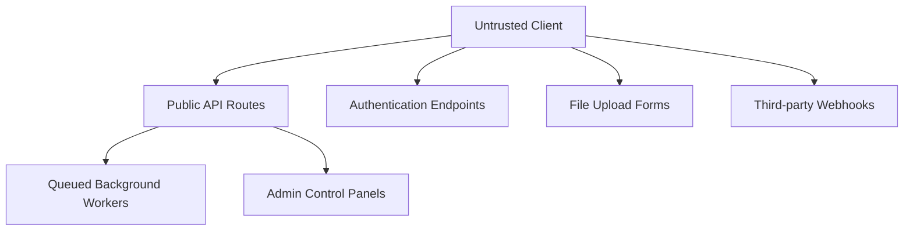
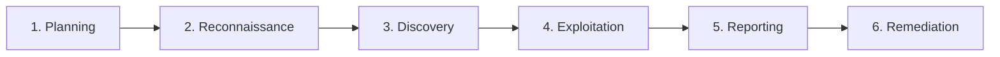

# Security Testing and Threat Modeling Workflow

## Purpose & Inheritance
This document defines the core standards for threat modeling and penetration testing. It inherits from and extends the [Universal Coding Standards](05-universal-coding-standards.md), the [Architecture Standards](02-architecture-and-simplicity.md), and the [Security Engineering Standard](08-security-engineering-standard.md). It outlines practical testing workflows to discover architectural flaws and software vulnerabilities before deployment.

---

## 1. Security Assessment Philosophy

Testing security is not merely compiling lists of generic scanner flags. A professional security assessment must establish the **contextual business risk** of findings.

### Rules of Risk Analysis
1. **No Vulnerability Without Impact**: An isolated bug (e.g., exposing a internal server version string) is not a critical risk unless it can be combined with other vectors to create an exploit path. Risk is defined as:
   $$\text{Risk} = \text{Likelihood} \times \text{Business Impact}$$
2. **Treat the Root Cause**: Do not suggest surface-level hotfixes (like blocking a specific input string). Analyze the underlying architectural flaw (e.g., missing input sanitization or parameterized bindings) to prevent the bug from returning.

---

## 2. Threat Modeling Workflow

Threat modeling is a structured process to identify and mitigate risks during the system design phase, before any code is written.

```text
Understand the System ──> Identify Assets ──> Identify Threat Actors ──> STRIDE Analysis ──> Define Mitigations
```

### Step 1: Understand the System
Document the architecture and boundaries of the target feature:
- **Architecture Diagram**: Map components (web proxy, load balancer, app code, queues, databases, cache).
- **Data Flows**: Track where input data enters the system and where it is saved.
- **Trust Boundaries**: Identify boundaries where data transitions from untrusted spaces to secure spaces (e.g., client browser $\rightarrow$ API endpoint).
- **Authentication & Authorization Points**: Map where user identity is validated and where resource access rules are checked.

### Step 2: Identify Assets
List the items that must be protected:
- **Sensitive Data**: PII, credit card details, session tokens, passwords.
- **Infrastructure**: Application servers, production databases, cloud object storage.
- **Business Operations**: Payment gateways, account sign-ups, ledger systems, admin panels.

### Step 3: Identify Threat Actors
Define the attackers, their motivations, and their access levels:
- **External Attacker**: Unauthenticated actor on the public internet. Highly motivated to exfiltrate data or compromise resources.
- **Malicious Authenticated User**: Standard tenant user trying to bypass access controls to view another tenant's data (IDOR focus).
- **Compromised Account**: A valid user account taken over by an attacker (via credential stuffing or session theft).
- **Insider Threat**: A malicious employee or administrator attempting to modify financial records or dump data.
- **Automated Bots**: Scanners scraping endpoints to find vulnerabilities or abuse API endpoints (e.g., spamming sign-up forms).

---

## 3. Attack Surface Analysis

Mapping your attack surface exposes all entry points that are vulnerable to exploitation:



- **Authentication Endpoints**: Login forms, token exchanges, password resets, registration routes.
- **API Endpoints**: Input fields, route parameters, JSON request payloads.
- **Admin Control Panels**: Interfaces with elevated system privileges.
- **File Uploads**: Paths allowing users to write files to disk.
- **Webhook Handlers**: Public endpoints processing events from third-party systems.
- **Background Jobs**: Queued processes that deserialize data objects.

---

## 4. STRIDE Threat Modeling Application

Apply the STRIDE framework to analyze threats and establish mitigations:

### 1. Spoofing (Authenticity)
- *Threat*: An attacker intercepts a session token and spoofs a user's identity to call private API routes.
- *Mitigation*: Enable `Secure` and `HttpOnly` cookie flags. Use cryptographic signature checks (HMAC) on API requests.

### 2. Tampering (Integrity)
- *Threat*: An attacker intercepts an API call to `/orders` and alters the `amount_cents` field to pay less.
- *Mitigation*: Enforce database-level schema validation. Recalculate price totals on the server instead of trusting client inputs.

### 3. Repudiation (Non-repudiability)
- *Threat*: An admin user deletes a database table and claims the action was a system bug.
- *Mitigation*: Log administrative operations to an immutable, write-once logging system.

### 4. Information Disclosure (Confidentiality)
- *Threat*: A database query error throws a full stack trace to the public API response, exposing database column schemas.
- *Mitigation*: Disable debug stack traces in production (`APP_DEBUG=false`). Return generic error codes.

### 5. Denial of Service (Availability)
- *Threat*: An attacker sends thousands of heavy search requests, saturating database connections.
- *Mitigation*: Configure rate limiters and enforce pagination limits. Implement request timeouts at the web server layer.

### 6. Elevation of Privilege (Authorization)
- *Threat*: A standard user modifies their client cookie payload to change their role status from `member` to `admin`.
- *Mitigation*: Enforce server-side role validation. Never trust role parameters passed from client payloads.

---

## 5. Penetration Testing Phases

Our penetration testing methodology consists of six sequential phases:



### Phase 1: Planning & Scope Definition
Define the boundary parameters for the test:
- **Scope**: Specific URLs, domain limits, target IP addresses, and user accounts.
- **Rules of Engagement**: Approved testing windows, contact protocols for system outages, and restrictions on destructive testing.
- **Allowed Testing**: Specify if automated vulnerability scanners, brute-force attacks, or privilege escalations are allowed.

### Phase 2: Reconnaissance & Information Gathering
Discover system and framework configurations:
- Identify underlying tech stacks, framework versions (e.g., Laravel, Nuxt), database types, and proxy servers.
- Scan for public endpoints, open directories, and leftover configuration files.

### Phase 3: Vulnerability Discovery
Search for weaknesses across target domains:
- Test input fields for injection vulnerabilities (SQLi, XSS).
- Analyze session management and token generation rules.
- Map out route structures to search for missing authorization checks.

### Phase 4: Exploitation Validation
Verify security findings manually:
- Confirm whether a discovered vulnerability can be executed to achieve an exploit.
- Assess actual business consequences (e.g., can this SQL injection dump credentials, or does it trigger an error)?
- Document step-by-step instructions to reproduce the exploit.

### Phase 5: Reporting
Compile findings into a structured report using this template:

```markdown
### [FINDING-01] IDOR on Invoice Download Endpoint
- **Severity**: High (CVSS v3.1: 8.5)
- **Description**: The invoice download route does not validate user ownership.
- **Impact**: Any authenticated user can view another user's invoice details by incrementing the ID.
- **Evidence**:
  ```http
  GET /api/v1/invoices/9924/download HTTP/1.1
  Authorization: Bearer token_of_user_A
  ```
- **Remediation**: Scope query checks through the authenticated user's tenant object.
```

### Phase 6: Remediation Testing
Validate that fixes resolve the root cause:
- Run regression tests to verify the patch works.
- Verify that the patch does not break existing application behavior or introduce new vulnerabilities.

---

## 6. Application Testing Areas

### Authentication
- **Weak Passwords**: Verify if the registration form allows passwords like `password123`.
- **Brute Force**: Verify if authentication forms are locked after multiple failed attempts.
- **Session Security**: Inspect cookies for `HttpOnly`, `Secure`, and `SameSite` configurations.

### Authorization
- **IDOR**: Test routes containing ID parameters (e.g., `/users/{id}`) by passing an ID belonging to another user.
- **Privilege Escalation**: Log in with a low-privilege account and attempt to access admin routes (e.g., `/admin/users`).

### Input Handling
- **SQLi**: Inject special symbols (`'`, `"`, `OR 1=1`) into inputs to verify parameter binding behavior.
- **XSS**: Inject script tags (`<script>alert(1)</script>`) into inputs and check if they execute when rendered.
- **Path Traversal**: Pass directory navigation symbols (`../../etc/passwd`) to file download routes.

### Business Logic
- **Price Manipulation**: Attempt to check out an item with a negative price parameter (`-1000` cents).
- **Workflow Bypass**: Attempt to skip step checkout dependencies (e.g., checking out without paying).
- **Race Conditions**: Send duplicate API requests concurrently to verify if balance limits are bypassed before DB locks register.

---

## 7. Security Risk Rating

We prioritize security findings using the **Common Vulnerability Scoring System (CVSS v3.1)**:

| Severity | Score Range | Mitigation Timeline | Priority |
| :--- | :--- | :--- | :--- |
| **Critical** | 9.0–10.0 | Patch within 48 hours | Immediate hotfix. Blocks releases. |
| **High** | 7.0–8.9 | Patch within 14 days | Major release blocker. |
| **Medium** | 4.0–6.9 | Patch within 30 days | Standard scheduling. |
| **Low** | 0.1–3.9 | Patch in next cycle | Deprioritized ticket. |
| **Informational**| 0.0 | No timeline | Code quality task. |

---

## 8. Security Tools

Tools help identify automated vulnerabilities, but they do not replace secure engineering practices:

- **SAST (Static Analysis)**: Checks source code files for syntax flaws (e.g., PHPStan with security extensions, ESLint).
- **SCA (Dependency Scanning)**: Checks third-party libraries for open CVEs (e.g., `composer audit`, `npm audit`).
- **DAST (Dynamic Analysis)**: Scans active endpoints for run-time vulnerabilities (e.g., OWASP ZAP).
- **Intercepting Proxies**: Captures and modifies HTTP traffic manually (e.g., Burp Suite, OWASP ZAP).

---

## 9. AI Security Review Workflow

AI coding agents must run this self-review checklist before completing code modifications:

```text
1. Did I introduce raw variable interpolations in SQL or commands?
2. Did I add a public HTTP route? If yes, is it protected by authentication and authorization middleware?
3. Did I write or read a file? If yes, is the path traversal proof?
4. Are database operations wrapped in transactional boundaries?
5. Did I output user-generated values to browser templates? If yes, are they encoded?
```

---

## 10. Security Testing Checklists

Use these checklists to evaluate features before deployment.

### New Features Checklist
- [ ] Has threat modeling been performed for the new feature?
- [ ] Are all new entry points (routes, forms, parameters) documented?
- [ ] Are input validations defined for all incoming fields?

### Authentication Changes Checklist
- [ ] Are passwords validated for complexity ($\ge 12$ characters)?
- [ ] Are session identifiers generated using cryptographically secure random value generators?
- [ ] Are login endpoints protected by rate limiters?

### Payment Changes Checklist
- [ ] Are prices calculated exclusively on the server side?
- [ ] Are multi-table database alterations wrapped inside a transaction block?
- [ ] Have race condition checks been run on inventory/balance deductions?

### File Uploads Checklist
- [ ] Are file mime types validated using file signature check tools?
- [ ] Are uploaded files renamed to randomized strings?
- [ ] Are files saved to an isolated storage server without execution privileges?

---

## References
- Security Engineering Standard: [08-security-engineering-standard.md](08-security-engineering-standard.md)
- Secure Database Schema Design: [06-database-engineering-standard.md](06-database-engineering-standard.md)
- API Security Controls: [07-api-engineering-standard.md](07-api-engineering-standard.md)
