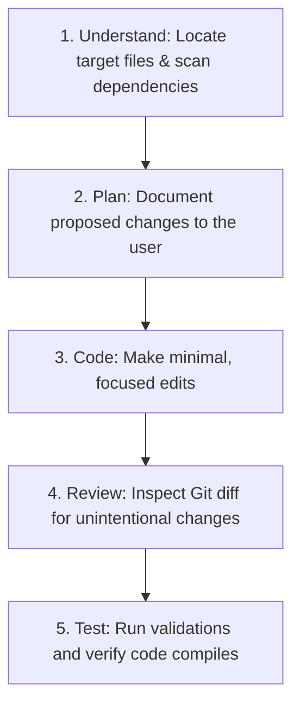

# Git and Collaboration Standard

## Purpose & Inheritance
This document defines the core standards for version control configuration, commit standards, branching models, code review protocols, and team collaboration. It inherits from and extends the [Universal Coding Standards](05-universal-coding-standards.md), the [Architecture Standards](02-architecture-and-simplicity.md), and all preceding core engineering documents. It establishes strict rules for human developers and AI coding agents collaborating in this repository.

---

## 1. Version Control Philosophy

Git is not a backup system; it is a **chronological ledger of system evolution**. Clean version control history provides:
- **Traceability**: An unbroken audit trail connecting feature requests to code modifications.
- **Collaboration Readiness**: Clear boundaries between active developer workspaces, preventing merge conflicts.
- **Accountability & Intent**: Documentation of *why* changes were made, not just *what* code was changed.
- **Safe Recovery**: The ability to roll back individual breaking changes without losing unrelated features.

---

## 2. Repository Structure & Hygiene

### Repository Standards
- **README Quality**: Every repository must contain a root-level `README.md` documenting installation setups, dependencies, test commands, and quick-start instructions.
- **Documentation Placement**: Put architecture designs, standard guides, and API specifications inside a dedicated `/docs` directory or register them in the playbook manifest.
- **Configuration Templates**: Do not commit configuration files containing credential settings. Provide an `.env.example` or `config.example.json` mapping all required variables with dummy values.
- **Strict gitignore**: Maintain a `.gitignore` template at the repository root to block temporary files, build outputs (`/node_modules`, `/vendor`), lock files flags, and environment configurations.

---

## 3. Commit Standards

Small, single-purpose commits keep code review paths transparent and make rollbacks trivial.

### Good Commit Characteristics
- **Single Intent**: A commit must address exactly one task (e.g., fixing a specific bug, adding a single model, updating a CSS style). Do not mix unrelated refactors and feature code in a single commit.
- **Atomic Operations**: The codebase must remain in a compilation-safe and test-passing state after every commit. Do not commit broken compile code.
- **Descriptive Messages**: Commit messages must clearly state the intent of the change.

```text
Good Commit:   fix(auth): correct token expiration validation checks
Good Commit:   feat(billing): add billing checkout layout resource
Bad Commit:    fix things and updated auth and refactored models
Bad Commit:    wip
```

---

## 4. Commit Message Conventions

We enforce the **Conventional Commits** specification (v1.0.0) for all commit messages.

### Message Structure
```text
<type>(<scope>): <description>

[optional body]

[optional footer(s)]
```

### Commit Types
- `feat`: A new feature addition.
- `fix`: A bug fix.
- `refactor`: Code changes that neither fix a bug nor add a feature (structural modifications).
- `docs`: Documentation alterations only.
- `test`: Adding missing tests or correcting existing tests.
- `chore`: Modifying build processes, dependency libraries versions, or auxiliary tools.
- `perf`: Code modifications optimizing performance.
- `security`: Changes mitigating security vulnerabilities.

---

## 5. Branching Strategy Matrix

Select the correct branching model based on team dynamics and deployment frequencies. Unless a project configuration specifies otherwise, prefer short-lived, focused feature branches.

### Naming Conventions for Branches
All branch names should follow standard semantic prefixes:
- **Features**: `feature/user-profile`, `feature/payment-webhooks`
- **Bug Fixes**: `fix/login-timeout`
- **Production Hotfixes**: `hotfix/payment-failure`
- **Auxiliary Work**: `chore/dependency-updates`

Avoid long-running branches that diverge frequently from the main line.

### 1. Trunk-Based Development
- **Concept**: Developers push small commits directly to the main branch (`main` or `master`) or merge short-lived feature branches multiple times per day.
- **When to Use**: Best for highly automated teams running robust CI/CD pipelines with comprehensive automated test suites.
- **Benefits**: Eliminates heavy merge conflicts ("merge hell") and accelerates feature delivery.
- **Trade-offs**: Requires disciplined developers and strict test gates to prevent breaking the build.

### 2. Feature Branching (Git Flow Light - Recommended Default)
- **Concept**: Developers create dedicated feature branches from `main`, push commits, open a Pull Request (PR), and merge after peer review.
- **When to Use**: Best for collaborative team environments, open-source projects, and systems requiring strict review controls.
- **Benefits**: Protects the main branch from unverified code; supports team code reviews.
- **Trade-offs**: Can lead to long-lived branches that diverge from main, introducing complex merge conflicts.

### 3. Git Flow
- **Concept**: Heavy branch segregation using `main` (production), `develop` (staging), `feature/*`, `release/*`, and `hotfix/*` branches.
- **When to Use**: Best for legacy enterprise systems with scheduled, slow release cycles (e.g., monthly releases).
- **Benefits**: Provides strict isolation for release preparation.
- **Trade-offs**: High branch management overhead; slows down hotfix releases.

---

## 6. Pull Request (PR) Standards

A Pull Request is an invitation for review. It must contain all the context required to verify the safety and correctness of the change.

### PR Description Template
```markdown
## Goal
Describe the problem being solved and the user impact.

## Proposed Changes
- Summary of files created or modified.
- Architectural design decisions.

## Verification & Testing
- Commands run to verify.
- Test logs or links to CI runs.
- [NEW/MODIFY] Include screenshots/videos if UI changes exist.

## Risk & Mitigations
State any database locking, migration, or backward-compatibility concerns.
```

---

## 7. Code Review Protocol

Code reviews are a collaborative process to protect code quality, not a gate for personal criticisms or styling debates.

### Review Focus Areas
1. **Correctness**: Does the code solve the target issue? Are edge cases handled?
2. **Architecture**: Does it align with playbook design conventions? Does it reuse existing abstractions?
3. **Security**: Are authorizations checked? Is input validation parameterized?
4. **Performance**: Are N+1 queries introduced? Are memory limits respected?
5. **Testing**: Are business rules and behaviors covered by integration tests?

### Reviewer Mindset Checklist
When reviewing a Pull Request, evaluate the code using these five questions:
- *Does this change preserve existing, correct behavior?*
- *Can this implementation be simplified?*
- *Is unnecessary code duplication introduced?*
- *Does it adhere strictly to the project's design and code conventions?*
- *Will another developer be able to read and understand this quickly?*

### Review Comments Guidelines
- **Focus on Code**: Address issues in the code, not the developer.
- **Explain the Rationale**: Always state *why* a change is requested (reference this playbook).
- **Clear Actions**: Explicitly demarcate critical blockers vs. minor suggestions.

### Code Ownership
- Respect `CODEOWNERS` configuration files where present.
- Changes affecting owned folders or files must receive review and approval from the designated maintainers. Avoid bypassing ownership gates.

---

## 8. Merge Strategies

- **Squash Merge**: Combines all commits from a feature branch into a single commit before merging to `main`. This is the **default strategy for feature branches** to keep the `main` history clean and linear.
- **Rebase Merge**: Re-applies feature branch commits on top of the main branch. Best for resolving conflicts locally before squashing.
- **Standard Merge Commit**: Preserves the complete commit history and branching tree. Best for merges between major deployment tracks (e.g., merging `develop` to `main`).

### Conflict Resolution Rules
- **Never accept both sides** of a merge conflict without fully understanding the combined runtime execution behavior.
- **Verify compile safety**: Execute automated tests and build scripts immediately after conflict resolution is completed to prevent broken imports from reaching upstream.

---

## 9. Release & Change Management

### Semantic Versioning (SemVer)
Enforce SemVer (`MAJOR.MINOR.PATCH`) version increments:
- **MAJOR**: Breaking changes that require modifications on the client consumer side.
- **MINOR**: Additive changes that are backward-compatible (new features, new options).
- **PATCH**: Backward-compatible bug fixes and optimizations.

### Tagging & Changelogs
- **Tags**: Every release deployment must be tagged in Git with the version index (e.g., `v1.4.2`).
- **Changelog**: Maintain a root-level `CHANGELOG.md` file summarizing major changes, fixes, and migration guides for every version step. Categorize entries by features, bug fixes, security patches, performance optimizations, and breaking changes. Avoid vague logs.
- **Hotfix Process**: Hotfixes must branch from the latest release tag, execute the fix, deploy, and merge back to both `main` and active staging branches.

### Clean Reversibility (Rollbacks)
- Every release deployment must have a clean rollback path.
- Avoid releases that require manual data reconstruction or irreversible database modifications. Always write reversible migrations.

### Dependency Upgrades Strategy
- Perform dependency updates as standalone, dedicated commits or branches. Do not mix dependency version upgrades into unrelated business features.
- Evaluate upgrades against security advisories, licensing compatibility, and maintenance indicators before merging.

### Release Stabilization & Freeze Discipline
Keep releases predictable. Do not introduce refactoring, major dependency upgrades, decorative style cleanups, or unrelated performance optimizations during:
- Hotfixes.
- Release candidates.
- Production stabilization or code freeze windows.

### Release Verification Safety Check
Prior to deploying a release, confirm:
1. All unit, integration, and E2E tests pass.
2. Database migrations are audited and verified.
3. System configuration parameters are updated.
4. Production secrets are verified as accessible in SRE variables.
5. Feature flags are configured and tested.
6. Dashboards and observability systems are operational.
7. The rollback procedure is documented and distributed.

---

## 10. Security in Version Control

Leaking credentials in code repositories is a critical security failure.

### Security Hygiene
- **Never Commit Secrets**: Secrets must reside exclusively in environment variables or cloud KMS systems.
- **Secrets Scanning**: Enforce automated secrets scanning (e.g., TruffleHog, GitGuardian) inside pre-commit hooks and CI pipelines to block commits containing API keys, private keys, or passwords.
- **History Cleanup**: If a secret is committed, rotating the credential is mandatory. Do not assume deleting the commit fixes the leak; Git history preserves records. Use `git-filter-repo` or BFG Repo-Cleaner to purge the variable from the repository history.

---

## 11. Collaboration with AI Agents

When AI agents collaborate in this repository, they must follow a structured execution workflow to prevent uncontrolled refactors.

### AI Code Generation Workflow



### AI Commit Rules
Before invoking a Git commit, the AI agent must verify:
- Only files related to the requested change are modified.
- No styling format rewrites or whitespace noise have been introduced.
- Automated tests pass successfully.
- No secrets or configuration keys have been written.
- The commit message strictly adheres to the Conventional Commits specification.
- Related modifications are grouped together; do not perform opportunistic refactoring unless requested or strictly required for code correctness.
- Explain deployment considerations and potential impacts when changes affect production environments.

---

## 12. Legacy Repositories

When working with legacy repositories that have poor commit history or lack documentation:
1. **Never Rewrite Shared History**: Do not force-push (`git push --force`) to rewrite history on shared team branches.
2. **Document Discoveries**: As you analyze legacy code modules, document your findings in Markdown files inside the `/docs` folder instead of leaving legacy systems undocumented.
3. **Incremental Improvements**: Apply changes in small feature branches. Improve the code structure gradually as you touch target files, rather than attempting massive refactors.

---

## 13. Decision Matrices

Use these matrices to identify the correct collaboration decision based on project context.

### Matrix 1: Feature Branch vs. Trunk-Based Development
| Context | Choice | Rationale |
| :--- | :--- | :--- |
| Large team, complex codebases, strict review compliance requirements | **Feature Branches** | Protects the release branch and allows peer reviews. |
| High-trust teams, microservice layouts, strong automated test suites | **Trunk-Based** | Minimizes merge conflicts and speeds up delivery. |

### Matrix 2: Squash Merge vs. Merge Commit
| Context | Choice | Rationale |
| :--- | :--- | :--- |
| Merging short-lived feature branches into main | **Squash Merge** | Cleans up intermediate commits; keeps the main history linear. |
| Merging release branches or staging tracks | **Merge Commit** | Preserves commit history and relationships across release versions. |

### Matrix 3: Small Commits vs. Large Commits
| Context | Choice | Rationale |
| :--- | :--- | :--- |
| Standard feature developments, bug fixes | **Small Commits** | Easy to review, test, and roll back if issues arise. |
| Large system upgrades, initial folder setups | **Large Commits** | Groups high-cohesion files together when code cannot compile in isolation. |

### Matrix 4: Git Flow vs. Simpler Workflows (GitHub Flow)
| Context | Choice | Rationale |
| :--- | :--- | :--- |
| Simple SaaS developments, continuous deployments | **GitHub Flow** | Lightweight; feature branches merge directly to main. |
| Regulated enterprise software with scheduled releases | **Git Flow** | Strict environment segregation for release verification. |

### Matrix 5: Rebase vs. Merge
| Context | Choice | Rationale |
| :--- | :--- | :--- |
| Syncing a local feature branch with the remote main branch | **Rebase** | Keeps the commit history clean and linear before squashing. |
| Integrating changes from a teammate's branch into your branch | **Merge** | Preserves actual development timelines and conflict resolutions. |

---

## 14. Review Checklist

Before finalizing code changes, verify your branch against this Git and release checklist:
- [ ] **Focused branch**: The feature branch prefix fits the work type (feature/, fix/, hotfix/, chore/) and isolates a single objective.
- [ ] **Small logical commits**: Changes are committed in distinct logical chunks rather than a single monolithic block.
- [ ] **Clear commit messages**: Messages describe the what and why in the imperative mood, following Conventional Commits.
- [ ] **Reviewable pull request**: The PR scope is small and contains a detailed solution description, testing, and rollback strategy.
- [ ] **Documentation updated**: README instructions, `.env.example`, and APIs are documented in sync with the codebase.
- [ ] **Tests completed**: Unit and integration tests compile, resolve conflicts safely, and pass cleanly.
- [ ] **Release notes prepared**: Release tag annotations and root changelog entries are detailed with no vague descriptions.
- [ ] **Rollback considered**: Reversible migrations and rollback procedures are tested and clear.
- [ ] **Semantic version impact identified**: Calculated SemVer version increment (Major, Minor, Patch) matches the change type.
- [ ] **Deployment risks explained**: Configuration, dependency changes, database locks, and monitoring status are mapped.

---

## References
- Universal Naming Rules: [core/05-universal-coding-standards.md](05-universal-coding-standards.md)
- Testing & CI Pipelines: [core/11-testing-engineering-standard.md](11-testing-engineering-standard.md)
- Infrastructure Environment Standards: [environment/01-local-dev-standards.md](../environment/01-local-dev-standards.md)
