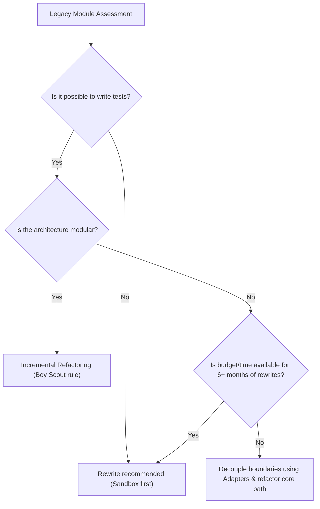

# Rewrite vs. Refactor Decision Tree

This guide outlines the critical trade-off factors, evaluation scores, and decision criteria to determine if a legacy application or module should be refactored incrementally or rewritten from scratch.

---

## 1. Decision Criteria Grid

Use this scoring grid to evaluate the target codebase:

| Criteria | Scoring 1 (Favors Refactoring) | Scoring 3 (Borderline Case) | Scoring 5 (Favors Rewrite) |
| :--- | :--- | :--- | :--- |
| **Business Value** | Simple internal tool, low rate of feature change | Moderate user activity, steady growth | Core system driving primary business revenue |
| **Vulnerability Density** | Minor lints, minor bugs, easy patch application | Repeated auth flaws, lacks testing safety net | Core structural security bugs, SQL injection-prone |
| **Dependency Lock** | Standard packages with simple upgrades | Major framework upgrades needed | Framework version deprecated, code relies on obsolete library |
| **Logic Obfuscation** | Clean structure, some undocumented functions | Spaghetti files, lacks modular separation | Completely unmaintainable "god" files with no tests |

---

## 2. Decision Trees

---

## 3. Operational Rules
- **Rule 1**: Never initiate a rewrite solely because the code is "ugly." Ugliness is aesthetic; correctness and reliability are functional.
- **Rule 2**: If refactoring is chosen, follow the protocols in [Safe Legacy Modernization and Refactoring](../legacy/01-safe-refactoring.md).
- **Rule 3**: If a rewrite is approved, run the new logic in parallel using feature flags before sunsetting the old path (refer to [Deployment Risk Reduction](../legacy/03-deployment-risk-reduction.md)).
