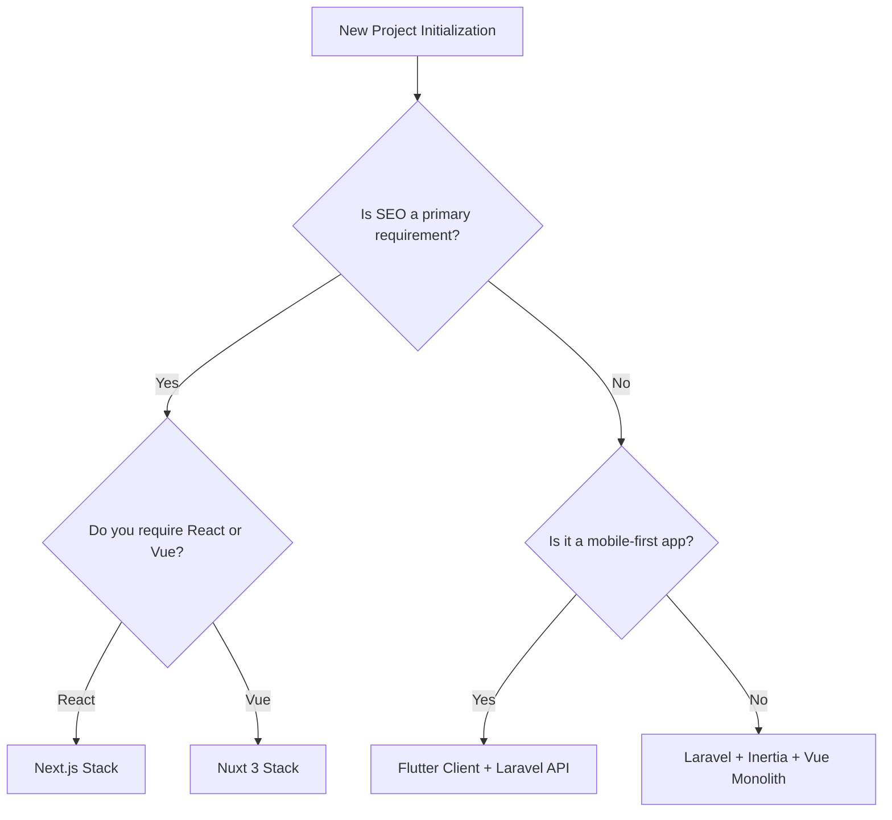

# Stack Selection Matrix

This guide provides the framework for selecting the appropriate engineering stack combination based on project complexity, target platform, and performance budgets.

---

## 1. Stack Evaluation Matrix

| Project Requirements | Selected Stack | Architectural Pattern | Rationale |
| :--- | :--- | :--- | :--- |
| Single web portal, rapid prototype, heavy CRUD | **Laravel Monolith** | MVC with Blade or Livewire | Low operational overhead; database modeling is tightly integrated. |
| Rich interactive web application, complex frontend state | **Laravel + Inertia + Vue** | Monolithic routing, rich JS client representation | Syncs backend state with frontend components directly; removes API serialization bloat. |
| Multi-platform mobile app, native speed requirements | **Laravel API + Flutter** | Decoupled client communicating via REST APIs | Unified codebase for iOS and Android; uses stateless JWT tokens (refer to [Laravel API Flutter](../bridges/laravel-api-flutter.md)). |
| Server-Side rendered portal, SEO-driven platform | **Nuxt 3 or Next.js** | Decoupled hybrid rendering | High performance, static caching, SEO configuration (refer to [SEO Engineering Standard](../core/27-seo-engineering-standard.md)). |

---

## 2. Selection Flowchart

---

## 3. Operational Directives
- **Rule 1**: Avoid using Next.js/Nuxt if the application is purely a back-office administration tool with no public search crawler needs.
- **Rule 2**: When using decoupled stacks, document and lock the API contract using OpenAPI specs *before* starting frontend component designs (refer to [Data and API Modeling](../core/03-data-and-api-modeling.md)).
