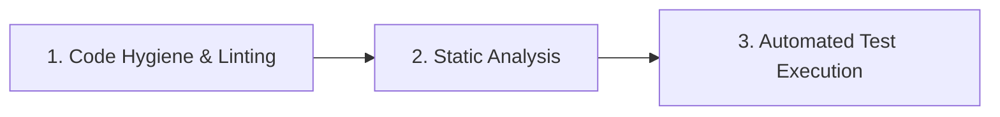

# Continuous Integration and Validation Pipelines

## Purpose
This document defines standards for CI workflows, ensuring that code style linting, unit/integration testing, security auditing, and static analysis checks are automated on every commit.

## Scope
Applies to GitHub Actions configuration, local git hooks, static code analyzers, and automated test runners.

---

## The Three Pipeline Gates

Every commit destined for integration branches (e.g. `main`, `develop`) must successfully pass through three automated validation gates:

### Gate 1: Code Hygiene & Linting
- **Rules**:
  - Run formatting checks to ensure code matches target ecosystems guidelines.
  - Fail execution on syntax formatting violations.
- **Commands**:
  - PHP: `vendor/bin/php-cs-fixer fix --dry-run`
  - JS/TS: `npm run lint`
  - Dart/Flutter: `flutter format --set-exit-if-changed .`

### Gate 2: Static Analysis
- **Rules**:
  - Verify static type completeness and structural correctness.
  - No code with logical errors or undeclared classes can pass.
- **Commands**:
  - PHP: `vendor/bin/phpstan analyse -l 8`
  - JS/TS: `npm run typecheck` (or `tsc --noEmit`)
  - Dart/Flutter: `flutter analyze`

### Gate 3: Automated Test Execution
- **Rules**:
  - Run all unit and integration/feature tests.
  - Fast unit tests must execute first; if a unit test fails, the runner should abort immediately before booting database-heavy integration integration tests.
- **Commands**:
  - PHP (Pest): `vendor/bin/pest --parallel`
  - JS/TS (Vitest): `npm run test:run`
  - Dart/Flutter: `flutter test`

---

## Local Validation (Pre-Commit Sanity)
- Developers and AI agents must run these validation checks locally before pushing a branch.
- **Git Hooks**: We recommend configuring a local pre-commit hook using tools like `husky` (for Node) or `pre-commit` (for PHP/Python/Dart) to prevent committing invalid syntax.

---

## Common Mistakes & Anti-Patterns
- **Ignored Failures**: Configuring CI pipelines to ignore linter exits or allow warning flags to pass build pipelines.
- **Missing Database States**: Failing to use transactional database resets in integration test runners, causing CI jobs to crash due to leftover records from previous test runs.
- **Flaky Tests**: Allowing unreliable tests (e.g., tests relying on active public internet APIs or timing race-conditions) to exist, leading developers to ignore build failures.

---

## References
- Testing standards: [04-testing-philosophy.md](file:///Users/kodexkode/Documents/workspace/promptengine/core/04-testing-philosophy.md)
- Dependency locking: [02-dependency-hygiene.md](file:///Users/kodexkode/Documents/workspace/promptengine/environment/02-dependency-hygiene.md)
