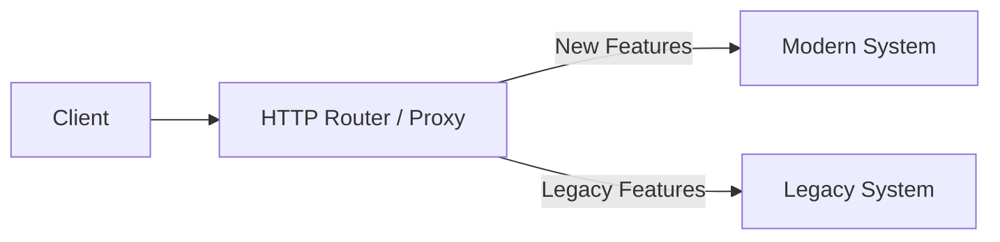

# Safe Legacy Modernization and Refactoring

## Purpose
This document defines techniques for refactoring old, unmaintained, or procedural codebases ("spaghetti code") into modern structures without breaking existing production behavior.

## Scope
Applies to legacy Pure PHP apps, old framework controller patterns, and outdated Dart/Vue designs.

---

## The Strangler Pattern

When replacing an entire subsystem or application, **never perform a single-release rewrite**. Use the Strangler Pattern to replace functionality incrementally:

### Steps of Execution
1. **Intercept**: Place an HTTP router, API gateway, or middleware proxy in front of the application.
2. **Coexist**: Routes targeting new or modernized features are routed to the new codebase. Legacy requests continue routing to the original codebase.
3. **Strangle**: Migrate features one route at a time. Eventually, the old code path handles zero traffic and can be decommissioned safely.

---

## Branch-by-Abstraction

To refactor a backend class or implementation detail *within* the same codebase without breaking production paths:

1. **Introduce an Abstraction**: Define an interface that represents the subsystem to refactor.
2. **Implement Legacy Wrapper**: Write a wrapper class implementing this interface that calls the old procedural code directly.
3. **Redirect Client Calls**: Refactor all parts of the application to call the new interface instead of calling the legacy methods directly.
4. **Implement Modern Version**: Write a new, modern, unit-tested implementation of the interface.
5. **Toggle Implementation**: Switch the active class binding in your dependency injector (or routing provider) to the new modern implementation. Keep the legacy class as a fallback fallback toggle.
6. **Clean Up**: Remove the legacy class and interface once the modern version compiles and operates error-free in production.

---

## Working with Spaghetti Code: Verification Golden Rule

> [!CAUTION]
> Never refactor spaghetti code that lacks tests.

If you must modify legacy code that has zero unit tests:
1. **Write Characterization Tests**: Before making changes, write integration tests that assert the *current* output of the legacy class under multiple input combinations, even if the outputs are weird or mathematically incorrect. These "characterization tests" lock in the legacy behavior.
2. **Refactor Safely**: Modify the code to implement clean typing or modularity.
3. **Verify**: Ensure the characterization tests continue to pass 100% after your refactoring.

---

## Common Mistakes & Anti-Patterns
- **The "Big-Bang" Rewrite**: Stopping all product feature development for 6 months to rewrite an application from scratch. This introduces countless regressions and usually fails.
- **Shadow Refactoring**: Making structural code improvements while trying to fix a bug in the same git branch. Keep refactoring PRs entirely separate from functional behavior bug-fix PRs.
- **Deleting Legacy Tests**: Modifying legacy tests to pass after a refactoring because they broke. If a test breaks during refactoring, you have modified the underlying behavior, which is a regression.

---

## References
- Caching legacy data: [performance/03-caching-and-queues.md](../performance/03-caching-and-queues.md)
- Modernizing Pure PHP files: [core/16-legacy-modernization-and-refactoring-standard.md](../core/16-legacy-modernization-and-refactoring-standard.md#7-modernizing-legacy-php--laravel-systems)
