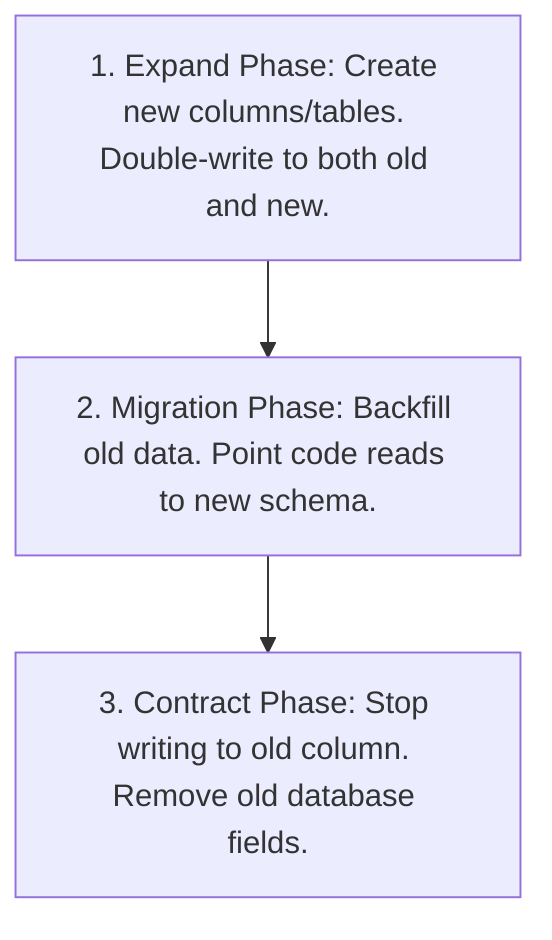

# Database Migrations and API Backward Compatibility

## Purpose
This document outlines techniques for schema updates and API routing versioning, allowing clients to run uninterrupted during zero-downtime deployments.

## Scope
Applies to SQL migrations (MySQL, PostgreSQL), backend API responses, and client-side integration models.

---

## The Expand-and-Contract Database Pattern

To migrate database schemas without system downtime (e.g. renaming a column or splitting tables), split the operation into three distinct phases across multiple deployment cycles:

### Phase 1: Expand
- **Rule**: Never drop or rename a column/table in a migration. This breaks active production code running during the deployment.
- **Action**: Add the new column/table.
- **Code Change**: Update the backend logic to write to **both** the old and new database fields (Double-Write pattern).
- **Deployment**: Deploy this configuration.

### Phase 2: Migrate
- **Action**: Write a database console query or background job to copy legacy records from the old column to the new column.
- **Code Change**: Update backend read logic to pull data from the new column. Keep the double-write logic active.
- **Deployment**: Deploy this configuration.

### Phase 3: Contract
- **Code Change**: Remove the double-write logic. The application now writes and reads solely from the new column.
- **Action**: Create a clean, final migration that drops the old column or table.
- **Deployment**: Deploy this final iteration.

---

## API Versioning and Fallbacks

To modify a public API without breaking existing mobile (Flutter) or web browser integrations:

### 1. Route Versioning
- Use explicit versioning prefixes in URLs: `/api/v1/users` $\rightarrow$ `/api/v2/users`.
- Maintain old v1 endpoints as light controller wrappers that transform v2 responses back into the legacy v1 JSON envelope format (refer to [core/03-data-and-api-modeling.md](file:///Users/kodexkode/Documents/workspace/promptengine/core/03-data-and-api-modeling.md)).

### 2. Graceful Property Deprecation
- If removing a JSON property, do not delete it immediately. Mark it as deprecated in API documentation.
- Maintain the property in the JSON payload, mapping it to a fallback value, for at least two release cycles before purging the key entirely.

---

## Common Mistakes & Anti-Patterns
- **The "Alter Table Rename" Trap**: Renaming a column in a single migration script. When this runs in production, the application crashes during the migration block because active queries continue requesting the old column name.
- **Breaking Mobile Hydration**: Deleting a property from an API response without verifying that older compiled Flutter clients in user devices will not throw serialization null-pointer errors.
- **Untested Backfills**: Running a migration query that updates millions of records in a single transactional block, locking database tables and causing query timeout outages.

---

## References
- Database Modeling Guidelines: [core/03-data-and-api-modeling.md](file:///Users/kodexkode/Documents/workspace/promptengine/core/03-data-and-api-modeling.md)
- Safe deployments: [03-deployment-risk-reduction.md](file:///Users/kodexkode/Documents/workspace/promptengine/legacy/03-deployment-risk-reduction.md)
