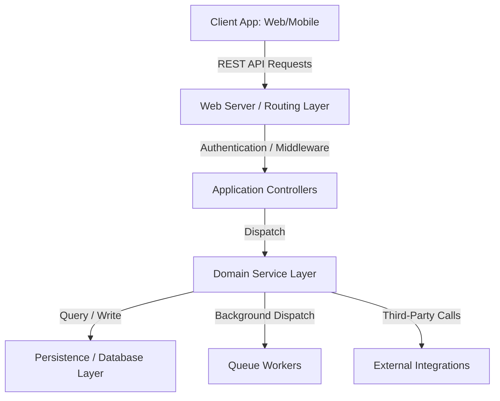

# System Architecture Document

## Playbook Metadata
- **Purpose**: Authoritative template describing HOW the system is built, outlining architectural patterns, directory structures, request lifecycles, and security boundaries.
- **Scope**: Reusable for monolithic, microservice, modular monolith, serverless, and multi-platform layouts (Laravel, Next.js, Spring Boot, Flutter, React, etc.).
- **When to Read**: During initial system planning, database modeling transitions, or major refactoring design phases.
- **Related Playbooks**: [Project Overview](../README.md), [Project Documentation Standard](../02-project-documentation-standard.md), [Architecture & Simplicity](../../core/02-architecture-and-simplicity.md).
- **Version**: 1.0.0
- **Last Reviewed**: 2026-08-03

---

## Document Metadata
- **Project Name**: [Enter Project Name]
- **Document Version**: 1.0.0
- **Status**: [Draft / In Review / Approved]
- **Owner**: [Enter Owner Name / Role]
- **Reviewers**: [Enter Reviewers]
- **Last Updated**: [YYYY-MM-DD]
- **Related Documents**: [PRD.md](PRD.md) | [BusinessRules.md](BusinessRules.md) | [Database.md](Database.md) | [API.md](API.md)

---

## 1. Executive Summary
- **Overview**: [High-level summary of the system's structural layout and deployment strategy.]
- **Rationale**: [Explain why this specific architecture was chosen (e.g. modularity, speed, small team layout).]
- **Architectural Goals**: [e.g. strict domain separation, fast API responses, horizontal scaling ready.]

---

## 2. Architecture Style
- **Pattern**: [e.g. Modular Monolith / Microservices / Clean Architecture / Layered Monolith]
- **Justification**: [Document the engineering justification for choosing this design pattern, including alternatives considered.]

---

## 3. Technology Stack

| Layer | Technology | Version | Purpose |
| :--- | :--- | :--- | :--- |
| **Backend** | [e.g. PHP / Laravel / NestJS] | [Version] | Core business processing & API routing |
| **Frontend** | [e.g. TS / React / Next.js] | [Version] | Web User Interface |
| **Mobile** | [e.g. Dart / Flutter] | [Version] | Cross-platform client apps |
| **Database** | [e.g. PostgreSQL] | [Version] | Relational data storage |
| **Caching** | [e.g. Redis] | [Version] | Session storage & query caching |
| **Queues** | [e.g. Redis / RabbitMQ] | [Version] | Asynchronous background workers |
| **Storage** | [e.g. AWS S3] | [Version] | File uploads & static media |
| **Auth** | [e.g. Laravel Sanctum / JWT] | [Version] | API token verification |
| **Payments** | [e.g. Stripe API] | [Version] | Transaction processing |
| **CI/CD** | [e.g. GitHub Actions] | [Version] | Automated testing & lint gates |
| **Observability** | [e.g. Sentry / Prometheus] | [Version] | Exception tracking & trace monitoring |

---

## 4. High-Level System Diagram

[Insert high-level Mermaid flow block or PlantUML architecture diagram below.]



---

## 5. Application Structure

### 5.1 Directory Layout
```text
Project/
├── app/                  # Main business logic
│   ├── Actions/          # Single-action business transactions
│   ├── Models/           # Database schema representations
│   └── Services/         # Integration adapters (external services)
├── config/               # System configurations
├── database/             # Migrations, seeders, and factories
├── docs/                 # Project documentation files (PRD, Architecture)
├── public/               # Static assets
└── tests/                # Automated unit and integration tests
```

### 5.2 Boundaries & Modules
- [Describe directory boundary policies, e.g. "Modules under `/app/Billing/` must not directly import models from `/app/Inventory/` without interface gates."]

---

## 6. Layer Responsibilities

- **Presentation Layer**: Handles HTTP parsing, controllers, JSON output formatting, and input validation.
- **Application Layer**: Orchestrates business transaction flows, dispatches background jobs, and maps inputs to DTOs.
- **Domain Layer**: Houses entities, value objects, core business policies, and mathematical computations.
- **Infrastructure Layer**: Implements adapters for external APIs, queue engines, and file storage APIs.
- **Persistence Layer**: Manages database queries, transactions, and migration logic.
- **Shared / Utilities**: Holds helper classes, date formatters, and custom log handlers.

---

## 7. Request Lifecycle

Below outlines the typical request execution pipeline:

```text
[Client Request] ──> [Routing] ──> [Middleware (Auth/Rate-limits)] ──> [Controller]
                                                                             │
 [Database]      <── [Repository] <── [Service/Action Layer]         <── [Validation] ┘
```

- **Client**: Triggers request.
- **Routing**: Dispatches path to the target class.
- **Middleware**: Validates token authentication and rate limits.
- **Controller**: Parses route input parameters and delegates to the Service.
- **Service/Action**: Executes business validations and updates database state.
- **Repository**: Executes SQL queries.
- **Database**: Commits transaction changes.

---

## 8. Domain Model

- [Explain high-level domain entities, aggregates, and value objects without detailing SQL tables or code classes.]
- **Aggregate 1**: [e.g. Order Aggregate (Order, OrderLineItem, ShippingAddress)]
- **Value Object 1**: [e.g. Money Value Object (amount, currency)]

---

## 9. Data Flow

### 9.1 Read / Write Flows
- **Write Request Flow**: [Describe the steps to commit data, e.g. Controller $\rightarrow$ Action $\rightarrow$ DB Transaction Commit.]
- **Read Request Flow**: [Describe data retrieval path, e.g. Controller $\rightarrow$ Database Model View $\rightarrow$ Cache check.]

### 9.2 Event & Background Flows
- **Webhooks**: [Describe ingestion and validation logic, e.g. Stripe webhook handler validations.]
- **Background Jobs**: [Describe queuing steps.]

---

## 10. Authentication & Authorization
- **Authentication**: [e.g. Stateless bearer tokens managed via Laravel Sanctum.]
- **Authorization**: [e.g. Role-Based Access Control (RBAC) with specific roles: admin, editor, viewer.]
- **Session/Token Lifecycle**: [e.g. Tokens expire after 30 days of inactivity; refresh token flow rules.]

---

## 11. Database Architecture
- **Database Type**: [e.g. PostgreSQL Relational Engine]
- **Connection Strategy**: [e.g. Connection pooling configured via pgbouncer.]
- **Transactions**: [e.g. Database transactions wrap any action modifying more than one table.]
- **Migrations**: [e.g. Expand-and-contract migrations only. Down-migrations must not drop columns in active environments.]
- **Reference**: For detailed database rules, refer to [Database.md](Database.md).

---

## 12. External Integrations

| Provider | Purpose | Ownership | Failure Strategy | Fallback Behavior |
| :--- | :--- | :--- | :--- | :--- |
| **Stripe** | Payment checkout | Billing module | Retry up to 3 times (exponential backoff) | Reject transaction, alert support |
| **SendGrid** | transactional emails | Notification module | queue retries | Log failure locally for SRE |

---

## 13. Caching Strategy
- **Caching Store**: [e.g. Redis in-memory database]
- **Cache Targets**: [e.g. Product catalog configuration, user sessions, static configurations.]
- **Invalidation & TTL**: [e.g. Catalog expires after 1 hour (TTL: 3600s), manually flushed on product edit.]

---

## 14. Queue Architecture
- **Queue Provider**: [e.g. Redis queues run by Laravel Horizon]
- **Workers Config**: [e.g. 3 active workers executing the default queue, 1 worker for notification queue.]
- **Failure Rules**: [e.g. Failed jobs move to the dead-letter queue after 3 execution attempts.]
- **Idempotency**: [e.g. Background workers must verify job UUIDs to prevent double-processing.]

---

## 15. Error Handling Strategy
- **Application Exceptions**: [e.g. Custom exceptions like `OrderValidationException` return standard JSON responses.]
- **External Failures**: [e.g. Wrap third-party APIs in try/catch blocks; return default fallback layouts if down.]
- **User-Facing Responses**: [e.g. Validation failures return RFC 7807 JSON error payloads.]

---

## 16. Security Architecture
- **Secrets Management**: [e.g. Secrets injected via production environment variables; never committed to git.]
- **Encryption**: [e.g. Encrypted sensitive personal info (emails, SSNs) using AES-256.]
- **Webhooks Verification**: [e.g. Signature validations required for all external callback controllers.]
- **Reference**: For detailed security standards, see [Security Engineering Standard](../../core/08-security-engineering-standard.md).

---

## 17. Scalability Strategy
- **Stateless Services**: [e.g. Application instances are stateless, allowing simple horizontal scaling behind a Load Balancer.]
- **Database Scaling**: [e.g. Read-replicas handle heavy read queries; main write instance is isolated.]
- **Storage**: [e.g. File uploads bypass the app server and go directly to AWS S3 buckets.]

---

## 18. Deployment Architecture
- **Environments**: [e.g. Local $\rightarrow$ Testing $\rightarrow$ Staging $\rightarrow$ Production]
- **Hosting Strategy**: [e.g. Dockerized containers deployed on AWS Elastic Container Service (ECS).]
- **Reference**: For detailed deployment rules, see [Deployment.md](Deployment.md).

---

## 19. Observability & SRE
- **Logging**: [e.g. JSON log outputs routed to ELK stack.]
- **Metrics**: [e.g. CPU, RAM, and database response latencies tracked via Prometheus.]
- **Health Checks**: [e.g. `/health` path tests database and Redis connections; used by load balancer.]

---

## 20. Trade-offs & Tech Debt

### 20.1 Trade-offs
- **Choice**: [e.g. Relational database over NoSQL]
  - **Alternative considered**: [e.g. MongoDB]
  - **Trade-off**: [e.g. Better schema constraint validations at the expense of higher indexing query costs.]

### 20.2 Known Technical Debt
- **Debt 1**: [Describe tech debt, e.g. Single large controller handling checkout logic.]
  - **Reason**: [e.g. Speed to market for MVP release.]
  - **Owner**: [Name / Team]
  - **Expected Resolution**: [e.g. Refactor into Action pattern inside Q3 sprint.]

---

## 21. Related Documents
- **PRD**: [PRD.md](PRD.md)
- **Business Rules**: [BusinessRules.md](BusinessRules.md)
- **Database Schema**: [Database.md](Database.md)
- **API Contracts**: [API.md](API.md)
- **ADR Logs**: [Decisions/README.md](Decisions/README.md)

---

## AI Guidance

When reading or updating architecture configurations, follow these rules:
- **Respect Boundaries**: Never introduce imports that violate directory separation rules (e.g. importing database repositories directly inside view components).
- **No Speculative Architecture**: Do not create database replication models or clean architecture abstractions unless explicitly requested.
- **Trace Structural Changes**: Update this document whenever modules are added, directories are refactored, or third-party engines are integrated.
- **No Code Snippets**: Do not write source code syntax blocks here; focus strictly on system topology and layer responsibilities.

---

## Developer Guidance

- **Regular Audits**: Review the architecture layout map during sprint planning to ensure code implementation aligns with directory rules.
- **Merge Warnings**: Reject pull requests that introduce architecture drift or violate structural boundaries.
- **Maintain Diagrams**: Keep system diagrams and Mermaid flows updated as the codebase layout changes.
