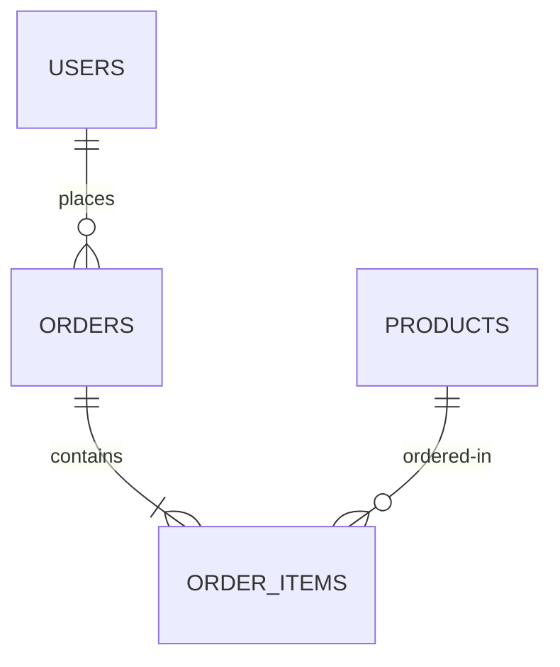

# Database Documentation

## Playbook Metadata
- **Purpose**: Authoritative reference template defining the project's data model, naming conventions, index strategies, transaction boundaries, and security rules.
- **Scope**: Reusable for relational and non-relational database engines (MySQL, PostgreSQL, MongoDB, DynamoDB, CockroachDB, SQLite, etc.).
- **When to Read**: Prior to writing schema migrations, optimizing queries, or refactoring entity relationships.
- **Related Playbooks**: [Project Overview](../README.md), [Project Documentation Standard](../02-project-documentation-standard.md), [Database Engineering Standard](../../core/06-database-engineering-standard.md).
- **Version**: 1.0.0
- **Last Reviewed**: 2026-08-03

---

## Document Metadata
- **Project Name**: [Enter Project Name]
- **Document Version**: 1.0.0
- **Status**: [Draft / In Review / Approved]
- **Owner**: [Enter Database Lead / Owner Role]
- **Database Engine**: [e.g. PostgreSQL / MongoDB]
- **Engine Version**: [e.g. 15.4]
- **Last Updated**: [YYYY-MM-DD]
- **Reviewers**: [Enter Reviewers]
- **Related Documents**: [PRD.md](PRD.md) | [Architecture.md](Architecture.md) | [API.md](API.md) | [BusinessRules.md](BusinessRules.md)

---

## 1. Database Overview
- **Overview**: [Provide a high-level description of the database role and system footprint.]
- **Business Purpose**: [Explain how data represents a critical business asset, e.g. billing reconciliation, user preferences retention.]
- **Design Philosophy**: [e.g. strict schema constraints, normalization to 3NF, or flexible document structures for horizontal scaling.]

---

## 2. Database Technologies

- **Database Engine**: [e.g. PostgreSQL]
- **ORM / ODM Engine**: [e.g. Eloquent / Prisma / Hibernate / Mongoose]
- **Query Builder**: [e.g. Knex / Doctrine Raw]
- **Migration Engine**: [e.g. Laravel Migrations / Liquibase / Phinx]
- **Connection Pooler**: [e.g. pgBouncer]
- **Replication Layout**: [e.g. Single write instance with 2 active read-replicas]
- **Backup Ingestion**: [e.g. Daily incremental snapshots stored on AWS S3]

---

## 3. Naming Conventions

Define the naming rules applied to database objects:
- **Tables / Collections**: [e.g. plural, snake_case, e.g., `order_items`]
- **Columns / Fields**: [e.g. singular, snake_case, e.g., `created_at`]
- **Primary Keys**: [e.g. `id` as integer / `uuid` as char(36)]
- **Foreign Keys**: [e.g. singular_table_name_id, e.g., `user_id`]
- **Indexes**: [e.g. table_column_idx, e.g., `users_email_idx`]
- **Constraints**: [e.g. table_column_chk, e.g., `orders_status_chk`]
- **Pivot / Join Tables**: [e.g. alphabetical singular table order, e.g., `role_user`]

---

## 4. Entity Inventory
High-level list of target business entities (no column details here):

| Entity Name | Purpose | Owner Module | Status |
| :--- | :--- | :--- | :--- |
| **User** | Represents login credentials and basic profile details | Auth | Active |
| **Order** | Tracks customer purchases and checkout transactions | Billing | Active |

---

## 5. Table / Collection Documentation

Create a section for each table/collection:

### Table Name: `[table_name_here]`
- **Purpose**: [Brief description of the table's business purpose.]
- **Business Owner**: [e.g. Billing Team]
- **Primary Key**: `[column_name]` (type: `[type_here]`)
- **Foreign Keys**:
  - `[fk_column]` references `[parent_table.id]` (Cascade Policy: `[RESTRICT/SET NULL/CASCADE]`)
- **Important Columns**:
  - `[column_1]`: [Business definition, format constraints.]
  - `[column_2]` (Nullable): [When this is null, what does it mean?]
- **Soft Deletes**: [Yes/No] (column name: `[deleted_at]`)
- **Audit Fields**: [e.g. `created_at`, `updated_at`, `created_by_user_id`]
- **Constraints / Default Values**: [e.g. `status` must be one of: 'pending', 'paid', 'failed'. Default: 'pending']
- **Business Notes**: [Special rules, e.g. "Do not delete records here if payments are attached."]

---

## 6. Relationships & Entity-Relationship Map

[Include a Mermaid ER diagram illustrating primary table links.]

### Relationship Types
- **One-to-One**: [Describe, e.g. User $\leftrightarrow$ UserProfile]
- **One-to-Many**: [Describe, e.g. Customer $\leftrightarrow$ Orders]
- **Many-to-Many**: [Describe, e.g. User $\leftrightarrow$ Roles via `role_user` pivot]
- **Polymorphic / Inheritance**: [Describe, e.g. Comments table morphs to Posts or Videos]

---

## 7. Constraints
- **Primary Keys**: [Rules for generation, e.g. auto-incrementing bigints or UUIDv4 values generated at app level.]
- **Unique Constraints**: [e.g. `users.email` must be unique.]
- **Check Constraints**: [e.g. `order_items.quantity` must be greater than zero.]

---

## 8. Index Strategy

| Table Name | Index Name | Columns Indexed | Reason / Target Queries | Performance Impact |
| :--- | :--- | :--- | :--- | :--- |
| **users** | `users_email_idx` | `(email)` | Fast lookups during login auth | Minimal write overhead |
| **orders** | `orders_user_id_idx` | `(user_id, status)` | Speeds up user dashboard lookup queries | Slightly slows bulk inserts |

---

## 9. Transactions
- **Transactional Boundaries**: [e.g. Wrapping all updates affecting both `orders` and `order_items` in a database transaction block.]
- **Isolation Level**: [e.g. Read Committed (PostgreSQL default) / Serializable for financial ledgers.]
- **Rollback Policy**: [e.g. Automatic database rollbacks triggered upon catching application exceptions.]

---

## 10. Data Integrity Rules
- **Referential Integrity**: [e.g. Use database foreign key constraints to prevent orphan order records.]
- **Soft Delete Behavior**: [e.g. Soft deletes do not delete records; queries must filter using `whereNull('deleted_at')` constraints.]
- **Cascade Policies**: [e.g. Restrict deletes on parent records if dependent child rows exist in transactions.]

---

## 11. Migration Strategy
- **Migration Ownership**: [e.g. Developers write migrations, SRE team executes them in staging/prod.]
- **Deployment Order**: [e.g. Always deploy database migrations before deploying code updates.]
- **Zero-Downtime Migration Policy**:
  - [e.g. Never execute drop columns or rename columns directly. Use the Expand-and-Contract strategy: add column $\rightarrow$ write dual $\rightarrow$ backfill $\rightarrow$ update code $\rightarrow$ remove old column.]
- **Rollback Plan**: [e.g. Every migration must be tested with a corresponding down script returning schemas to prior states.]

---

## 12. Data Lifecycle & Retention
- **Data Creation**: [Where data enters the database, e.g. user signup, checkout gateway.]
- **Archival Workflows**: [e.g. Move order transaction histories older than 7 years to glacier backups.]
- **Legal Retention / GDPR**: [e.g. User request for account deletion must mask PII data within 30 days.]

---

## 13. Seed & Reference Data
- **Reference / Static Data**: [e.g. ISO Currency table, Country lists, permissions registries.]
- **Lookup Tables**: [Identify tables serving strictly as state configurations.]
- **Environment Differences**: [e.g. Local developer seeds populate fake users; production seeds populate only static system states.]

---

## 14. Performance Considerations
- **Large Tables Strategy**: [e.g. Database partitioning on `orders` table by year partition ranges.]
- **Query Optimization**: [e.g. Mandatory use of EXPLAIN execution plan scans before optimizing indexes.]
- **Connection Management**: [e.g. Maximum pool size bounds to prevent CPU lockups.]

---

## 15. Security & Privacy
- **Sensitive Data & Encryption**: [e.g. Password hashes must use Argon2id; credit card tokens are stored offsite (Stripe API).]
- **Access Control Roles**: [e.g. Application connects using a read/write user; reporting scripts connect using a readonly user.]
- **PII & Masking**: [Identify columns containing PII (names, phone numbers); mask logs on export.]

---

## 16. Backup and Recovery
- **RTO / RPO Targets**: [e.g. RPO: under 1 hour data loss, RTO: under 15 minutes system restore.]
- **DR Drills**: [e.g. Monthly dry-run database recovery test verification.]

---

## 17. Monitoring & SRE Alerts
- **Slow Query Alerts**: [e.g. Dispatch warnings for SQL queries taking more than 500ms to run.]
- **Storage Growth Monitoring**: [Alert when disk storage capacity exceeds 80%.]

---

## 18. Known Database Limitations & Technical Debt
- **Debt Item 1**: [e.g., Composite primary keys used on legacy pivot tables.]
  - **Reason**: [e.g., Quick MVP delivery bounds.]
  - **Expected Resolution**: [e.g., Migrating to default UUID auto-increment IDs during Q4 maintenance sprint.]

---

## 19. Related Documents
- **PRD**: [PRD.md](PRD.md)
- **Architecture**: [Architecture.md](Architecture.md)
- **API Contracts**: [API.md](API.md)
- **ADR Logs**: [Decisions/README.md](Decisions/README.md)

---

## AI Guidance

When analyzing or updating database schemas, follow these rules:
- **Never Guess Schemas**: Do not invent SQL tables, columns, or foreign keys. Verify them by reading migration files or checking the codebase schema mapping.
- **Isolate Documentation Updates**: When database tables are added or columns edited, update only the target table documentation section.
- **Respect Database Standards**: Ensure all design changes align with the project's [Database Engineering Standard](../../core/06-database-engineering-standard.md).
- **Distinguish Inferred Knowledge**: Clearly tag inferred relationships as assumptions until confirmed by code or developers.

---

## Developer Guidance

- **Update Docs on Migration**: Always update this documentation file in the same pull request that introduces database migrations.
- **Verify down Scripts**: Never commit a migration unless the rollback down-script is confirmed correct in the local development database sandbox.
- **Document the "Why"**: Focus documentation on the business meaning of tables and columns rather than repeating raw SQL definitions.
