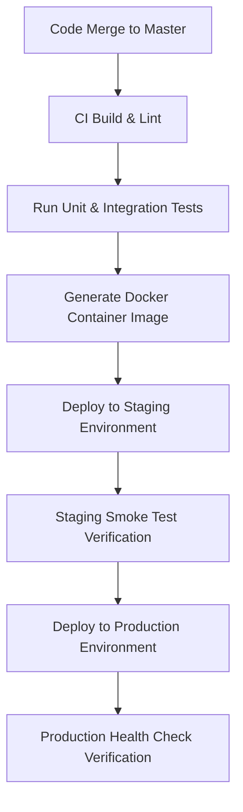

# Deployment & Operations Guide

## Playbook Metadata
- **Purpose**: Authoritative reference template defining the project's hosting topology, target environments, deployment pipelines, configuration rules, secrets management, and disaster recovery procedures.
- **Scope**: Reusable for cloud-hosted monoliths, modular systems, serverless layouts, and containerized microservices.
- **When to Read**: Prior to modifying deployment scripts, deploying code updates, changing secrets management setups, or performing disaster recovery testing.
- **Related Playbooks**: [Project Overview](../README.md), [Project Documentation Standard](../02-project-documentation-standard.md), [CICD and Deployment Standard](../../core/13-cicd-and-deployment-standard.md).
- **Version**: 1.0.0
- **Last Reviewed**: 2026-08-03

---

## Document Metadata
- **Project Name**: [Enter Project Name]
- **Document Version**: 1.0.0
- **Status**: [Active / Under Revision]
- **Owner**: [Enter DevOps Lead / SRE Owner Role]
- **Reviewers**: [Enter Reviewers]
- **Last Updated**: [YYYY-MM-DD]
- **Related Documents**: [PRD.md](PRD.md) | [Architecture.md](Architecture.md) | [Database.md](Database.md) | [Progress.md](Progress.md)

---

## 1. Deployment Overview
- **Deployment Topology**: [Provide a high-level summary of the system footprint, e.g. Kubernetes cluster, VM groups.]
- **Hosting Model**: [e.g. AWS Multi-AZ / GCP Serverless / On-Premise VMs]
- **Deployment Philosophy**: [e.g. Immutable infrastructure, stateless containers, infrastructure as code (IaC).]
- **Operational Goals**: [e.g. 99.9% uptime SLA, zero-downtime rolling upgrades, automated failure recovery.]

---

## 2. Target Environments

Configure rules for each active deployment environment:

### Environment: `[Environment Name: e.g. Production]`
- **Purpose**: [e.g. Live customer transactions traffic.]
- **Base URL(s)**: `[https://app.domain.com]`
- **Infrastructure Footprint**: [e.g. 1 AWS ALB, 3 ECS containers, 1 RDS Multi-AZ PostgreSQL.]
- **Owner / Team**: [e.g. Cloud Operations / SRE Team]
- **Deployment Strategy**: [e.g. Blue/Green Deployment / Rolling Updates]
- **Data Policy**: [e.g. Anonymized testing logs only. Live client databases strictly isolated.]
- **Access Policy**: [e.g. Strictly restricted to SRE on-call engineers via bastion VPN.]
- **Environment Notes**: [Special configurations or details.]

*(Repeat for Development, Testing, Staging, Sandbox, and Disaster Recovery environments)*

---

## 3. Infrastructure Overview
Outline the system hardware and hosting services topology:
- **Hosting Provider**: [e.g. AWS / GCP / Azure]
- **Regional Layout**: [e.g. us-east-1 primary, us-west-2 backup]
- **Compute Groups (VMs/Containers)**: [e.g. AWS ECS Fargate tasks]
- **Orchestration Layer**: [e.g. Kubernetes cluster limits / AWS ECS cluster]
- **Load Balancers & CDN**: [e.g. Cloudflare DNS Proxy pointing to Application Load Balancer]
- **Object Storage**: [e.g. Amazon S3 buckets for media uploads]
- **Managed Services**: [e.g. AWS RDS PostgreSQL, Elasticache Redis]
- **Network Architecture**: [Outline VPC setup, public vs private subnets, NAT Gateways.]

---

## 4. Application Components
Detail the individual deployment units:

| Component Name | Build Artifact | Runtime Config | Scaling Boundaries |
| :--- | :--- | :--- | :--- |
| **Backend API** | Docker Image | Env vars | Auto-scale: 2 to 10 tasks |
| **Frontend UI** | Static Assets CDN | Cloudflare | Edge cached |
| **Queue Worker** | Docker Image | Env vars | Scale based on SQS queue size |
| **Cron Scheduler** | Docker Image | Single instance | Static instance |

---

## 5. Deployment Workflow

A step-by-step trace of how code changes proceed to production:

---

## 6. Release Strategy
- **Rollout Mechanism**: [e.g. Canary release: route 10% traffic first, progressive ramp over 1 hour.]
- **Maintenance Windows**: [e.g. Scheduled updates on Sunday at 02:00 UTC. No downtime expected.]
- **Approval Process**: [e.g. Requires QA sign-off and SRE manager approval in release ticket.]
- **Rollback Window**: [e.g. Automatic rollback triggers if API 5xx errors exceed 1% in a 5-minute window.]

---

## 7. Configuration Management
- **Environment Variables Configuration**: [Explain variable schemas.]
- **Local Settings Files**: [e.g., config maps, configuration file overrides.]
- **Feature Flags**: [e.g. LaunchDarkly toggle dashboard paths.]
- **Validation Guidelines**: [e.g. App boot fails immediately if required env variables are missing.]

---

## 8. Secrets Management

> [!WARNING]
> Under no circumstances must actual secret keys, API passwords, database credentials, or certificates be recorded in this document.

- **Secrets Storage Engine**: [e.g. AWS Secrets Manager / HashiCorp Vault]
- **Rotation Schedule**: [e.g. Database passwords rotated automatically every 90 days.]
- **Emergency Procedure**: [Steps to invalidate compromised keys and trigger manual rotation scripts.]

---

## 9. Database Deployment & Migrations
- **Migration Orchestration**: [e.g. Laravel migrations run as a post-deploy step from task container.]
- **Zero-Downtime Migration Policy**:
  - [e.g. Must follow expand-and-contract column patterns to prevent lockouts.]
- **Rollback Protocol**: [e.g. Run down scripts or restore previous snapshot if migrations fail.]
- **Data Integrity Verifier**: [Verification validations, e.g. confirming indexes are built.]

---

## 10. External Services Integrations
- **Integration Registry**:
  - **Service**: [e.g. Stripe Payment API]
    - **Purpose**: Order payment checkouts.
    - **Auth Method**: Secret API Keys stored in Secrets Manager.
    - **Failure Behavior**: Graceful error message presented to customer; payment marked as pending checkout retry.
    - **Fallback Strategy**: [Retry with exponential backoff up to 3 times.]
    - **Monitoring Indicators**: Custom alerts on gateway timeouts.

---

## 11. Health & Liveness Checks
- **Liveness Endpoint**: `[GET /healthz]` (e.g. Returns 200 OK if container runtime is healthy.)
- **Readiness Endpoint**: `[GET /readyz]` (e.g. Checks database connection, Redis ping. Returns 503 if database is unreachable.)
- **Smoke Tests Suite**: [Run commands verifying vital endpoints on deployment completions.]

---

## 12. Monitoring, Metrics, & Alerting
- **Logs Ingestion**: [e.g. Datadog Log Forwarder capturing stdout logs.]
- **Telemetry Indicators (APM)**: [e.g. Tracking HTTP response latency, DB query counts.]
- **Alert Thresholds**: [e.g. Dispatch PagerDuty alert if HTTP 5xx error counts exceed 10 in 1 minute.]
- **On-Call Escalation**: [Reference to on-call roster, backup escalation loops.]

---

## 13. Backup and Recovery
- **Backup Strategy**: [e.g. Daily database snapshots retained for 30 days.]
- **Recovery Time Objective (RTO)**: [e.g. Restore operations under 30 minutes.]
- **Recovery Point Objective (RPO)**: [e.g. Maximum 1 hour data loss bounds.]
- **DR Drills**: [Identify scheduled validation exercises, e.g., biannual recovery dry-runs.]

---

## 14. Rollback Procedure
- **Rollback Triggers**: [e.g., Error count spike, memory leak crash loops.]
- **Manual Rollback Action Steps**:
  1. [Step 1, e.g. Revert Master branch commit.]
  2. [Step 2, e.g. Run deploy script targeting previous Docker image tag.]
- **Post-Rollback Verification**: [Run smoke tests, check logs for previous versions.]
- **Rollback Communications**: [Draft status notification to stakeholders.]

---

## 15. Incident Response Protocols
- **Incident Severities**:
  - **Sev-1**: Major outage, checkout unavailable. (Requires immediate SRE escalation).
  - **Sev-2**: Minor degradation, search is slow.
- **Escalation Path**: [SRE Lead $\rightarrow$ CTO.]
- **Postmortem Cadence**: [Mandatory postmortem analysis report within 48 hours of Sev-1 resolution.]

---

## 16. Maintenance & Patching Policies
- **Scheduled Maintenance Cadence**: [e.g. OS patches deployed biweekly in staging, monthly in production.]
- **Certificate Renewal Strategy**: [e.g. SSL certs auto-renew via AWS ACM.]
- **Capacity Planning reviews**: [Alert threshold increases based on monthly load scans.]

---

## 17. Security Hardening
- **Access Management Rules**: [Enforce Principle of Least Privilege. Readonly developer tokens, admin SRE console bounds.]
- **Network Isolation Constraints**: [e.g. Database has zero public routing paths; access restricted strictly to private backend subnets.]
- **Compliance Standards**: [e.g. SOC2, PCI-DSS compliance requirements details.]

---

## 18. Performance Scaling Architecture
- **Autoscaling Strategy**: [e.g. Scale Backend tasks up if average CPU usage exceeds 70% for 3 minutes.]
- **Autoscaling Limits**: [Maximum task instances allowed per cluster, e.g., min 2, max 10 tasks.]
- **Storage Growth Policy**: [e.g. Auto-expand RDS database storage volume sizes.]

---

## 19. Operational Runbooks Index
- **Deploying New Versions Runbook**: [Link to target deploy wiki or internal guides]
- **Reverting Production Code Runbook**: [Link to revert CLI sequences]
- **Restoring Database Backups Runbook**: [Link to DB snapshot restore commands]
- **Rotating Secret API Keys Runbook**: [Link to Secrets rotation console]

---

## 20. Known Operational Risks
- **Risk 1**: [e.g., Cold-start latency spikes on serverless frontend boots.]
  - **Impact**: [High / Med / Low]
  - **Likelihood**: [High / Med / Low]
  - **Mitigation Strategy**: [Enable provisioned concurrency scaling limits.]
  - **Risk Owner**: [Name / Team]

---

## 21. Related Documents
- **PRD**: [PRD.md](PRD.md)
- **Architecture Spec**: [Architecture.md](Architecture.md)
- **Database Schema**: [Database.md](Database.md)
- **API Contracts**: [API.md](API.md)
- **ADR Logs**: [Decisions/README.md](Decisions/README.md)

---

## AI Guidance

When analyzing deployment or operations tasks, comply with these guidelines:
- **Never Record Secrets**: Under no circumstances must database passwords, client keys, or JWT tokens be documented.
- **Do Not Guess Infrastructure**: Do not suggest ports, URLs, or servers that are not explicitly documented or verified in the codebase.
- **Distinguish Infrastructure State**: Clearly tag system configurations: `[Confirmed / Inferred / Planned]`.
- **Align with DevOps playbooks**: Ensure all scripts comply with the project's [CICD and Deployment Standard](../../core/13-cicd-and-deployment-standard.md).

---

## Developer Guidance

- **Keep Guide Synced**: Update this file in the same PR when hosting configurations, dependencies, or variables change.
- **Write Rollback Plans First**: Prior to executing major production upgrades, document the CLI rollback steps in this guide.
- **Audit Logging Integration**: Ensure every manual change in infrastructure is recorded in the operational changelogs.
