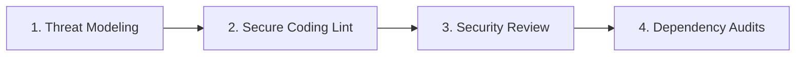

# Security Engineering Standards Overview

## Purpose
This directory outlines the security controls, authentication rules, and API safety checks required to protect applications against unauthorized access, data leaks, and code injection vulnerabilities.

## Scope
Defines the general security assurance processes integrated into the developer and deployment lifecycle.

---

## The Security Engineering Lifecycle

Security checks must be integrated directly into development, rather than treated as a post-release audit:

### 1. Threat Modeling (Pre-Code)
- During the planning phase (refer to [core/01-thinking-and-planning.md](file:///Users/kodexkode/Documents/workspace/promptengine/core/01-thinking-and-planning.md)), identify the data assets processed by the new feature.
- Explicitly define:
  - *Who is authorized to call this action?*
  - *What inputs are provided by the user, and why must they be untrusted?*
  - *Where is sensitive data stored, and is it encrypted at rest and in transit?*

### 2. Code Review and Lint Checks
- Static analyzers and linter tools (refer to [environment/03-ci-cd-pipelines.md](file:///Users/kodexkode/Documents/workspace/promptengine/environment/03-ci-cd-pipelines.md)) must check for raw database injections, SQL queries, or improper variable outputs.

### 3. Automated Dependency Scans
- CI/CD pipelines check all third-party libraries for open vulnerabilities on every push (refer to [environment/02-dependency-hygiene.md](file:///Users/kodexkode/Documents/workspace/promptengine/environment/02-dependency-hygiene.md)).

---

## Target Security Modules
The sub-modules in this directory define the implementation standards:
- [01-secure-coding.md](file:///Users/kodexkode/Documents/workspace/promptengine/security/01-secure-coding.md): Input sanitation and output encoding.
- [02-auth-and-permissions.md](file:///Users/kodexkode/Documents/workspace/promptengine/security/02-auth-and-permissions.md): Authentication models and session policies.
- [03-secrets-management.md](file:///Users/kodexkode/Documents/workspace/promptengine/security/03-secrets-management.md): Secret storage and local variable isolation.
- [04-api-and-infra-security.md](file:///Users/kodexkode/Documents/workspace/promptengine/security/04-api-and-infra-security.md): CORS parameters, API limits, and threat mitigations.
