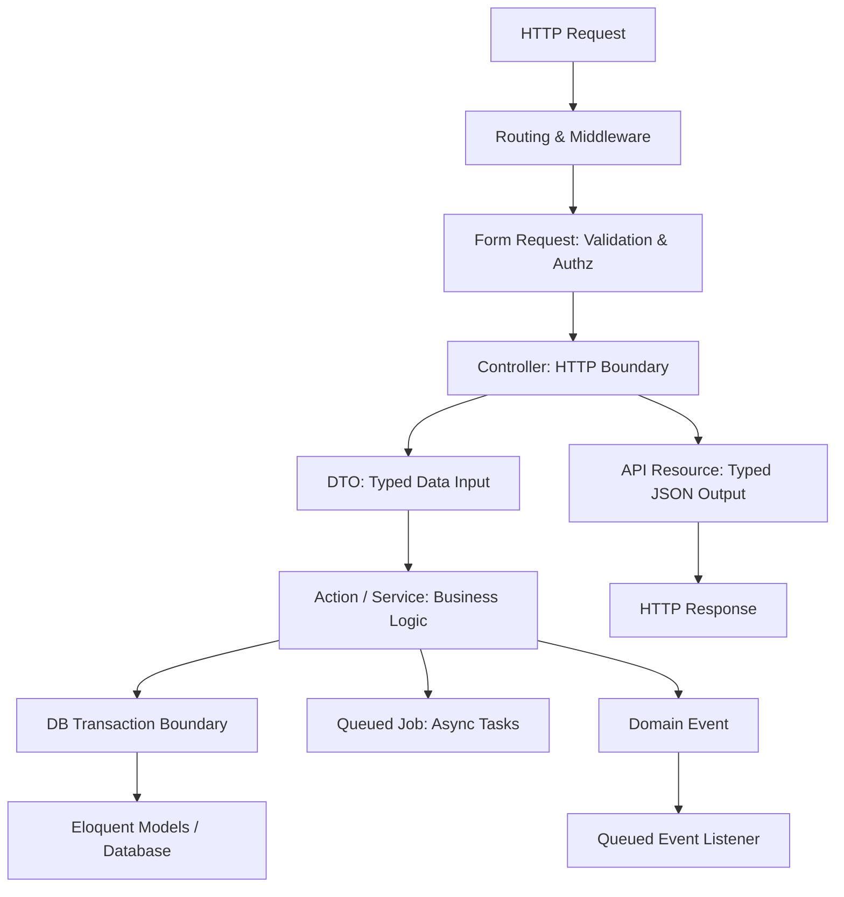
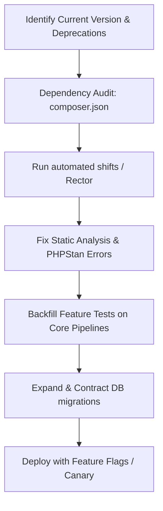

# Laravel Engineering Standard

## Inheritance & Alignment
This document inherits from and extends the [Universal Coding Standards](../../core/05-universal-coding-standards.md), the [Architecture & Simplicity Standards](../../core/02-architecture-and-simplicity.md), and the [PHP Engineering Standard](php-conventions.md). It outlines Laravel-specific conventions, design decision matrices, security mitigations, and performance targets.

---

## 1. Application Architecture & Boundaries

Laravel is a flexible framework that supports multiple structural patterns. We enforce architectural boundaries based on application scale to avoid premature complexity.



### Layer Responsibilities & Boundaries

| Component | Primary Responsibility | What MUST NOT happen here |
| :--- | :--- | :--- |
| **Controllers** | HTTP input/output mapping, routing responses, status codes. | Running SQL queries, executing business logic, sending emails. |
| **Form Requests** | Inbound HTTP payload validation, route parameter constraints, request authorization. | Changing database state, executing core business operations. |
| **Models (Eloquent)** | Mapping database tables, defining relations, casts, local scopes. | Performing API calls, invoking payment gateways, sending notifications. |
| **Actions** | Single-responsibility business transactions (e.g., `RegisterUser`). | Reading HTTP headers, session manipulation, direct JSON rendering. |
| **Services** | Grouping of related, multi-method business or third-party client integrations. | Storing state across multiple client request lifecycles (Octane safe). |
| **DTOs** | Strongly typed data representation across layers. | Accessing `request()` global helper, containing business logic. |
| **Jobs** | Asynchronous task execution. | Synchronously blocking the HTTP thread, using un-serialized Eloquent models (use IDs). |
| **Events / Listeners**| Decoupling side effects from the primary business transaction. | Modifying the immediate database state needed for the HTTP response. |
| **Policies** | Authorizing an action on a model instance or resource class. | Filtering large database lists (use model scopes instead). |
| **API Resources** | Formatting outbound JSON responses. | Mutating model database records, lazy-loading relationships (N+1 hazard). |
| **Repositories** | Abstracting data access from the framework (rarely needed). | Over-abstracting Eloquent for basic database reads/writes. |

---

## 2. Component Design Standards

### Controllers
Keep controllers thin. A controller must only map HTTP requests to business layers and return HTTP responses.
- **Rule**: Prefer single-action controllers using the `__invoke` method.
- **Request Handing**: Delegate all validation to Form Requests and all logic to Actions/Services.
- **Response Formatting**: Always use API Resources for JSON responses to avoid leaking raw database schemas.

```php
// Good: Thin Single-Action Controller
namespace App\Http\Controllers;

use App\Actions\CreateInvoiceAction;
use App\Http\Requests\StoreInvoiceRequest;
use App\Http\Resources\InvoiceResource;
use Illuminate\Http\JsonResponse;

class StoreInvoiceController
{
    public function __invoke(
        StoreInvoiceRequest $request,
        CreateInvoiceAction $createInvoice
    ): JsonResponse {
        $invoice = $createInvoice->execute($request->toDto());

        return response()->json(new InvoiceResource($invoice), 201);
    }
}
```

### Eloquent Models
Models represent your database tables and relations. Keep them focused on schema constraints and mapping.
- **Casts**: Leverage PHP 8 Enums and native Laravel casts to enforce data types.
- **Scopes**: Encapsulate queries in local scopes. Do not write inline raw queries in controllers or services.
- **Events/Observers**: Avoid performing business logic in model events (e.g., sending emails inside `saved`). Use domain events instead.

```php
// Good: Typed casts and local scopes
namespace App\Models;

use App\Enums\InvoiceStatus;
use Illuminate\Database\Eloquent\Builder;
use Illuminate\Database\Eloquent\Model;

class Invoice extends Model
{
    protected $casts = [
        'status' => InvoiceStatus::class,
        'amount_cents' => 'integer',
        'paid_at' => 'datetime',
    ];

    public function scopeOverdue(Builder $query): Builder
    {
        return $query->where('status', InvoiceStatus::Pending)
            ->where('due_date', '<', now());
    }
}
```

### Form Requests
Validate incoming payloads defensively before hitting controllers.
- **Segregation**: Put input validation and basic policy-based authorization inside the Form Request.
- **Conversion**: Enforce conversion from the Form Request to a strongly-typed DTO.

```php
namespace App\Http\Requests;

use App\Data\InvoiceData;
use Illuminate\Foundation\Http\FormRequest;

class StoreInvoiceRequest extends FormRequest
{
    public function authorize(): bool
    {
        return $this->user()->can('create', Invoice::class);
    }

    public function rules(): array
    {
        return [
            'customer_id' => ['required', 'exists:customers,id'],
            'amount_cents' => ['required', 'integer', 'gt:0'],
            'due_date' => ['required', 'date', 'after:today'],
        ];
    }

    public function toDto(): InvoiceData
    {
        return new InvoiceData(
            customerId: $this->integer('customer_id'),
            amountCents: $this->integer('amount_cents'),
            dueDate: $this->date('due_date')
        );
    }
}
```

### Services vs. Action Classes
We differentiate between services and actions to optimize readability and maintainability.
- **Action Class**: Represents a *single* business operation (e.g. `RegisterUserAction`). It has exactly one public method (`execute` or `__invoke`). It guarantees a single point of failure and testing.
- **Service Class**: Groups *related* capabilities, primarily around third-party client integrations or multi-method domains (e.g. `StripeGatewayService`).

```php
// Good: Action Class with single entry point
namespace App\Actions;

use App\Data\InvoiceData;
use App\Models\Invoice;
use Illuminate\Support\Facades\DB;

class CreateInvoiceAction
{
    public function execute(InvoiceData $data): Invoice
    {
        return DB::transaction(function () use ($data) {
            $invoice = Invoice::create([
                'customer_id' => $data->customerId,
                'amount_cents' => $data->amountCents,
                'due_date' => $data->dueDate,
            ]);

            // Dispatch domain event inside the transaction
            event(new InvoiceCreated($invoice));

            return $invoice;
        });
    }
}
```

### Data Transfer Objects (DTOs)
DTOs prevent unstructured associative arrays from leaking through business layers.
- **Immutability**: Make DTO properties `public readonly`.
- **Validation**: Enforce types during construction.

```php
namespace App\Data;

use DateTime;

readonly class InvoiceData
{
    public function __construct(
        public int $customerId,
        public int $amountCents,
        public DateTime $dueDate
    ) {}
}
```

### Repositories: The Abstractness Deconstruction
- **Standard**: Do not use the repository pattern by default if Eloquent satisfies query execution.
- **Why**: Eloquent already acts as a database abstraction layer (Data Mapper + Active Record). Adding a repository layer to wrap basic Eloquent queries (e.g. `UserRepository::find()`) creates useless overhead, breaks IDE auto-completion, and negates the power of eager loading and scopes.
- **When to use**: Use repositories ONLY if:
  1. You must query multiple underlying data sources (e.g., pulling data from an external microservice API and a local MySQL database).
  2. You have highly complex read/reporting models that require hand-written, optimized raw SQL scripts completely separate from write models.

---

## 3. Database Performance & Integrity

### N+1 Prevention
- Enable strict mode to disable lazy loading in development:
```php
// AppServiceProvider.php
public function boot(): void
{
    Model::preventLazyLoading(! app()->isProduction());
}
```
- Eager load relations explicitly via `with()` or load dynamically via `load()` when conditionally required.

### Database Optimizations
- **Indexes**: Add composite indexes on columns queried together. Index foreign keys.
- **Chunking**: When processing large tables (>5,000 rows), use `chunkById` or `lazy()` (generators) to keep memory overhead small. Do not use `get()` or `all()`.
- **Cursor Pagination**: Use `cursorPaginate()` for infinite scroll APIs or massive tables to prevent slow database offsets.

### Transactions and Locking
- **Safety**: Wrap multi-table modifications inside `DB::transaction()`.
- **Locks**: Use `sharedLock()` or `lockForUpdate()` to prevent race conditions during inventory/balance operations.

```php
DB::transaction(function () use ($productId, $quantity) {
    $inventory = Inventory::where('product_id', $productId)
        ->lockForUpdate()
        ->first();

    if ($inventory->stock < $quantity) {
        throw new OutOfStockException();
    }

    $inventory->decrement('stock', $quantity);
});
```

### Migrations
- **Rollback Safety**: Ensure migrations are fully reversible. Implement `down()` methods explicitly.
- **Constraints**: Enforce database integrity with foreign keys, checks, and unique indexes at the database layer.

```php
Schema::table('invoices', function (Blueprint $table) {
    $table->foreignId('customer_id')->constrained()->cascadeOnDelete();
    $table->unique(['customer_id', 'reference_number']);
});
```

---

## 4. Asynchronous & Event Architecture

### Queues & Jobs
Queued jobs are the backbone of application scalability. Move any operation that makes an external network call, processes media, or takes longer than 50ms off the HTTP thread.
- **Idempotency**: Jobs must be idempotent. If a job runs multiple times due to a timeout or failure, the system state must remain correct.
- **Payload Limits**: Pass only IDs or primitive parameters to jobs. Do not pass instantiated models; let the job fetch fresh records via the `SerializesModels` trait.

```php
namespace App\Jobs;

use App\Models\Invoice;
use App\Services\PaymentGateway;
use Illuminate\Bus\Queueable;
use Illuminate\Contracts\Queue\ShouldQueue;
use Illuminate\Foundation\Bus\Dispatchable;
use Illuminate\Queue\InteractsWithQueue;
use Illuminate\Queue\SerializesModels;

class ProcessPaymentJob implements ShouldQueue
{
    use Dispatchable, InteractsWithQueue, Queueable, SerializesModels;

    // Retry configuration
    public int $tries = 3;
    public int $backoff = 60;

    public function __construct(private int $invoiceId) {}

    public function handle(PaymentGateway $gateway): void
    {
        $invoice = Invoice::findOrFail($this->invoiceId);

        if ($invoice->isPaid()) {
            return; // Prevent duplicate payment execution (Idempotent)
        }

        $gateway->charge($invoice);
    }
}
```

### Events & Listeners
- **Decoupling**: Use events to trigger operations that are not part of the primary HTTP transaction (e.g. sending logs, user activation emails).
- **Queued Listeners**: Implement `ShouldQueue` on listeners to run side-effects asynchronously in the background.

```php
namespace App\Listeners;

use App\Events\InvoiceCreated;
use Illuminate\Contracts\Queue\ShouldQueue;

class SendInvoiceCreatedNotification implements ShouldQueue
{
    public function handle(InvoiceCreated $event): void
    {
        $event->invoice->customer->notify(new InvoiceCreatedNotification($event->invoice));
    }
}
```

---

## 5. Security Engineering (Laravel Specific)

Protecting the application boundaries from leaks and vulnerabilities is mandatory.

### Authentication & Authorization
- **IDOR Prevention**: Always authorize requests using Laravel Policies linked directly to the controller route or model instance.
- **Mass Assignment**: Disable `$guarded = []` globally or define `$fillable` fields explicitly to prevent request manipulation.

```php
// AppServiceProvider.php
public function boot(): void
{
    // Prevent generic mass assignment issues
    Model::shouldBeStrict(! app()->isProduction());
}
```

### File Uploads
- **Validation**: Validate uploaded files strictly. Verify mime types, size boundaries, and generate a randomized filename.
- **Storage**: Never store files inside public directories under their original names.

```php
$request->file('avatar')->storeAs(
    'avatars',
    Str::random(40) . '.' . $request->file('avatar')->getClientOriginalExtension(),
    'private'
);
```

### API Security & Rate Limiting
- **Rate Limiting**: Enforce rate limiters in routes:
```php
Route::middleware('throttle:api')->group(function () {
    Route::post('/invoices', StoreInvoiceController::class);
});
```
- **Secrets Management**: Never commit credentials to version control. Load secrets via `config()` wrappers mapped to `.env` variables.

---

## 6. Caching & State Management

Caching prevents database bottlenecks, but incorrect invalidation introduces structural bugs.

### Cache Strategy
- **Redis Integration**: Use Redis as the default production cache store.
- **Key Namespacing**: Format cache keys predictably: `{domain}:{resource_id}:{attribute}`.
- **Cache Invalidation**: Never write cache items without an explicit TTL (Time To Live). Prefer explicit invalidation over long lifetimes.

```php
// Reading and Writing safely
$invoice = Cache::remember(
    "invoice:{$invoiceId}:summary",
    now()->addHours(2),
    fn() => Invoice::with('customer')->findOrFail($invoiceId)
);
```

### Invalidation Hooks
Invalidate caches explicitly when resource states change:
```php
class InvoiceObserver
{
    public function saved(Invoice $invoice): void
    {
        Cache::forget("invoice:{$invoice->id}:summary");
    }
}
```

---

## 7. Testing Strategy (Pest & PHPUnit)

A green test suite is the single source of truth for application health. We prioritize Feature Tests for workflow assurance and Unit Tests for pure algorithms.

### Testing Rules
1. **DB Transactions**: Use `RefreshDatabase` to reset the database state between tests.
2. **Factories Only**: Never call raw SQL insert scripts. Always configure and use Model Factories.
3. **Mocks and Fakes**: Fake external integrations strictly at the start of each test.

```php
// Good: Pest Feature Test
use App\Models\User;
use App\Models\Invoice;
use Illuminate\Support\Facades\Http;
use function Pest\Laravel\{actingAs, postJson};

uses(Tests\TestCase::class, Illuminate\Foundation\Testing\RefreshDatabase::class);

test('authorized user can pay invoice', function () {
    Http::fake(['api.stripe.com/*' => Http::response(['status' => 'success'], 200)]);
    
    $user = User::factory()->create();
    $invoice = Invoice::factory()->forCustomer($user)->create(['amount_cents' => 5000]);

    actingAs($user)
        ->postJson(route('invoices.pay', $invoice))
        ->assertStatus(200)
        ->assertJsonPath('data.status', 'paid');

    $this->assertDatabaseHas('invoices', [
        'id' => $invoice->id,
        'status' => 'paid',
    ]);
});
```

---

## 8. Legacy Laravel Upgrade & Migration

Upgrading old Laravel environments demands strict protocols to avoid breaking production APIs.

### The Upgrade Blueprint



### Safety Rules for Migration
- **Incremental Refactoring (Strangler Pattern)**: Do not delete old controller structures instantly. Route old traffic to adapters while implementing new Action routes.
- **Zero-Downtime Database Alterations**: Refer to [legacy/02-backward-compatibility.md](../../legacy/02-backward-compatibility.md). Apply the "Expand and Contract" pattern:
  1. **Expand**: Add the new column or table without removing the old one.
  2. **Copy**: Sync data in the background (using queued jobs).
  3. **Contract**: Route application reads/writes to the new schema, then remove the deprecated structure.

---

## 9. Folder Structure Templates

### Small Applications (Default / Single Domain)
Keep directories flat to avoid overengineering.
```text
app/
├── Http/
│   ├── Controllers/
│   ├── Requests/
│   └── Resources/
├── Models/
└── Providers/
```

### Medium Applications (Layered Service-Oriented)
Introduce single-purpose actions and DTO boundaries.
```text
app/
├── Actions/          # Single-purpose transaction classes
├── Data/             # DTOs
├── Http/
│   ├── Controllers/
│   ├── Requests/
│   └── Resources/
├── Jobs/             # Background queue layers
├── Models/
├── Providers/
└── Services/         # Gateway clients & third-party integrations
```

### Large Applications (Modular Monolith / Domain-Driven)
Encapsulate boundaries inside domain folders to prevent class sprawl.
```text
app/
├── Domains/
│   ├── Invoicing/
│   │   ├── Actions/
│   │   ├── Models/
│   │   └── Events/
│   ├── Identity/
│   │   ├── Actions/
│   │   ├── Models/
│   │   └── Services/
├── Http/             # Shared Delivery Layer
│   ├── Controllers/
│   └── Middleware/
```

---

## 10. Decision Matrices

Use these matrices to identify the correct engineering choice based on project context.

### Matrix 1: Controller vs. Service
| Context | Choice | Rationale |
| :--- | :--- | :--- |
| Handing incoming HTTP requests, session values, cookie configurations | **Controller** | Controls access and response formats at the application boundary. |
| Coordinating complex workflows, interacting with external Stripe/AWS clients | **Service** | Decouples business steps from the transport layer. |

### Matrix 2: Service vs. Action
| Context | Choice | Rationale |
| :--- | :--- | :--- |
| Bundling multiple APIs for a specific provider (e.g., Stripe Payment, Refund) | **Service** | Groups high-cohesion API structures together. |
| A discrete, single business transaction (e.g., `CompleteCheckout`) | **Action** | Standardizes execution paths and makes transactions easily testable. |

### Matrix 3: Action vs. Job
| Context | Choice | Rationale |
| :--- | :--- | :--- |
| Tasks requiring instant visual confirmation (e.g., viewing an invoice) | **Action** | Executed synchronously on the main thread for immediate response. |
| Slow operations or side-effects (e.g., generating PDFs, sending emails) | **Job** | Offloads resource consumption to background queue workers. |

### Matrix 4: Model Logic vs. Service/Action Logic
| Context | Choice | Rationale |
| :--- | :--- | :--- |
| Internal column casting, attributes mapping, basic calculations | **Model** | Keeps schema-level logic self-contained. |
| Interacting with external payment APIs, writing to multiple tables | **Service/Action** | Prevents tight coupling of business logic to Eloquent structures. |

### Matrix 5: Event vs. Direct Call
| Context | Choice | Rationale |
| :--- | :--- | :--- |
| Operations that are optional or secondary to the core transaction (e.g., logging) | **Event** | Fully decouples side-effects, enhancing app throughput. |
| Critical operational steps (e.g., withdrawing money before saving order) | **Direct Call** | Guarantees atomic transaction execution and instant failure. |

### Matrix 6: Repository vs. Eloquent
| Context | Choice | Rationale |
| :--- | :--- | :--- |
| Standard SQL structures, basic database queries | **Eloquent** | Leverage scopes, eager loading, and active-record simplicity. |
| Non-SQL database engines, complex read-models crossing systems | **Repository** | Provides a structured interface to mock distinct persistence layers. |

### Matrix 7: Queue vs. Synchronous Execution
| Context | Choice | Rationale |
| :--- | :--- | :--- |
| Fast database writes, validating password criteria | **Synchronous** | Critical steps that the user must confirm before proceeding. |
| External network operations, image resizing, batch operations | **Queue** | Prevents connection timeouts and enhances response times. |

### Matrix 8: Cache vs. Database Query
| Context | Choice | Rationale |
| :--- | :--- | :--- |
| Read-heavy configurations, static lists (countries, settings) | **Cache** | Avoids redundant, slow SQL execution. |
| Highly dynamic transactional states, security credentials | **Database Query** | Ensures data freshness and prevents authorization bypasses. |

### Matrix 9: Observer vs. Explicit Call
| Context | Choice | Rationale |
| :--- | :--- | :--- |
| System-wide auditing, log telemetry, global cache invalidation | **Observer** | Guarantees executions across all model modification interfaces. |
| Business actions (e.g., charging credit card on model state change) | **Explicit Call** | Actions inside services ensure flow readability and transactional safety. |

### Matrix 10: DTO vs. Array
| Context | Choice | Rationale |
| :--- | :--- | :--- |
| Crossing application boundaries (FormRequest -> Action -> Service) | **DTO** | Ensures type safety, structure validity, and IDE auto-complete. |
| Temporary collections, internal private calculations | **Array** | Low overhead; avoids cluttering code with single-use classes. |

### Matrix 11: Package vs. Application Code
| Context | Choice | Rationale |
| :--- | :--- | :--- |
| Core application business rules, domain entities | **App Code** | Keeps code easy to modify and deploy. |
| Reusable infrastructure tools used across 3+ internal microservices | **Package** | Centralizes utility logic; version-controlled integration. |

---

## 11. AI Coding Agent Directives

AI agents modifying this codebase must adhere to the following rules to maintain quality:

1. **Verify Existing Abstractions**: Before creating a new Action, Service, or Helper class, search the codebase for similar functionality. Do not recreate existing algorithms.
2. **Inherit Coding Standards**: Declare strict types (`declare(strict_types=1);`) in every new or modified PHP file.
3. **No Database Modification without Migration**: Do not modify columns or tables in code without creating a corresponding database migration.
4. **Backward Compatibility**: When updating public APIs, verify that request payloads remain compatible with legacy callers unless versioned.
5. **No Speculative Abstraction**: Do not implement Repositories or Interfaces unless multi-provider structures are actively used.

---

## 12. Review Checklist

Use this checklist during code review to certify that changes align with this standard.

### Architecture
- [ ] Are business-layer classes kept clean of HTTP concerns?
- [ ] Are controllers kept thin and logic delegated?
- [ ] Is composition prioritized over class inheritance and traits?

### Security
- [ ] Are policy checks configured for all endpoint actions? (IDOR prevention)
- [ ] Are inputs validated through Form Requests?
- [ ] Are sensitive fields cast as `encrypted` in models?

### Performance
- [ ] Have you verified that no N+1 queries are introduced?
- [ ] Are large database updates or migrations executed in chunks?
- [ ] Are slow integrations offloaded to background queued jobs?

### Database
- [ ] Are indexes added to all new foreign keys and search terms?
- [ ] Does the migration include a functional `down()` rollback method?

### Testing
- [ ] Does the feature test suite verify database states and status codes?
- [ ] Are external HTTP client queries properly faked/mocked?

---

## References
- Universal Naming Rules: [core/05-universal-coding-standards.md](../../core/05-universal-coding-standards.md)
- System Architecture Design: [core/02-architecture-and-simplicity.md](../../core/02-architecture-and-simplicity.md)
- Safe Database Upgrades: [legacy/02-backward-compatibility.md](../../legacy/02-backward-compatibility.md)
- PHP Strict Conventions: [php-conventions.md](php-conventions.md)
