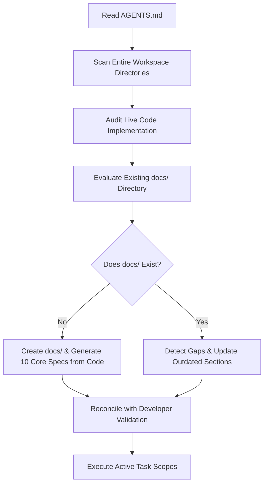

# Existing Project Bootstrap Workflow

## Playbook Metadata
- **Purpose**: Defines the official step-by-step workflow for adopting PromptEngine in an already existing codebase, outlining workspace auditing, docs migration, and delta reconciliation.
- **Scope**: Reusable for any programming language or framework.
- **When to Use**: When onboarding an AI coding assistant to an active repository that lacks PromptEngine structure or documentation.
- **Related Playbooks**: [AGENTS.md](../examples/AGENTS.example.md), [Project Onboarding Standard](../project/01-project-bootstrap-standard.md), [Project Documentation Standard](../project/02-project-documentation-standard.md).
- **Version**: 1.0.0
- **Last Reviewed**: 2026-08-03

---

## 1. Purpose & Expected Outcomes
- **Purpose**: Prevent code regression, establish a clean source-of-truth documentation base directly from the code implementation, and align future AI decisions with legacy architecture design.
- **Expected Outcomes**:
  - A fully synchronized `docs/` folder that accurately reflects the *current state* of the repository.
  - Identification of legacy technical debt or hidden assumptions.
  - Zero disruption to current user behavior or active production features.

---

## 2. Workflow Roles & Responsibilities

### AI Agent Responsibilities
- **First-Step Reading**: Always parse `AGENTS.md` and repository guidelines first.
- **Codebase Auditing**: Scan workspace files (directory trees, routing definitions, database structures) to construct a mental model of the codebase.
- **Delta Analysis**: Identify sections where existing docs differ from the live code implementation.
- **No Inventions**: Never document features or routing hooks that do not exist on disk unless explicitly planned as new work.

### Developer / Operations Responsibilities
- **Access Provisioning**: Ensure the AI agent can scan code directories and view database schema files.
- **Audit Verification**: Confirm that the generated technical documentation matches real legacy implementations.

---

## 3. Workflow Steps

### Step 1: Initialize Context & Scan
- Read `AGENTS.md` to load the current PromptEngine manifest and active guidelines.
- Execute repository discovery scans to inventory folder paths:
  - Locate configuration files (e.g. `composer.json`, `package.json`, `.env.example`).
  - Trace route registry folders (e.g. `routes/`, `src/routes/`).
  - Scan database migration and seeding folders (e.g. `database/migrations/`).
  - Audit source files to map layers (controllers, domain services, components).

### Step 2: Live Code Auditing
- Verify how the codebase actually behaves. Never assume code follows standard framework layouts if custom overrides are present.
- Identify the project boundaries, naming conventions, and layer communication rules.
- Map the database entities, tables, relationships, indexes, and constraints directly from schema files on disk.

### Step 3: Requirements Status Isolation
Establish database and API state directories separating:
- **Confirmed Information**: Directly verified from working code, configuration variables, and schemas on disk.
- **Inferred Information**: Assumed based on framework patterns (must be tagged "Inferred" until verified by a developer).
- **Unknown Information**: Dead code or legacy layers that lack trace indicators (log as technical debt).

### Step 4: Documentation Lifecycle Integration
Analyze the project workspace:

#### Case A: If `docs/` does **not** exist
- Create a `docs/` folder in the project root.
- Populate it by generating the following files, strictly following the corresponding PromptEngine templates:
  1. **`docs/PRD.md`**: Fill the [PRD Template](../project/templates/PRD.template.md) based on active workflows.
  2. **`docs/Architecture.md`**: Fill the [Architecture Template](../project/templates/Architecture.template.md) mapping directory layers on disk.
  3. **`docs/BusinessRules.md`**: Fill the [Business Rules Template](../project/templates/BusinessRules.template.md) extracting logic invariants from controller validators.
  4. **`docs/Database.md`**: Fill the [Database Template](../project/templates/Database.template.md) matching migrations.
  5. **`docs/API.md`**: Fill the [API Template](../project/templates/API.template.md) matching actual route definitions.
  6. **`docs/Progress.md`**: Fill the [Progress Template](../project/templates/Progress.template.md).
  7. **`docs/Roadmap.md`**: Fill the [Roadmap Template](../project/templates/Roadmap.template.md) indicating current phase is Maintenance/Stabilization.
  8. **`docs/Decisions.md`**: Fill the [Decisions Template](../project/templates/Decisions.template.md) (Log known legacy design decisions).
  9. **`docs/Deployment.md`**: Fill the [Deployment Template](../project/templates/Deployment.template.md) based on compose files.
  10. **`docs/Troubleshooting.md`**: Fill the [Troubleshooting Template](../project/templates/Troubleshooting.template.md).

#### Case B: If `docs/` already exists
- Read all existing documentation.
- Compare existing documentation against code on disk.
- Detect outdated sections or missing specifications.
- **Update only affected sections** to prevent deleting valuable historical context.
- Keep the `Decisions.md` ADR log history intact. Never overwrite previous design logs.

### Step 5: Validation Checkpoint
- Present the updated documentation list and clickable markdown links to the developer.
- Highlight any inferred assumptions or legacy anomalies discovered during the scan phase.
- Obtain developer verification before proceeding.

### Step 6: Coding Phase Execution
- **Read Specs First**: Prior to writing a feature or bug fix, read `docs/PRD.md` and related database/API specifications.
- **Apply Code Changes**: Comply with PromptEngine stack-specific playbooks.
- **Update Progress Logs**: Record all code modifications and test executions in `docs/Progress.md`.
- **Log ADRs**: Record any new architectural decisions in `docs/Decisions.md`.
- **Keep Documentation Synced**: Keep code and documentation fully aligned in every pull request.

---

## 4. Operational Checklists

### Discovery & Auditing Checklist
- [ ] Read `AGENTS.md` and verify workspace parameters.
- [ ] Scan compute directories, routing tables, and composer/package manifests.
- [ ] Map active database schemas and index constraints.
- [ ] Create the `docs/` directory if missing.

### Existing Docs Review Checklist
- [ ] Cross-reference `docs/Database.md` against live migrations on disk.
- [ ] Cross-reference `docs/API.md` against live controller routes.
- [ ] Trace business rules invariants in code and list them in `docs/BusinessRules.md`.
- [ ] Verify that legacy design records are preserved in `docs/Decisions.md`.
- [ ] Log any discovered dead code files as Technical Debt items in `docs/Progress.md`.

### Coding & Integration Checklist
- [ ] Ensure that pull requests altering database columns update `docs/Database.md` simultaneously.
- [ ] Verify that new routes are fully documented in `docs/API.md` using the RFC 7807 problem details error specs.
- [ ] Audit all relative markdown links prior to staging commits.
