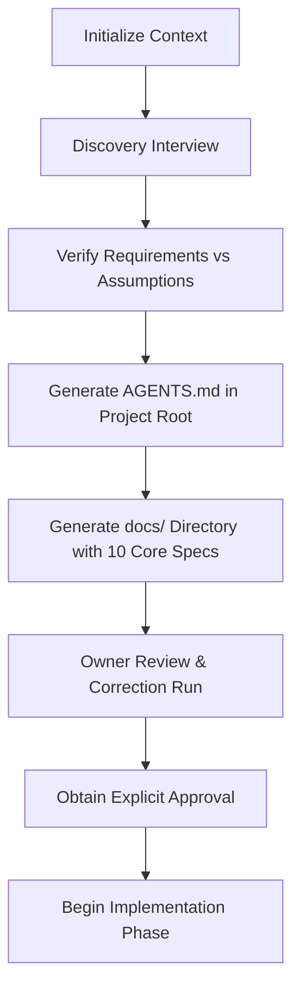

# New Project Bootstrap Workflow

## Playbook Metadata
- **Purpose**: Defines the official step-by-step workflow for starting a brand-new software project from a raw idea using PromptEngine, establishing requirements discovery, the project-specific AI Constitution (AGENTS.md), and baseline documentation.
- **Scope**: Reusable for any programming language or framework.
- **When to Use**: When initiating a greenfield software project from scratch.
- **Related Playbooks**: [AGENTS.template.md](../project/templates/AGENTS.template.md), [Project Onboarding Standard](../project/01-project-bootstrap-standard.md), [Project Documentation Standard](../project/02-project-documentation-standard.md).
- **Version**: 1.1.0
- **Last Reviewed**: 2026-08-03

---

## 1. Purpose & Expected Outcomes
- **Purpose**: Prevent early coding mistakes, prevent unvalidated assumptions, and establish a clear permanent Project Knowledge System before writing production code.
- **Expected Outcomes**:
  - A project-specific `AGENTS.md` in the project root, defining the project's AI Constitution.
  - A fully defined `docs/` folder containing the 10 required project documents populated with verified requirements.
  - Aligned project expectations between the developer, project owner, and AI coding assistant.
  - Zero unverified requirements or design ambiguities prior to the first commit.

---

## 2. Workflow Roles & Responsibilities

### AI Agent Responsibilities
- **First-Step Reading**: Always parse `AGENTS.md` (if it exists) and `project/01-project-bootstrap-standard.md` before prompting the user. During bootstrap initialization, read the PromptEngine bootstrap guides.
- **Interviewing Role**: Act as a technical product manager, adhering to the [Discovery Efficiency Rules](#discovery-efficiency-rules) to gather requirements.
- **Requirement Verification**: Maintain absolute distinction between confirmed requirements, inferred parameters, and assumptions.
- **Template Generation**: Copy and fill the `AGENTS.template.md` template (generating `AGENTS.md` in the project root) and the 10 core PromptEngine templates (generating files under `docs/`) based on the interview outcomes.

### Developer / Owner Responsibilities
- **Clear Scoping**: Respond to discovery questions factually, defining target capabilities, budget boundaries, and non-goals.
- **Documentation Review**: Critically audit the generated `AGENTS.md` and `docs/` markdown files, checking for errors before giving implementation approval.

---

## Discovery Efficiency Rules

The purpose of this section is to prevent unnecessary AI questioning and reduce token usage while still gathering enough information to successfully initialize a project.

- The AI must minimize discovery questions.
- The AI must only ask questions that can affect:
  - architecture decisions
  - database design
  - security requirements
  - API design
  - user experience
  - technology choices
- The AI must avoid questions that can be decided during implementation.
- The AI should group related questions together instead of asking many small questions one by one.
- The AI should ask the minimum number of questions required to create a reliable project specification.
- The discovery phase should not become a lengthy interview.
- The goal is to gather enough information to generate:
  - AGENTS.md (Project Constitution)
  - PRD
  - Architecture
  - Business Rules
  - Database Design
  - API Design
  - Implementation Roadmap

---

## 3. Workflow Steps

### Step 1: Initialize Context
Prior to writing code or planning files:
- Read the PromptEngine AI Agent Bootstrap Guide (`ai/bootstrap.md`) and indexing manifest (`playbook-manifest.json`).
- Read `project/01-project-bootstrap-standard.md` and `project/02-project-documentation-standard.md` to align on project onboarding and documentation standards.

### Step 2: Discovery Interview
To avoid user cognitive overload and verify requirements, while maintaining efficiency:
- Group related questions together instead of asking many small questions one by one, adhering to the [Discovery Efficiency Rules](#discovery-efficiency-rules).
- Never list a wall of multiple-choice questions unless explicitly requested.
- Focus questions on:
  1. High-level project purpose and business objectives.
  2. Primary actors (users, roles, permissions limits).
  3. Key functional workflows (e.g., checkout page inputs, dashboard metrics).
  4. Selected technology stack constraints (e.g., Laravel backend, Vue frontend).
  5. Deployment destination targets (e.g., AWS ECS container clusters).
- Continue the interview loop until you have enough detail to populate `AGENTS.md` and the 10 core documents.

### Step 3: Scoping Isolation
Create a table in your thinking space separating requirement statuses:
- **Confirmed Requirements**: Directly requested by the developer/owner.
- **Assumptions**: Inferred by technical context (must be presented to the user for validation).
- **Open Questions**: Gaps in business logic that must be resolved before documentation is finalized.

### Step 4: Generate Project Knowledge System
Based on the discovery interview outcomes, the AI agent must automatically generate the project's AI Constitution and core documentation:

- **`AGENTS.md` (Project Root)**: Fill the [AGENTS Template](../project/templates/AGENTS.template.md) with discovered project-specific parameters. This file becomes the project's AI Constitution and the primary AI entry point.
- **`docs/` Directory**: Create the folder and generate the following files, strictly following the corresponding PromptEngine templates:
  1. **`docs/PRD.md`**: Fill the [PRD Template](../project/templates/PRD.template.md).
  2. **`docs/Architecture.md`**: Fill the [Architecture Template](../project/templates/Architecture.template.md).
  3. **`docs/BusinessRules.md`**: Fill the [Business Rules Template](../project/templates/BusinessRules.template.md).
  4. **`docs/Database.md`**: Fill the [Database Template](../project/templates/Database.template.md).
  5. **`docs/API.md`**: Fill the [API Template](../project/templates/API.template.md).
  6. **`docs/Progress.md`**: Fill the [Progress Template](../project/templates/Progress.template.md).
  7. **`docs/Roadmap.md`**: Fill the [Roadmap Template](../project/templates/Roadmap.template.md).
  8. **`docs/Decisions.md`**: Fill the [Decisions Template](../project/templates/Decisions.template.md).
  9. **`docs/Deployment.md`**: Fill the [Deployment Template](../project/templates/Deployment.template.md).
  10. **`docs/Troubleshooting.md`**: Fill the [Troubleshooting Template](../project/templates/Troubleshooting.template.md).

### Step 5: Owner Review & Correction Loop
- Present the generated files list (with clickable links to `AGENTS.md` and the `docs/` folder) to the project owner.
- Ask the owner to audit the specifications and the project constitution for logical errors, missing edge cases, or incorrect technical assumptions.
- Apply corrections to the documents based on feedback.

### Step 6: Approval Checkpoint
- Do **not** generate code folders, classes, migrations, or frontend widgets until the project owner provides explicit text approval (e.g., "The documentation and AGENTS.md are approved, begin implementation").

### Step 7: Implementation & Update Pipeline
During active coding phases:
- **AI Entry Point Rule**: The AI must always read `AGENTS.md` first, followed by the relevant project documentation under `docs/`, and finally load appropriate PromptEngine standards before writing any code.
- **Follow Engineering Playbooks**: Comply with technology stacks files mapped in `playbook-manifest.json`.
- **Maintain Progress**: Immediately log completed features, changed files, and test results in `docs/Progress.md`.
- **Log ADRs**: Record major database or API schema changes in `docs/Decisions.md`.
- **Sync Documentation**: If implementation details change during coding, immediately update the corresponding docs (e.g., `docs/API.md` when payload fields evolve) to keep the project files synchronized with the codebase.

---

## 4. Operational Checklists

### Discovery Phase Checklist
- [ ] Parse the PromptEngine bootstrap entry point and manifest.
- [ ] Complete the discovery interview sequence adhering to the efficiency rules.
- [ ] Validate all assumptions with the project owner.
- [ ] Generate `AGENTS.md` in the project root using the template, combining Core Rules and the discovered Project Constitution.
- [ ] Create the `docs/` directory.

### Documentation Phase Checklist
- [ ] Generate `docs/PRD.md` mapping target users and functional scopes.
- [ ] Generate `docs/Architecture.md` outlining folder layouts and layer duties.
- [ ] Generate `docs/BusinessRules.md` listing invariants and system limits.
- [ ] Generate `docs/Database.md` detailing tables, relationships, and naming rules.
- [ ] Generate `docs/API.md` tracing RFC 7807 payloads and routes.
- [ ] Generate `docs/Progress.md` initialized with phase details.
- [ ] Generate `docs/Roadmap.md` mapping future releases.
- [ ] Generate `docs/Decisions.md` with initial ADR index logs.
- [ ] Generate `docs/Deployment.md` mapping environment topologies.
- [ ] Generate `docs/Troubleshooting.md` outlining verification checks.

### Post-Approval Coding Checklist
- [ ] Validate automated test coverage before checking off tasks in `Progress.md`.
- [ ] Record index migrations in `Decisions.md`.
- [ ] Verify relative link integrity across all modified project files.
